# Gap Analysis & Customer-Specific Recommendations
### Bridging Current State to Target State - Vendor & Customer Collaboration

---

## 📋 Executive Summary

This document provides a **gap analysis** based on the customer's current requirements management maturity (proficiency rating: **0.87**) and presents actionable recommendations to achieve a **target state of 3.0+**. 

**Current Assessment (from Customer Meeting):**
- **People:** 1.53 (Low skilled teams, misalignment between vendor and customer)
- **Process:** 0.8 (No established process, Excel/Word-based, not scalable)
- **Technology:** 0.9 (Jira/Confluence partially used, inconsistent)
- **Partners:** 0.9 (Integration gaps between vendor and customer processes)

**Target State:** Mature, integrated requirements management across the entire migration lifecycle with full traceability from requirements → design → code → testing → deployment.

---

## 🎯 Table of Contents

1. [Current State Analysis](#current-state-analysis)
2. [Critical Gaps Identified](#critical-gaps-identified)
3. [Migration-Specific Challenges](#migration-specific-challenges)
4. [Jira-to-GitLab Integration Strategy](#jira-to-gitlab-integration-strategy)
5. [Vendor-Customer Process Alignment](#vendor-customer-process-alignment)
6. [Tooling Recommendations](#tooling-recommendations)
7. [Team Structure & RACI](#team-structure--raci)
8. [Implementation Roadmap (4-Week Accelerated)](#implementation-roadmap-4-week-accelerated)
9. [Success Metrics & KPIs](#success-metrics--kpis)
10. [Risk Mitigation Strategies](#risk-mitigation-strategies)

---

## 📊 Current State Analysis

### Based on Customer Meeting & Assessment Image

#### **People (Current: 1.53 → Target: 3.0)**

**Current State:**
- ✗ Very different skilled people across vendor and customer teams
- ✗ Multiple, not well-aligned teams
- ✗ Requirements specialists are missing
- ✗ Lack of structured requirements gathering and management process

**Impact:**
- Miscommunication between vendor and customer stakeholders
- Inconsistent requirement quality
- No clear ownership or accountability
- Training gaps across teams

---

#### **Process (Current: 0.8 → Target: 3.0)**

**Current State:**
- ✗ No established process for adding or changing requirements
- ✗ Requirements are managed in Excel and Word (not scalable)
- ✗ Lack of structured process for requirements management
- ✗ No version control for requirements
- ✗ No change management process

**Impact:**
- Requirements drift and scope creep
- No audit trail for compliance
- Difficult to track changes
- Manual, error-prone processes

---

#### **Technology (Current: 0.9 → Target: 3.0)**

**Current State:**
- ✗ Jira and Confluence **partially used** but **inconsistent**
- ✗ Technology used by vendors sometimes does not work with other vendor technology
- ✗ No tool used for requirement management (Word documents are used)
- ✗ No integration between requirement tools and development tools

**Impact:**
- Tool sprawl and integration challenges
- No single source of truth
- Manual synchronization overhead
- Limited traceability

---

#### **Partners (Current: 0.9 → Target: 3.0)**

**Current State:**
- ✗ Integration of processes between vendor and customer is needed
- ✗ Taking agreement on a solution or topic takes a lot of time due to exhaustive stakeholder list
- ✗ Misalignment between vendor and customer processes

**Impact:**
- Delayed decision-making
- Process friction
- Unclear escalation paths
- Stakeholder fatigue

---

## 🚨 Critical Gaps Identified

### Gap 1: **No Migration-Specific Requirements Framework**

**Problem:**
- The customer is undergoing a **migration project** (application dependencies, cloud migration)
- Current documents don't specifically address migration requirements (e.g., data migration requirements, cutover requirements, rollback requirements)

**Recommendation:**
- Create **Migration Requirements Categories**:
  - **Functional Migration Requirements** (Feature parity, business logic preservation)
  - **Non-Functional Migration Requirements** (Performance targets, downtime windows)
  - **Data Migration Requirements** (Data mapping, validation rules, reconciliation)
  - **Cutover Requirements** (Rollback criteria, go/no-go decision points)
  - **Dependency Requirements** (Application interdependencies for migration sequencing)

**Deliverable:** Add section to RequirementManagement.md: "Migration-Specific Requirements"

---

### Gap 2: **Jira/Confluence Not Addressed**

**Problem:**
- Customer is already using **Jira and Confluence** (partially, inconsistently)
- Our documents focus heavily on GitLab but don't address:
  - How to integrate Jira with GitLab
  - How to migrate from Jira to GitLab (if desired)
  - How to standardize Jira workflows across vendor and customer teams

**Recommendation:**
- **Option A:** Standardize Jira + Confluence + integrate with GitLab for code
- **Option B:** Migrate from Jira to GitLab for unified platform
- **Option C:** Hybrid approach (Jira for requirements, GitLab for development)

**Deliverable:** Create "Jira-GitLab Integration Playbook"

---

### Gap 3: **Vendor-Customer Process Alignment Not Defined**

**Problem:**
- Two organizations (Vendor + Customer) need aligned processes
- Current documents assume single organization
- No guidance on:
  - Who owns requirements (Vendor vs. Customer)?
  - How are requirements reviewed across organizations?
  - What is the approval workflow?

**Recommendation:**
- Define **Cross-Organization RACI Matrix**
- Establish **Joint Change Advisory Board (CAB)** with vendor and customer representatives
- Create **Shared Requirements Repository** with clear ownership

**Deliverable:** Add "Multi-Vendor Collaboration Framework" section

---

### Gap 4: **Application Dependency Mapping Missing**

**Problem:**
- Customer mentioned: "Using questionnaire to understand **application dependencies for migration**"
- No tooling or template for capturing application dependencies
- Dependencies are critical for migration sequencing

**Recommendation:**
- Create **Application Dependency Matrix Template**
- Use **Dependency Graphs** (visual diagrams) to visualize
- Link application dependencies to migration requirements

**Deliverable:** Create "Application Dependency Mapping Template"

---

### Gap 5: **No Bi-Directional Traceability Implementation**

**Problem:**
- Customer needs: "Bi-directional traceability between requirements and code"
- Our documents explain traceability conceptually but don't show **how to implement** in Jira + GitLab

**Recommendation:**
- Use **GitLab's Jira Integration** (native two-way sync)
- Implement **requirement IDs in commit messages** (e.g., `REQ-123: Implement user authentication`)
- Use **GitLab Issue Links** to reference Jira requirements
- Create **automated reports** showing requirement → code → test coverage

**Deliverable:** Create "Bi-Directional Traceability Implementation Guide"

---

### Gap 6: **Change Management Process Lacks Multi-Vendor Workflow**

**Problem:**
- Our CAB process assumes single organization
- Customer has **exhaustive stakeholder list** spanning vendor and customer
- Need streamlined decision-making process

**Recommendation:**
- Define **Tiered Approval Process**:
  - **Tier 1:** Minor changes (Vendor team lead approval)
  - **Tier 2:** Moderate changes (Joint Vendor-Customer approval)
  - **Tier 3:** Major changes (Full CAB with all stakeholders)
- Use **Decision Log** (already created) with voting mechanism
- Set **SLA for decisions** (e.g., Tier 1: 24 hours, Tier 2: 3 days, Tier 3: 1 week)

**Deliverable:** Update DecisionLog.md with "Multi-Vendor Decision Framework"

---

## 🔄 Migration-Specific Challenges

### Challenge 1: **Capturing Migration Requirements**

**Current Gap:** Standard requirement types (functional, non-functional) don't cover migration scenarios.

**Solution:**

| Requirement Type | Description | Example | Owner |
|-----------------|-------------|---------|-------|
| **Migration Functional** | Business capability must work identically post-migration | "Invoice processing must maintain same approval workflow" | Customer BA |
| **Data Migration** | Data transformation, cleansing, validation rules | "Customer records must be deduplicated before migration" | Vendor Data Lead |
| **Cutover** | Go-live criteria, rollback triggers | "If error rate >5%, rollback to source system" | Joint CAB |
| **Dependency** | Application interdependencies | "App A must migrate before App B (shared database)" | Customer Architect |
| **Performance** | Post-migration performance targets | "API response time must be <500ms (same as current)" | Vendor Performance Lead |

**Template:**

```markdown
## Migration Requirement Template

**Requirement ID:** MIG-REQ-XXX  
**Type:** [Functional Migration | Data Migration | Cutover | Dependency | Performance]  
**Application:** [Application Name]  
**Priority:** [Critical | High | Medium | Low]

**Current State:**  
Describe how the functionality/data works in the source system.

**Target State:**  
Describe how it should work in the target system.

**Migration Criteria:**  
What must be true for this requirement to be satisfied post-migration?

**Validation Method:**  
How will we verify this requirement is met? (e.g., UAT test case, data reconciliation report)

**Dependencies:**  
List any applications or requirements that must be migrated first.

**Rollback Criteria:**  
Under what conditions should we rollback?

**Owner:** [Vendor | Customer]  
**Approver:** [Name]  
**Target Migration Wave:** [Wave 1 | Wave 2 | Wave 3]
```

---

### Challenge 2: **Application Dependency Mapping**

**Problem:** Migration sequencing requires understanding application dependencies.

**Solution:** Application Dependency Matrix

| Source App | Depends On | Dependency Type | Impact if Not Available | Migration Wave |
|------------|------------|-----------------|------------------------|----------------|
| CRM System | Customer DB | Database | Critical - Cannot function | Wave 1 (DB first) |
| Billing App | CRM System | API Calls | High - Orders will fail | Wave 2 (After CRM) |
| Reporting | Billing App | Data Feed | Medium - Reports delayed | Wave 3 (After Billing) |

**Visual Diagram:**


---

## 🔧 Jira-to-GitLab Integration Strategy

### Current Customer State: Jira + Confluence (Inconsistent Usage)

#### **Option A: Standardize Jira + Integrate with GitLab** ⭐ Recommended for Quick Wins

**Pros:**
- ✅ Customer already familiar with Jira
- ✅ Less change management required
- ✅ Can standardize workflows without tool migration
- ✅ GitLab native integration available

**Cons:**
- ⚠️ Two platforms to maintain
- ⚠️ Licensing costs for Jira + GitLab

**Implementation:**

1. **Standardize Jira Workflows:**
   - Create unified workflow for vendor and customer teams
   - Define requirement issue types: Epic → Story → Task → Sub-task
   - Custom fields: Migration Wave, Application Name, Dependency List

2. **GitLab-Jira Integration:**
   - Enable Jira integration in GitLab (Settings → Integrations → Jira)
   - Reference Jira issues in GitLab commits: `git commit -m "REQ-123: Add user authentication"`
   - GitLab merge requests auto-link to Jira issues
   - Jira issues show GitLab commits/MRs

3. **Bi-Directional Traceability:**
   ```
   Jira Epic (REQ-001: User Management)
     └─ Jira Story (REQ-002: Login Feature)
          ├─ GitLab Issue #45 (Implement OAuth)
          │    └─ GitLab MR !23 (OAuth Implementation)
          │         └─ GitLab Pipeline (Tests Passed)
          └─ Jira Test Case (TC-002: Verify Login)
   ```

**Jira Project Structure:**

| Jira Project | Purpose | Issue Types | Owner |
|--------------|---------|-------------|-------|
| **REQ** | Requirements Repository | Epic, Story, Task | Customer BA + HCL BA |
| **MIG** | Migration Planning | Epic, Story, Subtask | HCL Migration Lead |
| **CHG** | Change Requests | Change, Task | Joint CAB |
| **DEP** | Application Dependencies | Task, Subtask | Customer Architect |

---

#### **Option B: Migrate to GitLab (Unified Platform)**

**Pros:**
- ✅ Single platform for requirements, code, CI/CD, security
- ✅ Lower long-term licensing costs
- ✅ Better integration and traceability
- ✅ Modern, Git-based requirement management

**Cons:**
- ⚠️ Requires migration effort
- ⚠️ Change management for Jira users
- ⚠️ Training required

**Migration Path:**


**Timeline:** 2-3 weeks for pilot project migration

---

#### **Option C: Hybrid (Jira for Requirements, GitLab for Development)** ⚠️ Not Recommended

**Why Not Recommended:**
- Creates dual maintenance burden
- Requires manual synchronization
- Integration points are fragile
- Increases complexity

---

## 🤝 HCL-Customer Process Alignment

### Cross-Organization RACI Matrix

| Activity | Customer BA | HCL BA | Customer Architect | HCL Dev Lead | Customer PMO | Joint CAB |
|----------|-------------|--------|-------------------|--------------|--------------|-----------|
| **Define Requirements** | R | C | I | I | I | - |
| **Approve Requirements** | A | C | C | - | I | - |
| **Implement Requirements** | I | I | C | R/A | - | - |
| **Test Requirements** | C | C | I | R | I | - |
| **Approve Changes (Minor)** | A | R | I | I | I | - |
| **Approve Changes (Major)** | I | I | A | I | C | R |
| **Migration Planning** | C | A | R | C | I | - |
| **Dependency Mapping** | C | C | R | C | I | - |
| **Cutover Decision** | C | C | C | C | I | A |

**Legend:**
- **R** = Responsible (Does the work)
- **A** = Accountable (Final decision maker)
- **C** = Consulted (Provides input)
- **I** = Informed (Kept updated)

---

### Joint Process Definition

#### **Requirements Creation Workflow:**


---

### Shared Requirements Repository Structure

**Single Source of Truth:** GitLab or Jira (standardized)

```
Requirements Repository
│
├── 📁 Functional Requirements
│   ├── FR-001: User Authentication
│   ├── FR-002: Data Import
│   └── FR-XXX: ...
│
├── 📁 Migration Requirements
│   ├── MIG-001: Database Migration
│   ├── MIG-002: API Migration
│   └── MIG-XXX: ...
│
├── 📁 Non-Functional Requirements
│   ├── NFR-001: Performance
│   ├── NFR-002: Security
│   └── NFR-XXX: ...
│
├── 📁 Application Dependencies
│   ├── DEP-001: CRM → Database
│   └── DEP-XXX: ...
│
└── 📁 Change Requests
    ├── CHG-001: Add OAuth
    └── CHG-XXX: ...
```

---

## 🛠️ Tooling Recommendations

### Recommendation 1: **Standardize on GitLab (Ultimate)**

**Why GitLab Ultimate:**
- ✅ **Requirements Management:** Native issue tracking with epics, labels, milestones
- ✅ **Traceability:** Automated links from requirements → code → tests → deployment
- ✅ **CI/CD Integration:** Validate requirements in pipelines
- ✅ **Security:** Dependency scanning, SAST, DAST
- ✅ **Compliance:** Audit logs, approval rules, protected branches
- ✅ **Migration Support:** API for importing Jira data

**GitLab Features for Requirements:**

| Feature | Use Case | Benefit |
|---------|----------|---------|
| **Epics** | Group related requirements | High-level requirement organization |
| **Issues** | Individual requirements | Detailed requirement tracking |
| **Labels** | Categorize (Migration, Functional, etc.) | Easy filtering and reporting |
| **Milestones** | Migration waves | Track progress by wave |
| **Issue Boards** | Kanban view of requirements | Visualize workflow |
| **Requirements (Ultimate)** | Native requirement objects | Compliance and traceability |
| **Merge Request Links** | Link code to requirements | Bi-directional traceability |
| **CI/CD Validation** | Automated requirement checks | Ensure requirements met |

---

### Recommendation 2: **If Staying with Jira: Standardize Workflows**

**Jira Configuration:**

1. **Custom Issue Types:**
   - Epic: High-level requirement grouping
   - Requirement: Individual requirement
   - Sub-Requirement: Detailed breakdown
   - Change Request: Requirement modifications

2. **Custom Fields:**
   ```
   - Migration Wave: [Wave 1 | Wave 2 | Wave 3 | Wave 4]
   - Application: [App A | App B | App C]
   - Requirement Type: [Functional | Non-Functional | Migration | Dependency]
   - Owner Organization: [HCL | Customer | Joint]
   - Approval Status: [Draft | Under Review | Approved | Rejected]
   - Dependency List: [Link to other requirements]
   ```

3. **Standardized Workflow:**
   ```
   Draft → Under Review → Approved → In Development → Testing → Done
            ↓
         Rejected (with reason)
   ```

4. **Automation Rules:**
   - Auto-assign to BA when created
   - Notify approvers when "Under Review"
   - Update linked GitLab issues when status changes

---

### Recommendation 3: **Confluence for Documentation**

**Use Confluence for:**
- Requirements specification templates
- Architecture decision records
- Migration runbooks
- Meeting notes and decisions

**Structure:**

```
Confluence Space: Requirements Management
│
├── 📄 Requirements Management Framework (link to GitHub docs)
├── 📄 Requirement Templates
│   ├── Functional Requirement Template
│   ├── Migration Requirement Template
│   └── Non-Functional Requirement Template
│
├── 📄 Architecture Decisions
│   ├── ADR-001: Select GitLab
│   └── ADR-002: Migration Wave Strategy
│
├── 📄 Application Catalog
│   ├── App A: CRM System
│   │   ├── Dependencies
│   │   ├── Requirements
│   │   └── Migration Plan
│   └── App B: Billing System
│
└── 📄 Meeting Notes
    └── Weekly Requirements Review
```

---

## 👥 Team Structure & RACI

### Recommended Team Structure


---

### Roles & Responsibilities

#### **Joint Change Advisory Board (CAB)**

**Composition:**
- Customer: Program Manager, Enterprise Architect, Product Owner
- HCL: Engagement Manager, Solution Architect, Delivery Lead

**Responsibilities:**
- Approve major requirement changes (Tier 3)
- Resolve escalations
- Set strategic direction
- Review monthly metrics

**Meeting Cadence:** Bi-weekly (1 hour)

---

#### **Requirements Specialist (New Role)**

**Gap Identified:** "Requirements specialists are missing"

**Recommendation:** Hire or train **dedicated requirements specialists**

**Responsibilities:**
- Elicit requirements from stakeholders
- Document requirements in standardized format
- Maintain requirements traceability matrix
- Facilitate requirement review sessions
- Manage change requests
- Train teams on requirements management

**Skills Required:**
- Business analysis certification (CBAP, PMI-PBA)
- Experience with Jira or GitLab
- Strong communication skills
- Domain knowledge (migration projects)

**Team Size:** 1-2 specialists (one from HCL, one from customer for alignment)

---

## 🚀 Implementation Roadmap (4-Week Accelerated)

### Phase 1: **Foundation & Quick Wins** (Week 1)

#### Day 1-2: Assessment & Alignment
- [ ] Conduct joint workshop with HCL and customer teams
- [ ] Review current requirements in Jira/Confluence/Excel
- [ ] Identify top 10 critical requirements for pilot
- [ ] Define success criteria

#### Day 3-5: Tool Setup
- [ ] Decide: Standardize Jira OR Migrate to GitLab
- [ ] If Jira: Configure custom fields, workflows, automation
- [ ] If GitLab: Setup project, labels, issue templates
- [ ] Create requirement templates
- [ ] Setup GitLab-Jira integration (if using both)

**Deliverables:**
- ✅ Tool configured and ready
- ✅ Requirement templates created
- ✅ 10 pilot requirements documented

---

### Phase 2: **Process Standardization** (Week 2)

#### Day 1-2: Process Definition
- [ ] Document requirement creation workflow
- [ ] Define approval workflows (Tier 1/2/3)
- [ ] Create RACI matrix (HCL vs. Customer roles)
- [ ] Setup Joint CAB meeting cadence

#### Day 3-5: Migration Planning
- [ ] Create application dependency matrix
- [ ] Define migration waves based on dependencies
- [ ] Document cutover requirements
- [ ] Create rollback criteria

**Deliverables:**
- ✅ Standardized process documented
- ✅ Application dependency matrix
- ✅ Migration wave plan

---

### Phase 3: **Traceability & Integration** (Week 3)

#### Day 1-3: Bi-Directional Traceability
- [ ] Configure GitLab-Jira integration
- [ ] Train teams on linking requirements to code
- [ ] Setup automated traceability reports
- [ ] Create sample: Requirement → Code → Test → Deployment

#### Day 4-5: Automation
- [ ] Create CI/CD pipeline with requirement validation
- [ ] Setup automated notifications (Jira → Slack/Teams)
- [ ] Create dashboard for requirement metrics

**Deliverables:**
- ✅ Traceability working end-to-end
- ✅ Automated reports
- ✅ CI/CD validation

---

### Phase 4: **Rollout & Training** (Week 4)

#### Day 1-2: Training
- [ ] Train HCL team on new process
- [ ] Train customer team on new process
- [ ] Create video tutorials
- [ ] Document FAQs

#### Day 3-5: Go-Live
- [ ] Migrate all active requirements to new system
- [ ] Freeze old systems (Excel/Word)
- [ ] Monitor adoption
- [ ] Collect feedback
- [ ] Iterate and improve

**Deliverables:**
- ✅ All teams trained
- ✅ Requirements migrated
- ✅ System live

---

## 📈 Success Metrics & KPIs

### Proposed KPIs (Aligned with Customer's Assessment)

| Metric | Current | Target (3 Months) | Measurement Method |
|--------|---------|-------------------|-------------------|
| **Requirements Defect Rate** | Unknown | <5% | % of requirements needing rework |
| **Traceability Coverage** | 0% | 95% | % of requirements linked to code |
| **Requirement Approval Time** | Unknown (long) | <3 days (Tier 1) | Avg. time from draft to approval |
| **Change Request Cycle Time** | Unknown | <5 days | Avg. time to approve changes |
| **Stakeholder Satisfaction** | Low (0.87 rating) | >4.0/5.0 | Quarterly survey |
| **Team Alignment Score** | Low (people 1.53) | >3.5/5.0 | Quarterly survey |
| **Tool Adoption Rate** | Partial (Jira) | 100% | % of requirements in system |
| **Migration Wave Success** | N/A | 100% (no rollbacks) | % of waves completed successfully |

**Dashboard Example:**

```mermaid
graph LR
    subgraph Metrics Dashboard
    A[📊 Requirements Created<br/>45 this month]
    B[✅ Requirements Approved<br/>38 / 45 = 84%]
    C[🔗 Traceability<br/>92% linked to code]
    D[⏱️ Avg Approval Time<br/>2.3 days]
    E[🎯 Defect Rate<br/>3.2%]
    end
    
    style A fill:#3498db,stroke:#2980b9,color:#fff
    style B fill:#2ecc71,stroke:#27ae60,color:#fff
    style C fill:#9b59b6,stroke:#8e44ad,color:#fff
    style D fill:#f39c12,stroke:#e67e22,color:#fff
    style E fill:#e74c3c,stroke:#c0392b,color:#fff
```



---

## ⚠️ Risk Mitigation Strategies

### Risk 1: **Stakeholder Fatigue (Long Decision Times)**

**Current State:** "Taking agreement on a solution or topic takes a lot of time due to exhaustive stakeholder list"

**Mitigation:**
- ✅ Implement **Tiered Approval Process** (not all stakeholders for all decisions)
- ✅ Set **SLAs for decisions** (auto-escalate if not met)
- ✅ Use **Decision Log with async voting** (don't wait for meetings)
- ✅ Empower **delegates** (stakeholders can delegate to trusted deputies)

**Example:**

| Change Type | Stakeholders Required | Decision SLA |
|-------------|----------------------|--------------|
| **Tier 1: Minor** | HCL Team Lead only | 24 hours |
| **Tier 2: Moderate** | HCL + Customer BA | 3 business days |
| **Tier 3: Major** | Full CAB (5-7 people) | 1 week |

---

### Risk 2: **Tool Integration Failures**

**Current State:** "Technology used by vendors sometimes does not work with other vendor technology"

**Mitigation:**
- ✅ Use **native integrations** (GitLab-Jira is officially supported)
- ✅ Avoid custom integration scripts (fragile)
- ✅ Test integration in **sandbox environment** first
- ✅ Have **fallback plan** (manual linking if integration fails)
- ✅ Monitor integration health (setup alerts)

---

### Risk 3: **Skill Gaps in Teams**

**Current State:** "Very different skilled people" and "Requirements specialists are missing"

**Mitigation:**
- ✅ **Hire requirements specialist** (dedicated role)
- ✅ Conduct **intensive training** (Week 4 of roadmap)
- ✅ Create **buddy system** (pair experienced with inexperienced)
- ✅ Use **templates and automation** to reduce complexity
- ✅ Provide **ongoing support** (office hours, Slack channel)

---

### Risk 4: **Migration Complexity**

**Current State:** Application dependencies are complex

**Mitigation:**
- ✅ Create **detailed dependency matrix** (before migration)
- ✅ Start with **low-risk applications** (Wave 1 = simple apps)
- ✅ Define **clear rollback criteria**
- ✅ Conduct **dry runs** before actual cutover
- ✅ Have **rollback plan ready** for each wave

---

## 🎯 Immediate Next Steps

### Actions for This Week:

1. **Decision Required:** Jira vs. GitLab vs. Hybrid
   - **Recommendation:** Standardize Jira + integrate with GitLab (Option A)
   - **Rationale:** Faster adoption, less change management
   - **Owner:** Customer + HCL leadership
   - **Deadline:** This week

2. **Schedule Joint Workshop**
   - **Purpose:** Align on process, tool, and timeline
   - **Attendees:** HCL BA, Customer BA, Architects from both sides
   - **Duration:** Half-day (4 hours)
   - **Deadline:** Next week

3. **Pilot Requirements Selection**
   - **Action:** Identify 10 requirements for pilot
   - **Criteria:** Mix of functional, migration, and dependency requirements
   - **Owner:** Joint BA team
   - **Deadline:** End of this week

4. **Tool Configuration**
   - **Action:** Setup Jira project or GitLab group
   - **Include:** Custom fields, workflows, templates
   - **Owner:** HCL DevOps lead
   - **Deadline:** Next week

---

## 📚 Related Documents

- [RequirementManagement.md](RequirementManagement.md) - Core framework
- [RequirementsTraceabilityMatrix.md](RequirementsTraceabilityMatrix.md) - Traceability templates
- [DecisionLog.md](DecisionLog.md) - Decision tracking
- [PipelineRequirements.md](PipelineRequirements.md) - CI/CD validation

---

## 📞 Support & Escalation

### Escalation Path:


**Response SLAs:**
- **Level 1:** 1 business day
- **Level 2:** 3 business days
- **Level 3:** 1 week

---

**© 2025 Microsoft Global Delivery - Requirements Management Framework**

**Document Type:** Gap Analysis & Recommendations  
**Version:** 1.0  
**Last Updated:** November 11, 2025  
**Author:** Pavleen Bali, Cloud Solution Architect  
**For:** Customer Engagement - HCL Migration Project

---

## Appendix A: Jira-GitLab Integration Setup

### Step 1: Enable Jira Integration in GitLab

```bash
# In GitLab Project Settings → Integrations → Jira
Web URL: https://your-company.atlassian.net
API URL: https://your-company.atlassian.net
Username: service-account@company.com
Password: [API Token]

# Transition IDs for auto-close
- In Progress: 21
- Done: 31
```

### Step 2: Reference Jira Issues in GitLab

```bash
# In commit messages
git commit -m "REQ-123: Implement user authentication"

# In merge request descriptions
Implements REQ-123
Closes REQ-124

# GitLab will auto-link to Jira
```

### Step 3: View Traceability in Jira

Jira issues will show:
- Related GitLab commits
- Related merge requests
- CI/CD pipeline status

---

## Appendix B: Migration Requirement Examples

### Example 1: Functional Migration Requirement

```markdown
**Requirement ID:** MIG-REQ-001  
**Type:** Functional Migration  
**Application:** CRM System  
**Priority:** Critical

**Current State:**  
Users can create customer records in the legacy CRM system with fields: Name, Email, Phone, Address, Account Type.

**Target State:**  
All fields must be preserved in the new cloud-based CRM. Account Type must map to new enum values.

**Migration Criteria:**  
- All customer records migrated (100% completeness)
- Field mapping verified (Name, Email, Phone, Address preserved)
- Account Type mapping: Legacy "Premium" → New "Enterprise"
- Data validation: Email format, Phone format

**Validation Method:**  
- UAT test case: TC-001-CRM-Create-Customer
- Data reconciliation report (compare record counts)

**Dependencies:**  
- Customer Database must be migrated first (MIG-REQ-000)

**Rollback Criteria:**  
- If >1% of customer records fail validation, rollback

**Owner:** HCL  
**Approver:** Customer Product Owner  
**Target Migration Wave:** Wave 2
```

---

## Appendix C: Application Dependency Matrix Template

| Source App | Target App | Dependency Type | Direction | Critical Path | Migration Wave | Notes |
|------------|------------|-----------------|-----------|---------------|----------------|-------|
| Customer DB | CRM System | Database | Customer DB → CRM | Yes | DB: Wave 1, CRM: Wave 2 | CRM cannot function without DB |
| CRM System | Billing App | API (REST) | CRM → Billing | Yes | CRM: Wave 2, Billing: Wave 3 | Billing needs customer data |
| CRM System | Reporting | Data Feed (Batch) | CRM → Reporting | No | CRM: Wave 2, Reporting: Wave 4 | Reporting can be delayed |

**Dependency Types:**
- Database: Shared database
- API: REST/SOAP API calls
- Data Feed: Batch file transfer, ETL
- Authentication: Shared auth provider
- Messaging: Queue/topic subscriptions
