# Pipeline Requirements Validation

## 📋 Overview

Pipeline Requirements Validation is an automated approach to verify that software requirements are satisfied during the CI/CD pipeline execution. This document explains how to integrate requirement validation into your GitLab CI/CD pipelines using the `requirements.json` artifact.

---

## 🎯 Purpose

Automated requirement validation provides:

- ✅ **Fail-Fast Feedback**: Catch requirement violations early in the pipeline
- ✅ **Automated Compliance**: Ensure all requirements are tested automatically
- ✅ **Traceability**: Link CI/CD runs directly to requirements
- ✅ **Quality Gates**: Prevent deployment of incomplete features
- ✅ **Audit Trail**: Maintain evidence of requirement satisfaction

---

## 🏗️ How It Works

### GitLab Requirements Validation Flow

```mermaid
sequenceDiagram
    participant Dev as Developer
    participant Git as GitLab
    participant CI as CI Pipeline
    participant Tests as Test Suite
    participant Req as Requirements
    
    Dev->>Git: Push Code + MR
    Git->>CI: Trigger Pipeline
    CI->>Tests: Run Unit Tests
    CI->>Tests: Run Integration Tests
    CI->>Tests: Run E2E Tests
    Tests->>CI: Test Results
    CI->>CI: Generate requirements.json
    Note over CI: {"1": "passed", "2": "passed", "3": "failed"}
    CI->>Req: Upload Artifact
    Req->>Req: Update Status
    alt All Requirements Passed
        Req->>Git: Mark Requirements Satisfied
        Git->>Dev: ✅ Pipeline Success
    else Some Requirements Failed
        Req->>Git: Mark Requirements Failed
        Git->>Dev: ❌ Pipeline Failed
    end
```



---

## 🔧 Configuration

### Basic Setup

#### Step 1: Enable Requirements in GitLab

1. Navigate to **Plan > Requirements** in your GitLab project
2. Ensure you have **GitLab Ultimate** license (required for native requirements feature)
3. Create requirements or import from CSV

#### Step 2: Add CI/CD Job to `.gitlab-ci.yml`

```yaml
# .gitlab-ci.yml

stages:
  - test
  - validate_requirements

# Example test stage
unit_tests:
  stage: test
  script:
    - npm install
    - npm run test
  artifacts:
    reports:
      junit: test-results.xml

# Basic requirements validation (mark all as passed)
requirements_confirmation:
  stage: validate_requirements
  when: manual
  allow_failure: false
  script:
    - mkdir -p tmp
    - echo '{"*":"passed"}' > tmp/requirements.json
  artifacts:
    reports:
      requirements: tmp/requirements.json
```

---

### Advanced Configuration

#### Conditional Requirements Validation

Only run when there are open requirements:

```yaml
requirements_confirmation:
  stage: validate_requirements
  rules:
    - if: '$CI_HAS_OPEN_REQUIREMENTS == "true"'
      when: manual
    - when: never
  allow_failure: false
  script:
    - mkdir -p tmp
    - echo '{"*":"passed"}' > tmp/requirements.json
  artifacts:
    reports:
      requirements: tmp/requirements.json
```

#### Validate Specific Requirements

```yaml
requirements_validation:
  stage: validate_requirements
  script:
    - mkdir -p tmp
    # Specify individual requirement results by IID
    - |
      cat > tmp/requirements.json << EOF
      {
        "1": "passed",
        "2": "passed",
        "3": "failed",
        "4": "passed",
        "5": "passed"
      }
      EOF
  artifacts:
    reports:
      requirements: tmp/requirements.json
```

---

### Automated Requirements Validation

#### Based on Test Results

```yaml
stages:
  - test
  - validate_requirements

# Run all tests
run_tests:
  stage: test
  script:
    - npm install
    - npm run test:unit
    - npm run test:integration
    - npm run test:e2e
  artifacts:
    reports:
      junit: test-results/*.xml
    paths:
      - test-results/
      - coverage/

# Auto-generate requirements.json from test results
validate_requirements:
  stage: validate_requirements
  dependencies:
    - run_tests
  script:
    - python scripts/generate_requirements_report.py
  artifacts:
    reports:
      requirements: tmp/requirements.json
```

---

## 📝 requirements.json Format

### Structure

The `requirements.json` file maps requirement IIDs (Internal IDs) to their validation status.

#### Format Options

**1. All Requirements Passed:**
```json
{
  "*": "passed"
}
```

**2. Specific Requirements:**
```json
{
  "1": "passed",
  "2": "passed",
  "3": "failed",
  "4": "passed"
}
```

**3. Mixed Status:**
```json
{
  "1": "passed",
  "2": "passed",
  "3": "failed",
  "4": "passed",
  "5": "missing"
}
```

### Valid Status Values

- `"passed"` - Requirement is satisfied
- `"failed"` - Requirement validation failed
- Omitted - No result reported for this requirement

---

## 🔗 Mapping Requirements to Tests

### Requirements-to-Tests Mapping

Create a mapping file to link requirements to test cases:

#### `requirements-mapping.yaml`

```yaml
requirements:
  - id: 1
    title: "OAuth 2.0 Authentication"
    test_files:
      - tests/unit/auth.test.ts
      - tests/integration/oauth.test.ts
    test_cases:
      - "should authenticate with valid credentials"
      - "should reject invalid tokens"
      - "should refresh expired tokens"
  
  - id: 2
    title: "CSV Export Functionality"
    test_files:
      - tests/unit/export.test.ts
      - tests/integration/csv-export.test.ts
    test_cases:
      - "should export data to CSV format"
      - "should include all required columns"
      - "should handle special characters"
  
  - id: 3
    title: "Dashboard Performance < 2s"
    test_files:
      - tests/performance/dashboard.test.ts
    test_cases:
      - "should load dashboard under 2 seconds"
      - "should handle 100 concurrent users"
    performance_threshold:
      max_load_time_ms: 2000
  
  - id: 4
    title: "Role-Based Access Control"
    test_files:
      - tests/unit/rbac.test.ts
      - tests/integration/permissions.test.ts
    test_cases:
      - "should enforce admin permissions"
      - "should restrict viewer access"
      - "should allow editor modifications"
```

---

## 🐍 Python Script for Auto-Generation

### `scripts/generate_requirements_report.py`

```python
#!/usr/bin/env python3
"""
Generate requirements.json from test results
"""

import json
import os
import sys
import xml.etree.ElementTree as ET
from pathlib import Path
from typing import Dict

# Requirements to test mapping
REQUIREMENTS_MAPPING = {
    "1": ["tests/unit/auth.test.ts", "tests/integration/oauth.test.ts"],
    "2": ["tests/unit/export.test.ts", "tests/integration/csv-export.test.ts"],
    "3": ["tests/performance/dashboard.test.ts"],
    "4": ["tests/unit/rbac.test.ts", "tests/integration/permissions.test.ts"],
    "5": ["tests/unit/validation.test.ts"]
}


def parse_junit_xml(xml_file: Path) -> Dict[str, bool]:
    """Parse JUnit XML and extract test results by file"""
    test_results = {}
    
    try:
        tree = ET.parse(xml_file)
        root = tree.getroot()
        
        for testcase in root.iter('testcase'):
            classname = testcase.get('classname', '')
            file_path = testcase.get('file', classname)
            
            # Check for failures or errors
            has_failure = testcase.find('failure') is not None
            has_error = testcase.find('error') is not None
            
            test_results[file_path] = not (has_failure or has_error)
            
    except Exception as e:
        print(f"Error parsing {xml_file}: {e}", file=sys.stderr)
    
    return test_results


def generate_requirements_json(test_results_dir: str) -> Dict[str, str]:
    """Generate requirements.json based on test results"""
    requirements_status = {}
    
    # Parse all JUnit XML files
    all_test_results = {}
    for xml_file in Path(test_results_dir).glob("*.xml"):
        results = parse_junit_xml(xml_file)
        all_test_results.update(results)
    
    # Map test results to requirements
    for req_id, test_files in REQUIREMENTS_MAPPING.items():
        all_passed = True
        
        for test_file in test_files:
            # Check if any test file matches
            matching_results = [
                result for path, result in all_test_results.items()
                if test_file in path
            ]
            
            if matching_results and not all(matching_results):
                all_passed = False
                break
        
        requirements_status[req_id] = "passed" if all_passed else "failed"
    
    return requirements_status


def main():
    # Configuration
    test_results_dir = os.getenv('TEST_RESULTS_DIR', 'test-results')
    output_dir = 'tmp'
    output_file = 'requirements.json'
    
    # Create output directory
    Path(output_dir).mkdir(parents=True, exist_ok=True)
    
    # Generate requirements status
    requirements_status = generate_requirements_json(test_results_dir)
    
    # Write requirements.json
    output_path = Path(output_dir) / output_file
    with open(output_path, 'w') as f:
        json.dump(requirements_status, f, indent=2)
    
    print(f"✅ Generated {output_path}")
    print(f"📊 Requirements Status:")
    for req_id, status in requirements_status.items():
        icon = "✅" if status == "passed" else "❌"
        print(f"  {icon} Requirement {req_id}: {status}")
    
    # Exit with error if any requirement failed
    if any(status == "failed" for status in requirements_status.values()):
        print("\n❌ Some requirements failed!")
        sys.exit(1)
    else:
        print("\n✅ All requirements passed!")
        sys.exit(0)


if __name__ == "__main__":
    main()
```

---

## 📊 Example CI/CD Configurations

### Node.js/TypeScript Project

```yaml
# .gitlab-ci.yml for Node.js project

stages:
  - install
  - lint
  - test
  - validate_requirements
  - build
  - deploy

variables:
  NODE_VERSION: "18"

cache:
  paths:
    - node_modules/
    - .npm/

install_dependencies:
  stage: install
  image: node:${NODE_VERSION}
  script:
    - npm ci --cache .npm --prefer-offline
  artifacts:
    paths:
      - node_modules/

lint_code:
  stage: lint
  image: node:${NODE_VERSION}
  dependencies:
    - install_dependencies
  script:
    - npm run lint

unit_tests:
  stage: test
  image: node:${NODE_VERSION}
  dependencies:
    - install_dependencies
  script:
    - npm run test:unit -- --coverage
  coverage: '/All files[^|]*\|[^|]*\s+([\d\.]+)/'
  artifacts:
    reports:
      junit: test-results/unit/junit.xml
      coverage_report:
        coverage_format: cobertura
        path: coverage/cobertura-coverage.xml
    paths:
      - test-results/
      - coverage/

integration_tests:
  stage: test
  image: node:${NODE_VERSION}
  services:
    - postgres:14
  variables:
    POSTGRES_DB: test_db
    POSTGRES_USER: test_user
    POSTGRES_PASSWORD: test_pass
  dependencies:
    - install_dependencies
  script:
    - npm run test:integration
  artifacts:
    reports:
      junit: test-results/integration/junit.xml
    paths:
      - test-results/

e2e_tests:
  stage: test
  image: node:${NODE_VERSION}
  dependencies:
    - install_dependencies
  script:
    - npm run test:e2e
  artifacts:
    reports:
      junit: test-results/e2e/junit.xml
    paths:
      - test-results/

validate_requirements:
  stage: validate_requirements
  image: python:3.11
  dependencies:
    - unit_tests
    - integration_tests
    - e2e_tests
  rules:
    - if: '$CI_HAS_OPEN_REQUIREMENTS == "true"'
  script:
    - python scripts/generate_requirements_report.py
  artifacts:
    reports:
      requirements: tmp/requirements.json
  allow_failure: false
```

---

### Python Project

```yaml
# .gitlab-ci.yml for Python project

stages:
  - test
  - validate_requirements

variables:
  PYTHON_VERSION: "3.11"

run_pytest:
  stage: test
  image: python:${PYTHON_VERSION}
  before_script:
    - pip install -r requirements.txt
    - pip install pytest pytest-cov pytest-html
  script:
    - pytest tests/ 
        --junitxml=test-results/junit.xml 
        --cov=src 
        --cov-report=xml:coverage/coverage.xml
        --cov-report=html:coverage/html
  coverage: '/(?i)total.*? (100(?:\.0+)?\%|[1-9]?\d(?:\.\d+)?\%)$/'
  artifacts:
    reports:
      junit: test-results/junit.xml
      coverage_report:
        coverage_format: cobertura
        path: coverage/coverage.xml
    paths:
      - test-results/
      - coverage/

validate_requirements:
  stage: validate_requirements
  image: python:${PYTHON_VERSION}
  dependencies:
    - run_pytest
  script:
    - python scripts/generate_requirements_report.py
  artifacts:
    reports:
      requirements: tmp/requirements.json
  rules:
    - if: '$CI_HAS_OPEN_REQUIREMENTS == "true"'
```

---

### Java/Maven Project

```yaml
# .gitlab-ci.yml for Maven project

stages:
  - build
  - test
  - validate_requirements

variables:
  MAVEN_CLI_OPTS: "-s .m2/settings.xml --batch-mode"
  MAVEN_OPTS: "-Dmaven.repo.local=.m2/repository"

cache:
  paths:
    - .m2/repository/

build:
  stage: build
  image: maven:3.8-openjdk-17
  script:
    - mvn $MAVEN_CLI_OPTS compile
  artifacts:
    paths:
      - target/

test:
  stage: test
  image: maven:3.8-openjdk-17
  script:
    - mvn $MAVEN_CLI_OPTS test
  artifacts:
    reports:
      junit:
        - target/surefire-reports/TEST-*.xml
    paths:
      - target/surefire-reports/

validate_requirements:
  stage: validate_requirements
  image: python:3.11
  dependencies:
    - test
  script:
    - python scripts/generate_requirements_report.py
  artifacts:
    reports:
      requirements: tmp/requirements.json
```

---

## 🎯 Best Practices

### ✅ Do's

1. **Automate Everything**: Let CI/CD validate requirements automatically
2. **Map Requirements to Tests**: Maintain clear mapping between requirements and test cases
3. **Fail Fast**: Set `allow_failure: false` to block bad code
4. **Use Conditional Execution**: Only run when requirements exist using `CI_HAS_OPEN_REQUIREMENTS`
5. **Generate Dynamically**: Create `requirements.json` from actual test results
6. **Version Control Mappings**: Keep requirement-to-test mappings in Git
7. **Include in Definition of Done**: Requirement validation must pass before merging

### ❌ Don'ts

1. **Don't Hardcode Status**: Always generate from actual test execution
2. **Don't Skip Failed Requirements**: Address failures immediately
3. **Don't Manual Override**: Avoid manually marking requirements as passed
4. **Don't Ignore Missing Tests**: Every requirement needs test coverage
5. **Don't Forget Documentation**: Document the mapping logic

---

## 📊 Monitoring and Reporting

### GitLab Requirements Dashboard

After pipeline execution, GitLab automatically updates requirement status:

```
Plan > Requirements
├── Requirement #1: OAuth 2.0 Authentication ✅ Satisfied
├── Requirement #2: CSV Export ✅ Satisfied  
├── Requirement #3: Dashboard Performance ❌ Failed
├── Requirement #4: Multi-language Support ⏳ Open
└── Requirement #5: RBAC ✅ Satisfied
```

### Pipeline Status Integration

```mermaid
flowchart LR
    REQ[Requirements] --> PIPELINE[CI Pipeline]
    PIPELINE --> TESTS[Test Execution]
    TESTS --> JSON[requirements.json]
    JSON --> STATUS[Update Status]
    STATUS --> REQ
    
    STATUS --> SATISFIED[✅ Satisfied]
    STATUS --> FAILED[❌ Failed]
    STATUS --> OPEN[⏳ Open]
    
    style REQ fill:#4c6ef5,stroke:#364fc7,color:#fff
    style SATISFIED fill:#37b24d,stroke:#2b8a3e,color:#fff
    style FAILED fill:#ff6b6b,stroke:#c92a2a,color:#fff
    style OPEN fill:#ffd43b,stroke:#fab005
```



---

## 🔄 Migration to Work Items (Future)

GitLab is migrating requirements to Work Items. For projects with work items enabled:

```yaml
requirements_confirmation:
  rules:
    - if: '$CI_HAS_OPEN_REQUIREMENTS == "true"'
      when: manual
    - when: never
  allow_failure: false
  script:
    - mkdir -p tmp
    - echo '{"*":"passed"}' > tmp/requirements.json
  artifacts:
    reports:
      # Use requirements_v2 for work items
      requirements_v2: tmp/requirements.json
```

---

## 🎓 Complete Example

### Full Project Setup

```
project-root/
├── .gitlab-ci.yml
├── requirements-mapping.yaml
├── scripts/
│   └── generate_requirements_report.py
├── tests/
│   ├── unit/
│   │   ├── auth.test.ts
│   │   ├── export.test.ts
│   │   └── rbac.test.ts
│   ├── integration/
│   │   ├── oauth.test.ts
│   │   └── csv-export.test.ts
│   └── performance/
│       └── dashboard.test.ts
└── src/
    └── ...
```

### `.gitlab-ci.yml` (Complete Example)

```yaml
stages:
  - test
  - validate_requirements
  - build
  - deploy

# Run all tests
run_tests:
  stage: test
  image: node:18
  script:
    - npm ci
    - npm run test:all
  artifacts:
    reports:
      junit: test-results/**/*.xml
    paths:
      - test-results/
      - coverage/

# Validate requirements based on test results
validate_requirements:
  stage: validate_requirements
  image: python:3.11
  dependencies:
    - run_tests
  rules:
    - if: '$CI_HAS_OPEN_REQUIREMENTS == "true"'
  before_script:
    - pip install pyyaml
  script:
    - python scripts/generate_requirements_report.py
  artifacts:
    reports:
      requirements: tmp/requirements.json
  allow_failure: false

# Only build if requirements pass
build:
  stage: build
  image: node:18
  dependencies:
    - run_tests
    - validate_requirements
  script:
    - npm run build
  artifacts:
    paths:
      - dist/

# Only deploy if all gates pass
deploy:
  stage: deploy
  dependencies:
    - build
  script:
    - echo "Deploying to production..."
  only:
    - master
  when: manual
```

---

## 📚 Related Documents

- [Requirements Management Framework](./RequirementManagement.md)
- [Requirements Traceability Matrix](./RequirementsTraceabilityMatrix.md)
- [Decision Log](./DecisionLog.md)
- [GitLab Quick Reference](../_docs/GITLAB_QUICK_REFERENCE.md)
- [Implementation Guide](../_docs/IMPLEMENTATION_GUIDE.md)

---

## 📖 External Resources

- [GitLab Requirements Documentation](https://docs.gitlab.com/user/project/requirements/)
- [GitLab CI/CD YAML Reference](https://docs.gitlab.com/ee/ci/yaml/)
- [GitLab Artifacts Reports](https://docs.gitlab.com/ee/ci/yaml/artifacts_reports.html#artifactsreportsrequirements)

---

**Version:** 1.0  
**Last Updated:** November 11, 2025  
**Author:** Pavleen Bali, Senior Cloud Solution Architect  
**For:** Siemens - DevOps PPT Initiative
