# Requirements Management Framework
### A Comprehensive Guide to Enterprise-Grade Requirements Gathering and Change Management

---

## 📋 Table of Contents

1. [Executive Summary](#executive-summary)
2. [Introduction](#introduction)
3. [Understanding Requirements](#understanding-requirements)
4. [The Requirements Gathering Process](#the-requirements-gathering-process)
5. [Key Stakeholders](#key-stakeholders)
6. [Requirements Analysis Framework](#requirements-analysis-framework)
7. [Characteristics of Quality Requirements](#characteristics-of-quality-requirements)
8. [Common Challenges & Solutions](#common-challenges--solutions)
9. [Best Practices](#best-practices)
10. [Change Management](#change-management)
11. [Azure DevOps Integration](#azure-devops-integration)
12. [Conclusion](#conclusion)

---

## 🎯 Executive Summary

**Purpose**: This framework provides a structured approach to requirements gathering and change management for Microsoft Global Delivery engagements, ensuring on-time delivery of software projects while managing scope and cost effectively.

**Target Audience**: Consultants, Project Managers, Engagement Managers, Technical Sales, and Solution Architects involved in customer requirements gathering.

**Key Benefits**:
- ✅ Reduced project volatility
- ✅ Clear stakeholder communication
- ✅ Controlled scope management
- ✅ Enhanced project success rates
- ✅ Minimized rework and cost overruns

---

## 📖 Introduction

### The Requirements Challenge

Requirements are the foundation of successful software delivery. However, common issues include:

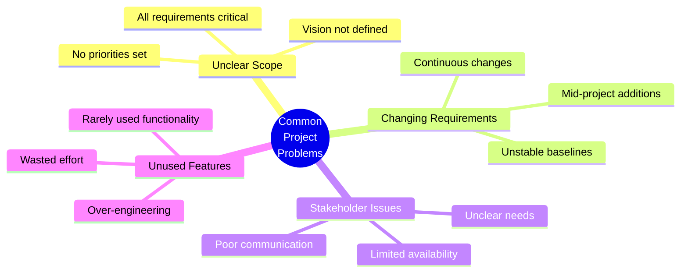

### Impact of Poor Requirements

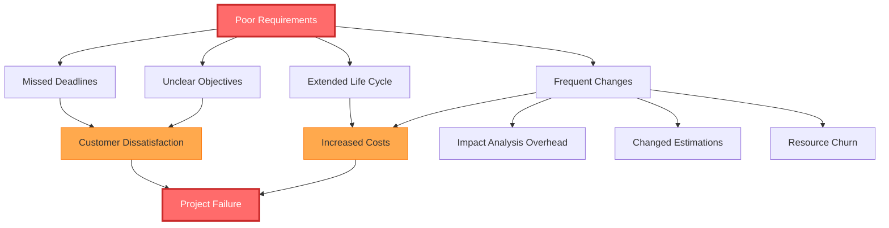

---

## 🔍 Understanding Requirements

### Types of Requirements

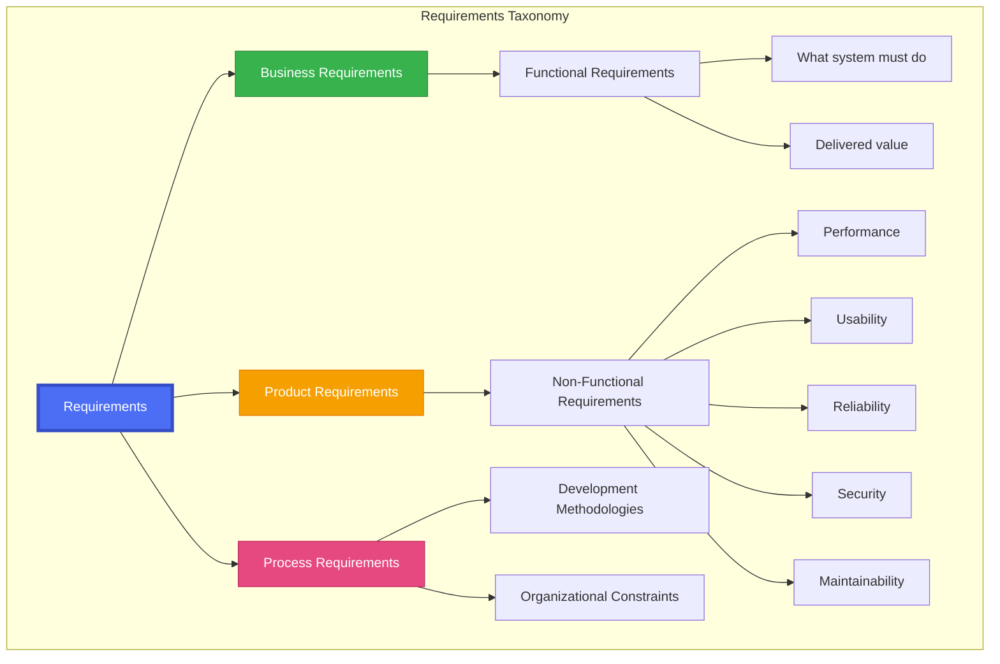

### User Requirement Categories

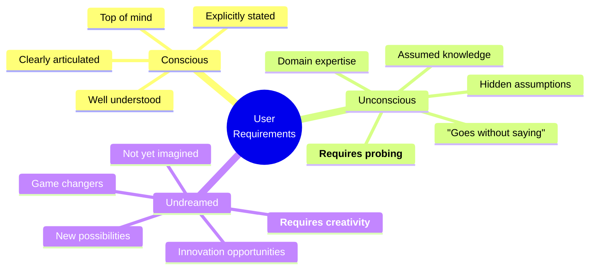

**Key Challenge**: Identifying unconscious and undreamed requirements through:
- ✓ Open-ended questioning
- ✓ No assumptions approach
- ✓ Active listening
- ✓ Detailed documentation
- ✓ Stakeholder validation

---

## 🔄 The Requirements Gathering Process

### Three Core Activities

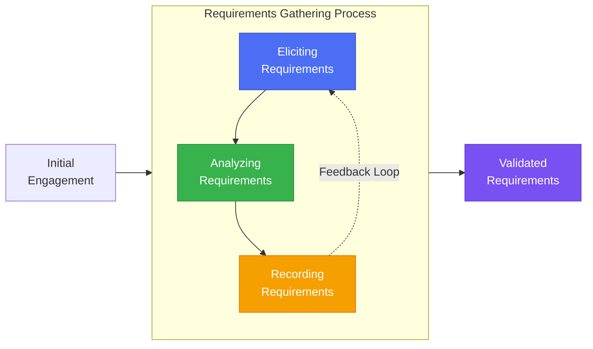

### Detailed Process Flow

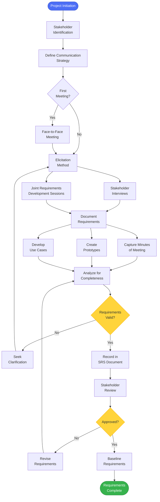

---

## 👥 Key Stakeholders

### Stakeholder Ecosystem

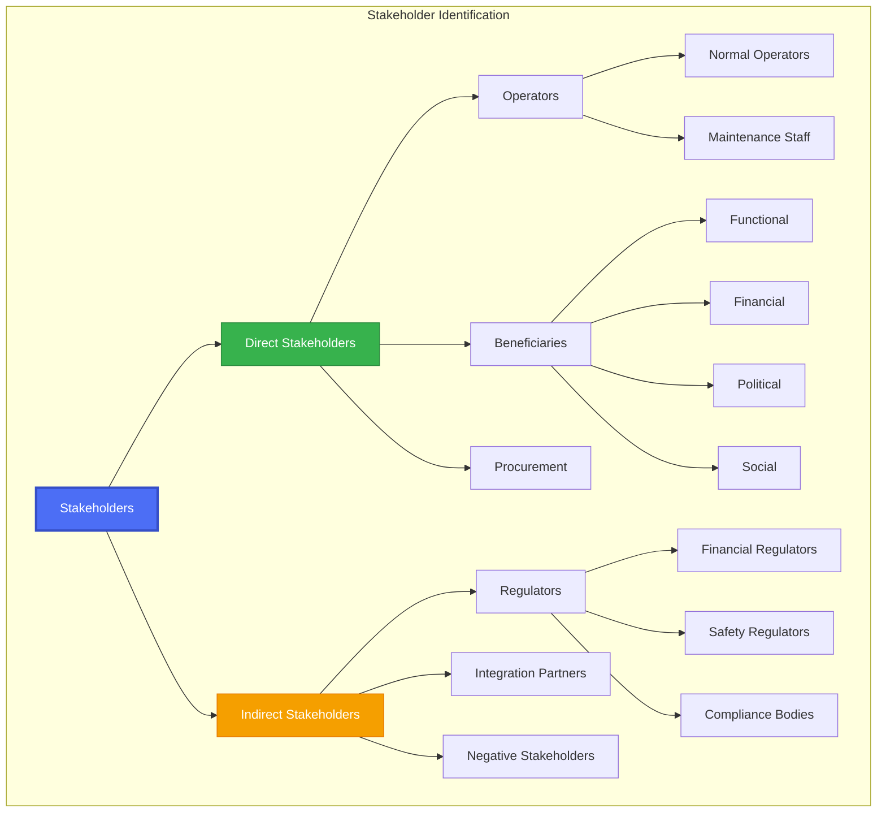

### Elicitation Methods Comparison

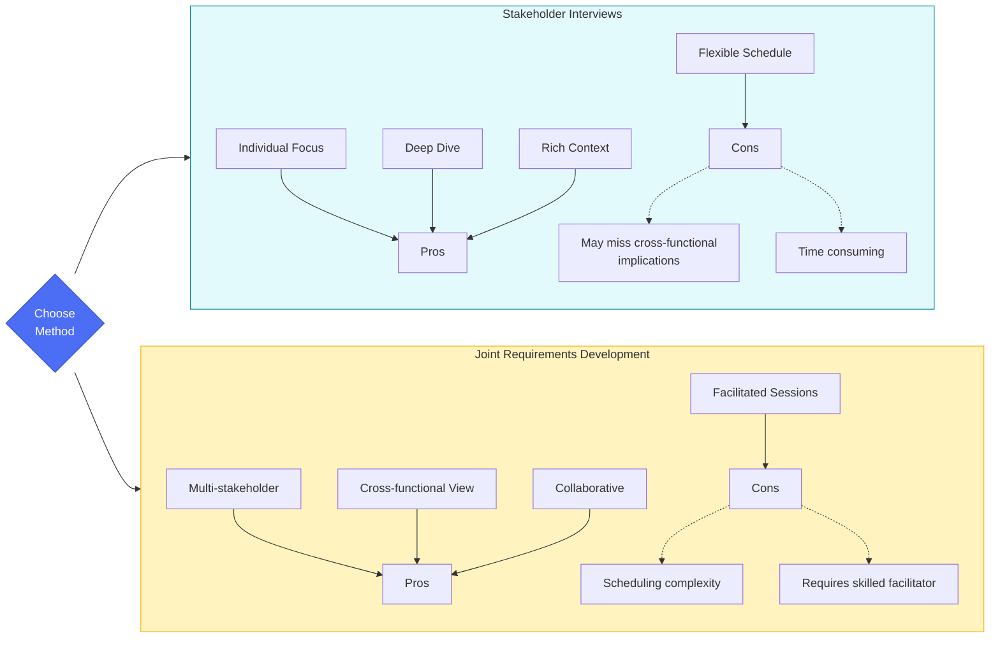

---

## 📊 Requirements Analysis Framework

### Analysis Techniques

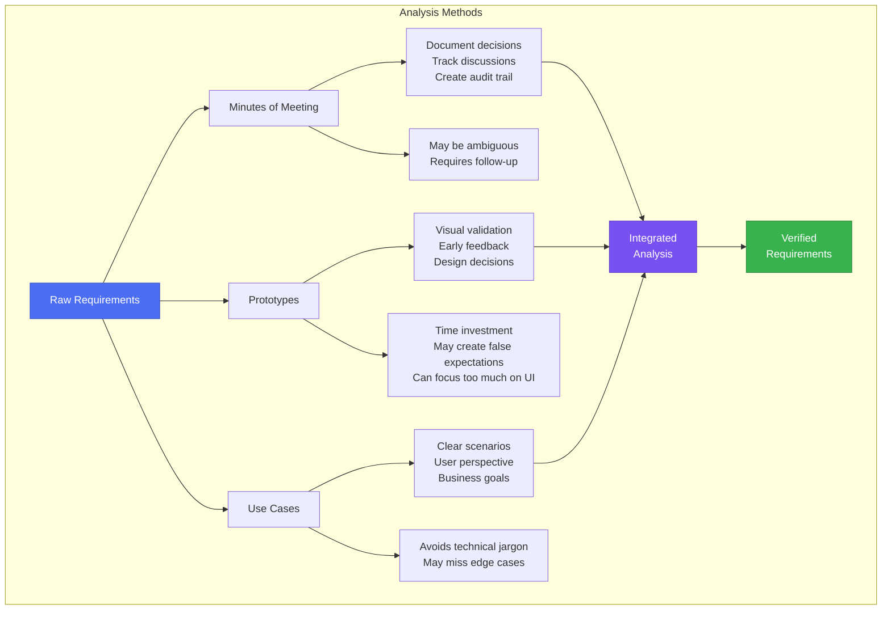

### Requirements Volatility - Root Causes

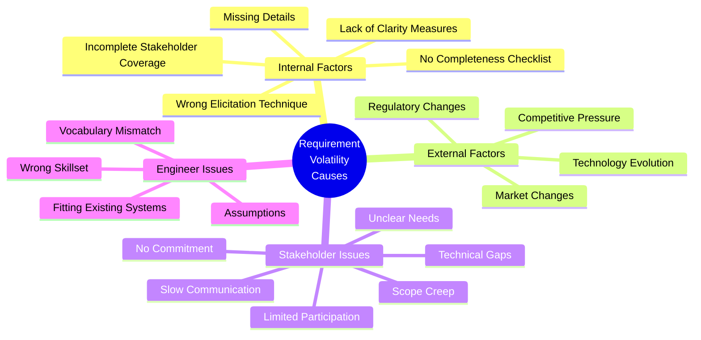

---

## ✨ Characteristics of Quality Requirements

### The SMART + Quality Framework

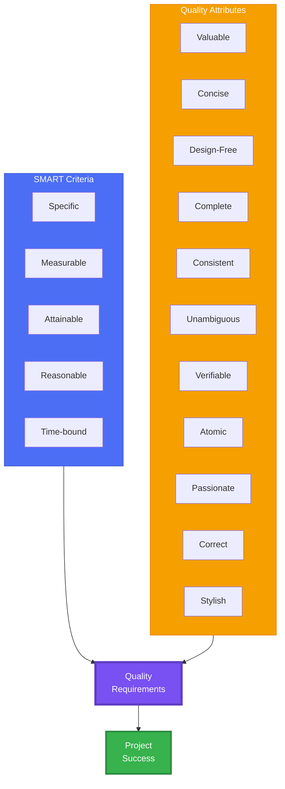

### Detailed Quality Checklist

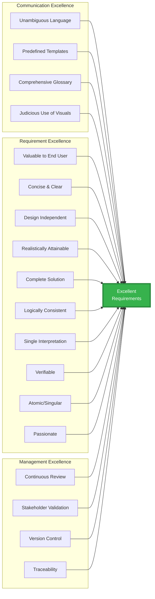

---

## ⚠️ Common Challenges & Solutions

### Issues During Elicitation

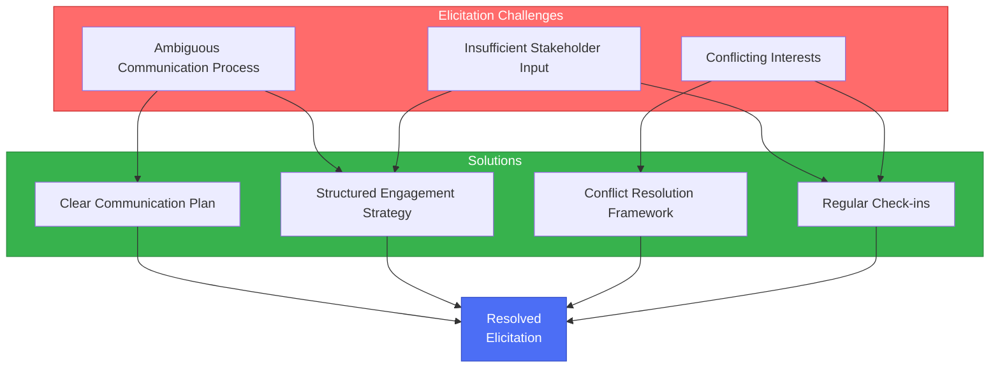

### Issues During Analysis & Documentation

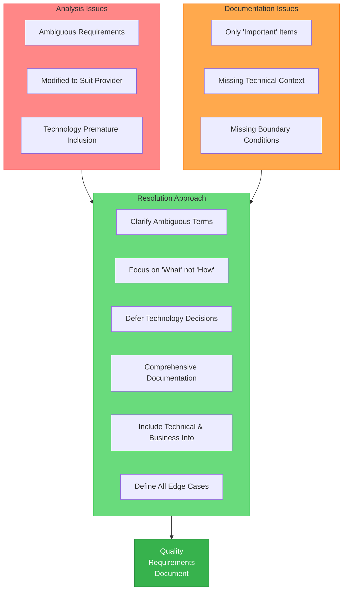

---

## 🏆 Best Practices

### Comprehensive Best Practices Framework

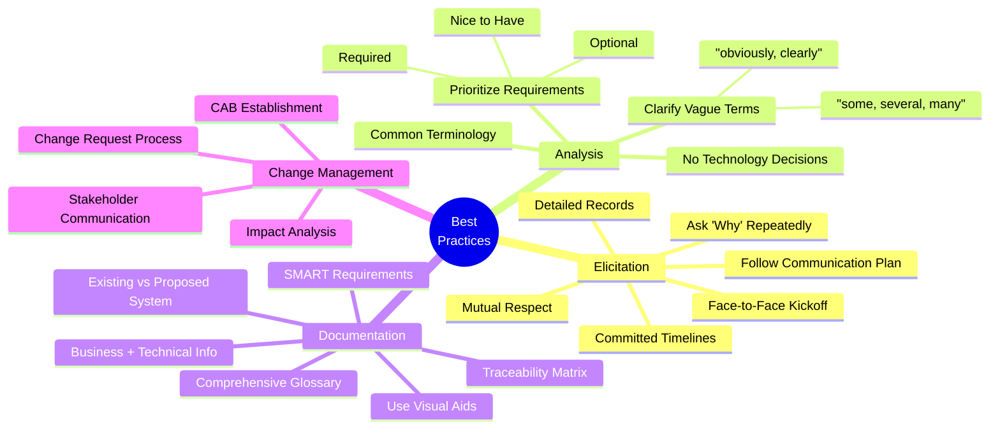

### Requirement Prioritization Matrix

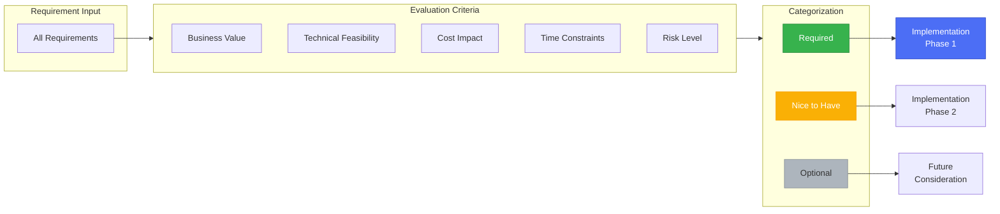

---

## 🔄 Change Management

### Change Request Triggers

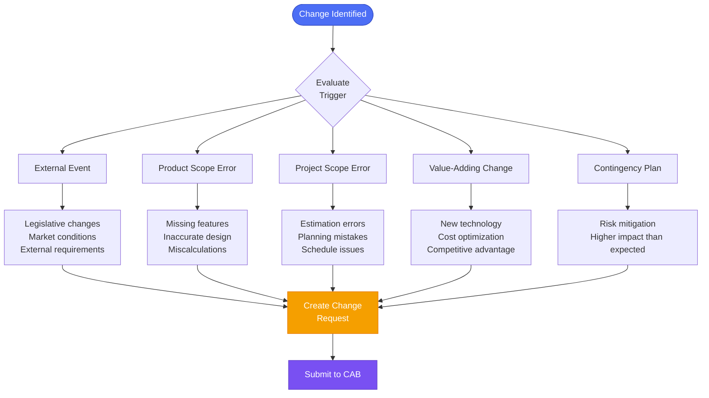

### Change Management Process (6-Step Framework)

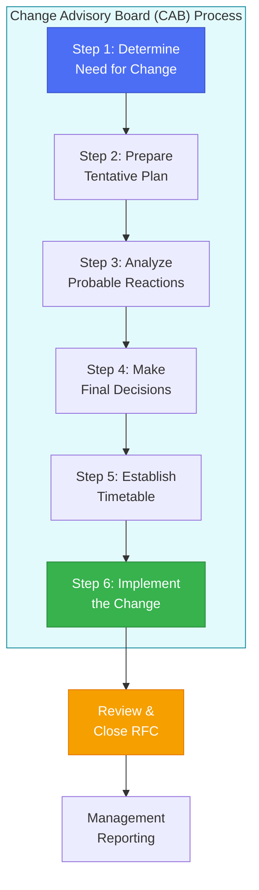

### Change Advisory Board (CAB) Structure

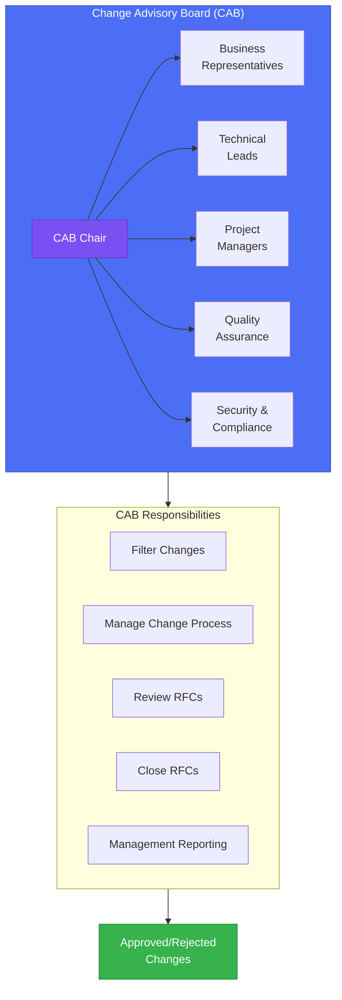

### Change Management Best Practices

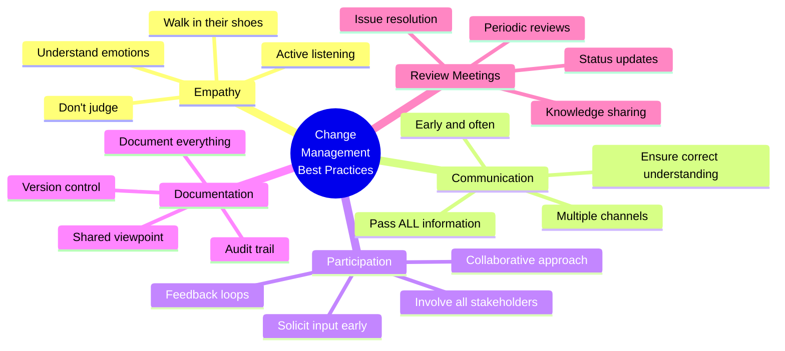

### Detailed Change Workflow

```mermaid
sequenceDiagram
    participant SH as Stakeholder
    participant PM as Project Manager
    participant CAB as Change Advisory Board
    participant BA as Business Analyst
    participant DEV as Development Team
    participant QA as QA Team
    
    SH->>PM: Submit Change Request
    PM->>BA: Analyze Impact
    BA->>BA: Assess Scope, Cost, Time
    BA->>PM: Impact Analysis Report
    
    PM->>CAB: Present Change Request
    Note over CAB: Step 1: Determine Need
    Note over CAB: Step 2: Prepare Plan
    Note over CAB: Step 3: Analyze Reactions
    
    CAB->>CAB: Evaluate Change
    
    alt Change Approved
        Note over CAB: Step 4: Final Decision - APPROVED
        CAB->>PM: Approve with Conditions
        Note over CAB: Step 5: Establish Timetable
        PM->>DEV: Schedule Implementation
        PM->>QA: Plan Testing
        Note over CAB: Step 6: Implement Change
        DEV->>DEV: Implement Changes
        DEV->>QA: Ready for Testing
        QA->>QA: Test Changes
        QA->>PM: Test Results
        PM->>CAB: Implementation Complete
        CAB->>SH: Change Implemented
    else Change Rejected
        Note over CAB: Step 4: Final Decision - REJECTED
        CAB->>PM: Reject with Rationale
        PM->>SH: Change Rejected
    end
    
    CAB->>CAB: Close RFC
    CAB->>CAB: Generate Management Report
```

---

## ☁️ Platform Integration Options

This framework supports integration with both Azure DevOps and GitLab platforms, providing flexibility for organizations using either tool.

---

## 🔷 Option 1: Azure DevOps Integration

### Requirements Management in Azure DevOps

Azure DevOps provides a comprehensive work item tracking system with hierarchical structure perfect for requirements management.

```mermaid
flowchart TB
    subgraph AZURE["Azure DevOps Boards Hierarchy"]
        EPIC[Epics<br/>Strategic Initiatives]
        FEATURE[Features<br/>Major Capabilities]
        US[User Stories<br/>User Requirements]
        TASK[Tasks<br/>Implementation Work]
        BUG[Bugs<br/>Defects]
        
        EPIC --> FEATURE
        FEATURE --> US
        US --> TASK
        US --> BUG
    end
    
    subgraph WORKFLOW["Work Item Lifecycle"]
        NEW[New]
        ACTIVE[Active]
        RESOLVED[Resolved]
        CLOSED[Closed]
        
        NEW --> ACTIVE
        ACTIVE --> RESOLVED
        RESOLVED --> CLOSED
    end
    
    subgraph TRACKING["Tracking & Reporting"]
        QUERIES[Custom Queries]
        BOARDS[Kanban Boards]
        DASHBOARDS[Dashboards]
        REPORTS[Analytics & Reports]
    end
    
    AZURE --> WORKFLOW
    WORKFLOW --> TRACKING
    
    style AZURE fill:#0078d4,stroke:#005a9e,color:#fff
    style WORKFLOW fill:#37b24d,stroke:#2b8a3e,color:#fff
    style TRACKING fill:#f59f00,stroke:#e67700,color:#fff
```

### Azure DevOps Requirements Features

```mermaid
mindmap
  root((Azure DevOps<br/>Requirements<br/>Management))
    Work Item Types
      Epics
      Features
      User Stories
      Tasks
      Bugs
      Custom Types
    Traceability
      Parent-Child Links
      Related Links
      Code Commits
      Pull Requests
      Test Cases
      Builds & Releases
    Collaboration
      @Mentions
      Rich Text Editor
      Attachments
      Comments & Discussions
      Email Notifications
    Customization
      Custom Fields
      Custom States
      Custom Workflows
      Templates
      Process Templates
    Reporting
      Queries
      Charts
      Dashboards
      Analytics Views
      Power BI Integration
```

### Azure DevOps Best Practices

```mermaid
graph TB
    subgraph BP["Best Practices"]
        BP1[Use Work Item<br/>Hierarchy Properly]
        BP2[Link Requirements<br/>to Code & PRs]
        BP3[Implement Branch<br/>Policies]
        BP4[Enable Full<br/>Traceability]
        BP5[Automated<br/>Testing]
        BP6[CI/CD<br/>Integration]
        BP7[Use Tags &<br/>Custom Fields]
        BP8[Regular Backlog<br/>Refinement]
        BP9[Definition of<br/>Done/Ready]
        BP10[Sprint<br/>Planning]
    end
    
    subgraph BENEFITS["Key Benefits"]
        B1[Complete Visibility]
        B2[Change Tracking]
        B3[Impact Analysis]
        B4[Audit Trail]
        B5[Quality Assurance]
        B6[Team Collaboration]
    end
    
    BP --> BENEFITS
    
    style BP fill:#0078d4,stroke:#005a9e,color:#fff
    style BENEFITS fill:#37b24d,stroke:#2b8a3e,color:#fff
```

### Azure DevOps Requirements Lifecycle

```mermaid
flowchart LR
    REQ_GATHER[Requirements<br/>Gathering] --> AZURE_WI[Create Work Items<br/>in Azure Boards]
    
    AZURE_WI --> PRIORITIZE[Backlog<br/>Prioritization]
    
    PRIORITIZE --> SPRINT[Sprint<br/>Planning]
    
    SPRINT --> DEV[Development<br/>Linked to WI]
    
    DEV --> CODE_REVIEW[Code Review<br/>& Pull Request]
    
    CODE_REVIEW --> BUILD[CI/CD<br/>Pipeline]
    
    BUILD --> TEST[Automated<br/>Testing]
    
    TEST --> DEPLOY[Deployment<br/>to Environments]
    
    DEPLOY --> VERIFY[Verification<br/>& Validation]
    
    VERIFY --> CLOSE{Requirement<br/>Satisfied?}
    
    CLOSE -->|Yes| DONE[Close Work Item]
    CLOSE -->|No| FEEDBACK[Feedback Loop]
    
    FEEDBACK --> AZURE_WI
    
    style AZURE_WI fill:#0078d4,stroke:#005a9e,color:#fff
    style DONE fill:#37b24d,stroke:#2b8a3e,color:#fff
```

### Azure DevOps Implementation Steps

| Step | Action | Details |
|------|--------|---------|
| 1 | **Setup Organization** | Create Azure DevOps organization and projects |
| 2 | **Configure Process** | Choose Agile, Scrum, or CMMI process template |
| 3 | **Define Work Item Types** | Customize fields, states, and workflows |
| 4 | **Create Area & Iteration Paths** | Structure your project hierarchy |
| 5 | **Setup Boards** | Configure Kanban boards and backlogs |
| 6 | **Configure Queries** | Create custom queries for reporting |
| 7 | **Enable Notifications** | Setup email and team notifications |
| 8 | **Integrate Repos** | Link code repositories for traceability |
| 9 | **Setup Pipelines** | Configure CI/CD with work item integration |
| 10 | **Create Dashboards** | Build visualization and reporting dashboards |

---

## 🦊 Option 2: GitLab Integration

### Requirements Management in GitLab

GitLab provides a modern, unified platform for requirements management through Work Items, Issues, and native Requirements features (Ultimate tier).

```mermaid
flowchart TB
    subgraph GITLAB["GitLab Requirements Structure"]
        EPIC[Epics<br/>Strategic Goals]
        ISSUE[Issues<br/>Requirements & Tasks]
        REQ[Requirements<br/>Ultimate Tier]
        MR[Merge Requests<br/>Code Changes]
        TEST[Test Cases<br/>Quality Assurance]
        
        EPIC --> ISSUE
        ISSUE --> REQ
        ISSUE --> MR
        REQ --> TEST
        MR --> TEST
    end
    
    subgraph STATES["Requirement States"]
        OPEN[Open]
        SATISFIED[Satisfied]
        FAILED[Failed]
        ARCHIVED[Archived]
        
        OPEN --> SATISFIED
        OPEN --> FAILED
        OPEN --> ARCHIVED
        SATISFIED --> ARCHIVED
    end
    
    subgraph TRACKING["GitLab Tracking"]
        LABELS[Labels & Scoped Labels]
        MILESTONE[Milestones]
        BOARDS[Issue Boards]
        ROADMAP[Roadmaps]
    end
    
    GITLAB --> STATES
    STATES --> TRACKING
    
    style GITLAB fill:#fc6d26,stroke:#e24329,color:#fff
    style STATES fill:#37b24d,stroke:#2b8a3e,color:#fff
    style TRACKING fill:#f59f00,stroke:#e67700,color:#fff
```

### GitLab Work Items Architecture

```mermaid
graph TB
    subgraph WORKITEMS["GitLab Work Items (Modern Approach)"]
        WI[Work Items<br/>Unified Model]
        
        WI --> EPIC_WI[Epic]
        WI --> ISSUE_WI[Issue]
        WI --> TASK_WI[Task]
        WI --> INC_WI[Incident]
        WI --> REQ_WI[Requirement]
        WI --> TEST_WI[Test Case]
        WI --> OKR_WI[Objective/Key Result]
        WI --> TICKET_WI[Ticket]
    end
    
    subgraph WIDGETS["Customizable Widgets"]
        W1[Assignees]
        W2[Description]
        W3[Labels]
        W4[Milestone]
        W5[Hierarchy]
        W6[Notes/Comments]
        W7[Due Date]
        W8[Health Status]
        W9[Weight]
        W10[Iteration]
        W11[Linked Items]
    end
    
    WORKITEMS --> WIDGETS
    
    style WORKITEMS fill:#fc6d26,stroke:#e24329,color:#fff
    style WIDGETS fill:#4c6ef5,stroke:#364fc7,color:#fff
```

### GitLab Requirements Features Matrix

```mermaid
mindmap
  root((GitLab<br/>Requirements<br/>Management))
    Native Requirements
      Create Requirements
      Edit & Archive
      Search & Filter
      Import from CSV
      Export to CSV
      CI/CD Integration
      Status: Satisfied/Failed/Missing
    Work Items
      Flexible Types
      Custom Widgets
      Hierarchical Structure
      Cross-Project Links
      Rich Descriptions
      Markdown Support
    Traceability
      Link to Issues
      Link to Merge Requests
      Link to Epics
      Test Case Association
      CI/CD Pipeline Status
      Automated Satisfaction
    Collaboration
      Comments & Notes
      @Mentions
      Assignees
      Due Dates
      Health Status
      Labels & Milestones
    Integration
      CI/CD Pipelines
      requirements.json Artifact
      Automated Testing
      API Access
      Webhooks
      External Trackers
```

### GitLab Requirements Workflow

```mermaid
sequenceDiagram
    participant BA as Business Analyst
    participant PM as Project Manager
    participant DEV as Developer
    participant CI as CI/CD Pipeline
    participant QA as QA Engineer
    
    BA->>PM: Create Requirement in GitLab
    Note over BA,PM: Plan > Requirements > New
    
    PM->>PM: Link to Epic/Issue
    PM->>PM: Set Status: Open
    
    PM->>DEV: Assign to Sprint/Milestone
    DEV->>DEV: Create Issue from Requirement
    DEV->>DEV: Develop Feature
    
    DEV->>CI: Create Merge Request
    Note over DEV,CI: Link MR to Requirement
    
    CI->>CI: Run Pipeline
    CI->>CI: Execute Tests
    
    alt Tests Pass
        CI->>CI: Generate requirements.json
        Note over CI: {"requirement_id": "passed"}
        CI->>PM: Mark Requirement as Satisfied
        PM->>BA: Requirement Validated
    else Tests Fail
        CI->>PM: Mark Requirement as Failed
        PM->>DEV: Fix Issues
        DEV->>CI: New Merge Request
    end
    
    QA->>QA: Verify Requirement
    QA->>PM: Final Approval
    PM->>PM: Archive Requirement
```

### GitLab CI/CD Requirements Integration

```mermaid
flowchart TD
    START[Requirement Created] --> LINK[Link to Issue/MR]
    
    LINK --> DEV_START[Development Begins]
    
    DEV_START --> MR[Merge Request<br/>Created]
    
    MR --> PIPELINE[CI Pipeline<br/>Triggered]
    
    PIPELINE --> TEST[Automated<br/>Tests Run]
    
    TEST --> JSON{Generate<br/>requirements.json}
    
    JSON -->|All Pass| ALL_PASS["All tests passed<br/>*: passed"]
    JSON -->|Specific| SPECIFIC["Specific results<br/>1: passed, 2: failed"]
    
    ALL_PASS --> ARTIFACT[Upload as<br/>CI Artifact]
    SPECIFIC --> ARTIFACT
    
    ARTIFACT --> UPDATE[GitLab Updates<br/>Requirement Status]
    
    UPDATE --> SATISFIED[Requirement<br/>Marked Satisfied]
    UPDATE --> FAILED[Requirement<br/>Marked Failed]
    
    SATISFIED --> ARCHIVE{Archive?}
    FAILED --> REWORK[Rework Required]
    
    REWORK --> DEV_START
    ARCHIVE -->|Yes| ARCHIVED[Archived]
    
    style START fill:#fc6d26,stroke:#e24329,color:#fff
    style SATISFIED fill:#37b24d,stroke:#2b8a3e,color:#fff
    style FAILED fill:#ff6b6b,stroke:#c92a2a,color:#fff
    style ARCHIVED fill:#adb5bd,stroke:#868e96
```

### GitLab Requirements Best Practices

```mermaid
graph LR
    subgraph BP["Best Practices"]
        BP1[Use Requirements<br/>for Compliance]
        BP2[Link to Work<br/>Items]
        BP3[Automate with<br/>CI/CD]
        BP4[Use CSV<br/>Import/Export]
        BP5[Label &<br/>Categorize]
        BP6[Regular<br/>Reviews]
        BP7[Archive When<br/>Complete]
        BP8[Document Test<br/>Criteria]
        BP9[Use Scoped<br/>Labels]
        BP10[Enable<br/>Notifications]
    end
    
    subgraph BENEFITS["Key Benefits"]
        B1[Compliance Ready]
        B2[Full Traceability]
        B3[Automated Validation]
        B4[Single Platform]
        B5[DevSecOps Native]
        B6[Cost Effective]
    end
    
    BP --> BENEFITS
    
    style BP fill:#fc6d26,stroke:#e24329,color:#fff
    style BENEFITS fill:#37b24d,stroke:#2b8a3e,color:#fff
```

### GitLab Requirements Implementation Guide

```mermaid
flowchart TD
    INIT[Initialize GitLab<br/>Requirements] --> CHECK{Tier<br/>Level?}
    
    CHECK -->|Ultimate| NATIVE[Use Native<br/>Requirements Feature]
    CHECK -->|Premium/Free| WORKITEMS[Use Work Items<br/>& Issues]
    
    NATIVE --> CONFIG_NAT[Configure Requirements<br/>in Project]
    WORKITEMS --> CONFIG_WI[Configure Work<br/>Item Types]
    
    CONFIG_NAT --> CREATE_REQ[Create Requirements]
    CONFIG_WI --> CREATE_ISS[Create Issues as<br/>Requirements]
    
    CREATE_REQ --> LINK_NAT[Link to Epics<br/>& Issues]
    CREATE_ISS --> LINK_ISS[Use Labels &<br/>Relationships]
    
    LINK_NAT --> CI_SETUP[Setup CI/CD<br/>Integration]
    LINK_ISS --> CI_SETUP
    
    CI_SETUP --> YAML[Add requirements<br/>job to .gitlab-ci.yml]
    
    YAML --> ARTIFACT[Configure<br/>requirements.json]
    
    ARTIFACT --> TEST[Write Automated<br/>Tests]
    
    TEST --> VALIDATE[Pipeline Validates<br/>Requirements]
    
    VALIDATE --> REPORT[View Requirements<br/>Status]
    
    REPORT --> ITERATE[Iterate & Improve]
    
    style INIT fill:#fc6d26,stroke:#e24329,color:#fff
    style VALIDATE fill:#37b24d,stroke:#2b8a3e,color:#fff
```

### GitLab Implementation Steps

| Step | Action | Details |
|------|--------|---------|
| 1 | **Verify License Tier** | Requirements feature requires GitLab Ultimate tier |
| 2 | **Enable Requirements** | Navigate to Plan > Requirements in project |
| 3 | **Import Existing** | Use CSV import for bulk requirement creation |
| 4 | **Create Work Item Types** | Configure custom work items for requirements |
| 5 | **Setup Labels** | Create scoped labels for categorization |
| 6 | **Configure Milestones** | Align requirements with delivery milestones |
| 7 | **Link to Epics** | Establish hierarchy from epics to requirements |
| 8 | **Setup CI/CD Integration** | Add requirements job to `.gitlab-ci.yml` |
| 9 | **Create requirements.json** | Configure automated requirement validation |
| 10 | **Enable Notifications** | Setup email notifications for requirement updates |
| 11 | **Create Dashboards** | Use issue boards and roadmaps for visualization |
| 12 | **Export Reports** | Regularly export requirements to CSV for stakeholders |

### GitLab CI/CD Configuration Example

```yaml
# .gitlab-ci.yml example for requirements validation
requirements_confirmation:
  stage: test
  rules:
    - if: '$CI_HAS_OPEN_REQUIREMENTS == "true"'
      when: manual
    - when: never
  allow_failure: false
  script:
    - mkdir tmp
    # Mark all requirements as passed
    - echo '{"*":"passed"}' > tmp/requirements.json
    # OR mark specific requirements
    # - echo '{"1":"passed", "2":"failed", "3":"passed"}' > tmp/requirements.json
  artifacts:
    reports:
      requirements: tmp/requirements.json
```

---

## 🔄 Platform Comparison Matrix

### Azure DevOps vs GitLab for Requirements Management

```mermaid
graph TB
    subgraph COMPARISON["Feature Comparison"]
        direction TB
        
        subgraph AZDO["Azure DevOps Strengths"]
            AZ1[Mature Work Item System]
            AZ2[Extensive Customization]
            AZ3[Process Templates]
            AZ4[Power BI Integration]
            AZ5[Enterprise Reporting]
            AZ6[Microsoft Ecosystem]
        end
        
        subgraph GL["GitLab Strengths"]
            GL1[Single Platform Solution]
            GL2[Native CI/CD Integration]
            GL3[DevSecOps Native]
            GL4[Modern Work Items]
            GL5[Open Source Option]
            GL6[Cost Effective]
        end
        
        subgraph COMMON["Common Features"]
            C1[Hierarchical Structure]
            C2[Traceability]
            C3[Custom Fields]
            C4[API Access]
            C5[Boards & Visualization]
            C6[Collaboration Tools]
        end
    end
    
    AZDO --> COMMON
    GL --> COMMON
    
    style AZDO fill:#0078d4,stroke:#005a9e,color:#fff
    style GL fill:#fc6d26,stroke:#e24329,color:#fff
    style COMMON fill:#37b24d,stroke:#2b8a3e,color:#fff
```

| Feature | Azure DevOps | GitLab | Notes |
|---------|--------------|--------|-------|
| **Native Requirements** | ✅ Work Items | ✅ Requirements (Ultimate) | Both support hierarchical requirements |
| **Customization** | ⭐⭐⭐⭐⭐ | ⭐⭐⭐⭐ | Azure DevOps has more extensive customization |
| **CI/CD Integration** | ✅ Azure Pipelines | ⭐ Native GitLab CI | GitLab has tighter integration |
| **Traceability** | ✅ Full | ✅ Full | Both offer complete traceability |
| **Import/Export** | ✅ CSV, Excel | ✅ CSV | Similar capabilities |
| **Reporting** | ⭐⭐⭐⭐⭐ | ⭐⭐⭐⭐ | Azure DevOps + Power BI more powerful |
| **License Cost** | Per User | Per User (Tiered) | GitLab has free tier with limitations |
| **Single Platform** | ❌ Separate | ✅ Unified | GitLab is fully integrated |
| **Open Source** | ❌ | ✅ Community Edition | GitLab offers self-hosted option |
| **Learning Curve** | Medium | Medium-Low | GitLab slightly easier for developers |

### Decision Framework

```mermaid
flowchart TD
    START{Choose Platform} --> Q1{Already Using<br/>Microsoft Tools?}
    
    Q1 -->|Yes| Q2{Need Extensive<br/>Customization?}
    Q1 -->|No| Q3{Need Single<br/>DevOps Platform?}
    
    Q2 -->|Yes| AZDO[Choose<br/>Azure DevOps]
    Q2 -->|No| Q3
    
    Q3 -->|Yes| GL[Choose<br/>GitLab]
    Q3 -->|No| Q4{Budget<br/>Constraints?}
    
    Q4 -->|Tight| GL
    Q4 -->|Flexible| Q5{Power BI<br/>Required?}
    
    Q5 -->|Yes| AZDO
    Q5 -->|No| EITHER[Either Platform<br/>Works Well]
    
    style AZDO fill:#0078d4,stroke:#005a9e,color:#fff
    style GL fill:#fc6d26,stroke:#e24329,color:#fff
    style EITHER fill:#37b24d,stroke:#2b8a3e,color:#fff
```

---

## 📈 Success Metrics & KPIs

### Key Performance Indicators

```mermaid
mindmap
  root((Requirements<br/>Success<br/>Metrics))
    Quality Metrics
      Requirements Completeness
      Defect Density
      Ambiguity Index
      Review Coverage
    Process Metrics
      Elicitation Time
      Analysis Duration
      Review Cycles
      Approval Time
    Change Metrics
      Change Request Rate
      Approval Ratio
      Implementation Time
      Impact Scope
    Stakeholder Metrics
      Satisfaction Score
      Participation Rate
      Response Time
      Feedback Quality
    Project Metrics
      On-Time Delivery
      Scope Creep %
      Budget Variance
      Requirement Stability
```

---

## 📚 Documentation Templates

### Software Requirements Specification (SRS) Structure

```mermaid
flowchart TD
    SRS[SRS Document]
    
    SRS --> S1[1. Introduction]
    SRS --> S2[2. Overall Description]
    SRS --> S3[3. System Features]
    SRS --> S4[4. External Interface Requirements]
    SRS --> S5[5. Non-Functional Requirements]
    SRS --> S6[6. Other Requirements]
    
    S1 --> S1A[Purpose]
    S1 --> S1B[Scope]
    S1 --> S1C[Definitions & Acronyms]
    S1 --> S1D[References]
    
    S2 --> S2A[Product Perspective]
    S2 --> S2B[User Characteristics]
    S2 --> S2C[Constraints]
    S2 --> S2D[Assumptions]
    
    S3 --> S3A[Functional Requirements]
    S3 --> S3B[Use Cases]
    S3 --> S3C[User Stories]
    
    S5 --> S5A[Performance]
    S5 --> S5B[Security]
    S5 --> S5C[Reliability]
    S5 --> S5D[Maintainability]
    
    style SRS fill:#4c6ef5,stroke:#364fc7,stroke-width:4px,color:#fff
```

---

## 🎓 Conclusion

### Key Takeaways

```mermaid
mindmap
  root((Requirements<br/>Management<br/>Success))
    No Silver Bullet
      Multiple approaches needed
      Context matters
      Continuous improvement
    Communication is Key
      Clear stakeholder engagement
      Regular updates
      Documentation
      Mutual understanding
    Change is Inevitable
      Proper change management
      CAB structure
      Impact analysis
      Stakeholder buy-in
    Quality over Quantity
      SMART requirements
      Verifiable criteria
      Traceability
      Continuous validation
    Tool Integration
      Azure DevOps
      Automation
      CI/CD
      Reporting
```

### Success Formula

```mermaid
flowchart LR
    A[Clear<br/>Requirements] --> B[Effective<br/>Communication]
    B --> C[Proper<br/>Analysis]
    C --> D[Quality<br/>Documentation]
    D --> E[Change<br/>Management]
    E --> F[Stakeholder<br/>Engagement]
    F --> G[Azure DevOps<br/>Integration]
    G --> SUCCESS[Project<br/>Success]
    
    style SUCCESS fill:#37b24d,stroke:#2b8a3e,stroke-width:4px,color:#fff
    style A fill:#4c6ef5,stroke:#364fc7,color:#fff
```

---

## 📞 Getting Started Checklist

### Implementation Roadmap

- [ ] **Identify Stakeholders**: Map all direct and indirect stakeholders
- [ ] **Define Communication Strategy**: Establish channels and protocols
- [ ] **Schedule Kickoff Meeting**: Face-to-face initial engagement
- [ ] **Select Elicitation Methods**: Choose between interviews, JRD, or hybrid
- [ ] **Create Documentation Templates**: Prepare SRS, MOM, and use case templates
- [ ] **Establish CAB**: Form Change Advisory Board with representatives
- [ ] **Set Up Azure DevOps**: Configure boards, workflows, and dashboards
- [ ] **Define Quality Criteria**: Establish SMART and quality checklists
- [ ] **Plan Review Cycles**: Schedule regular requirement reviews
- [ ] **Implement Change Process**: Roll out change management framework
- [ ] **Train Team**: Ensure all team members understand the process
- [ ] **Monitor & Improve**: Track metrics and continuously refine

---

## 🔗 Additional Resources

### Recommended Reading
- BABOK (Business Analysis Body of Knowledge)
- IEEE 830 - Software Requirements Specifications
- IIBA Standards for Requirements Engineering
- Agile Requirements Documentation
- Azure DevOps Documentation

### Tools & Templates
- Azure DevOps Boards
- Requirements Traceability Matrix Template
- Change Request Form
- MOM Template
- Use Case Template
- Stakeholder Analysis Matrix

---

---

## � Additional Documentation

### Companion Guides

1. **[Implementation Guide](../_docs/IMPLEMENTATION_GUIDE.md)** - Quick start guide for customers with GitLab-specific recommendations
2. **[GitLab Quick Reference](../_docs/GITLAB_QUICK_REFERENCE.md)** - Cheat sheet for GitLab requirements management commands and workflows

### Document Suite Overview

```mermaid
graph LR
    MAIN[README.md<br/>Main Framework] --> IMPL[IMPLEMENTATION_GUIDE.md<br/>Quick Start]
    MAIN --> QUICK[GITLAB_QUICK_REFERENCE.md<br/>Cheat Sheet]
    
    IMPL --> TEAM[For Project Teams<br/>& Managers]
    QUICK --> DEV[For Developers<br/>& Engineers]
    MAIN --> EXEC[For Executives<br/>& Stakeholders]
    
    style MAIN fill:#4c6ef5,stroke:#364fc7,color:#fff
    style IMPL fill:#37b24d,stroke:#2b8a3e,color:#fff
    style QUICK fill:#fc6d26,stroke:#e24329,color:#fff
```

---

## 🎯 Getting Started Roadmap

### For Different Audiences

**Executives & Stakeholders:**
1. Read [Executive Summary](#executive-summary)
2. Review [Platform Comparison Matrix](#platform-comparison-matrix)
3. Make platform decision
4. Review [Success Metrics](#success-metrics--kpis)

**Project Managers & BAs:**
1. Read complete [README.md](README.md)
2. Follow [Implementation Guide](IMPLEMENTATION_GUIDE.md)
3. Setup pilot project
4. Train team

**Developers & Engineers:**
1. Review [GitLab Quick Reference](GITLAB_QUICK_REFERENCE.md)
2. Configure CI/CD integration
3. Start linking code to requirements
4. Automate validation

---

## �📄 Document Control

| Version | Date | Author | Changes |
|---------|------|--------|---------|
| 1.0 | 10/11/2025 | Pavleen Bali | Initial comprehensive framework with visual diagrams |
| 1.1 | 10/11/2025 | Pavleen Bali | Added GitLab Option 2, comparison matrix, implementation guides |

---

## 🌟 What's Included in This Package

✅ **README.md** (This Document)
- Complete requirements management framework
- 30+ professional Mermaid diagrams
- Azure DevOps AND GitLab integration options
- Best practices and methodologies
- Change management processes

✅ **IMPLEMENTATION_GUIDE.md**
- Platform selection guidance
- Quick start for customers (GitLab)
- Week-by-week implementation roadmap
- Templates and examples
- Migration strategies

✅ **GITLAB_QUICK_REFERENCE.md**
- GitLab commands and workflows
- CI/CD configuration examples
- API reference
- Labels and automation
- Troubleshooting guide

---

**© 2025 Microsoft Global Delivery - Requirements Management Framework**

*This comprehensive documentation suite provides everything needed for enterprise-grade requirements gathering and change management. For questions or feedback, please contact your engagement manager.*

**Next Steps:**
1. Review this README for overall framework
2. Check [Implementation Guide](../_docs/IMPLEMENTATION_GUIDE.md) for customer-specific recommendations
3. Use [GitLab Quick Reference](../_docs/GITLAB_QUICK_REFERENCE.md) as daily cheat sheet
