# Standard Statement of Work (SOW) Mapping Workflow
### A Comprehensive Guide for SOW-to-Requirements Traceability

---

## 📋 Table of Contents

1. [Executive Summary](#-executive-summary)
2. [Introduction](#-introduction)
3. [SOW Structure Overview](#-sow-structure-overview)
4. [SOW Mapping Workflow](#-sow-mapping-workflow)
5. [SOW to Requirements Mapping Process](#-sow-to-requirements-mapping-process)
6. [Deliverable Tracking Framework](#-deliverable-tracking-framework)
7. [Traceability Matrix](#-traceability-matrix)
8. [Best Practices](#-best-practices)
9. [Templates](#-templates)
10. [Integration with Requirements Management](#-integration-with-requirements-management)
11. [Tool Integration (Confluence & Microsoft Loop)](#-tool-integration-confluence--microsoft-loop)
12. [Success Metrics](#-success-metrics)
13. [Document Control](#-document-control)

---

## 🎯 Executive Summary

**Purpose**: This document provides a standardized workflow for mapping Statement of Work (SOW) commitments to project requirements, ensuring complete traceability from contractual obligations to technical deliverables.

**Target Audience**: Project Managers, Engagement Managers, Business Analysts, Technical Leads, and Account Managers responsible for SOW delivery.

**Key Benefits**:
- ✅ Complete SOW-to-requirement traceability
- ✅ Reduced scope ambiguity and disputes
- ✅ Clear deliverable acceptance criteria
- ✅ Automated tracking and reporting
- ✅ Improved stakeholder confidence
- ✅ Ready-to-use templates for Confluence and Microsoft Loop

---

## 📖 Introduction

### The SOW Challenge

Statement of Work documents are contractual commitments that must be meticulously tracked and delivered. Common challenges include:

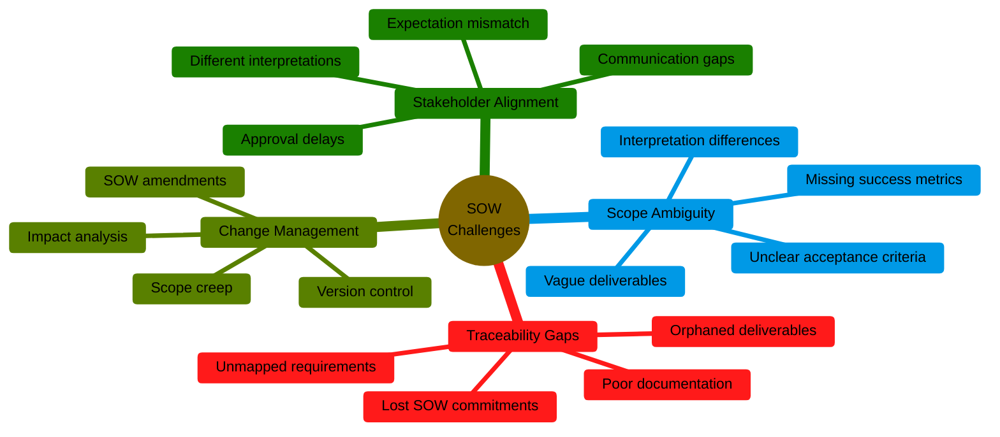

### Why SOW Mapping Matters

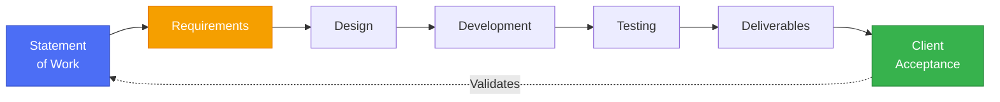

---

## 📄 SOW Structure Overview

### Standard SOW Components

```mermaid
flowchart TB
    subgraph SOW["Statement of Work Structure"]
        HEADER[Header Section]
        EXEC[Executive Summary]
        SCOPE[Scope of Work]
        DELIVER[Deliverables]
        TIMELINE[Timeline & Milestones]
        RESOURCE[Resources & Staffing]
        TERMS[Terms & Conditions]
        ACCEPT[Acceptance Criteria]
    end
    
    HEADER --> H1[Project Title]
    HEADER --> H2[Contract Number]
    HEADER --> H3[Parties Involved]
    HEADER --> H4[Effective Date]
    
    EXEC --> E1[Project Overview]
    EXEC --> E2[Business Objectives]
    EXEC --> E3[Success Criteria]
    
    SCOPE --> S1[In Scope]
    SCOPE --> S2[Out of Scope]
    SCOPE --> S3[Assumptions]
    SCOPE --> S4[Constraints]
    
    DELIVER --> D1[Technical Deliverables]
    DELIVER --> D2[Documentation]
    DELIVER --> D3[Training]
    DELIVER --> D4[Support]
    
    TIMELINE --> T1[Project Phases]
    TIMELINE --> T2[Key Milestones]
    TIMELINE --> T3[Deadlines]
    
    ACCEPT --> A1[Definition of Done]
    ACCEPT --> A2[Quality Criteria]
    ACCEPT --> A3[Sign-off Process]
    
    style SOW fill:#4c6ef5,stroke:#364fc7,color:#fff
    style DELIVER fill:#37b24d,stroke:#2b8a3e,color:#fff
    style ACCEPT fill:#f59f00,stroke:#e67700,color:#fff
```

### SOW Hierarchy

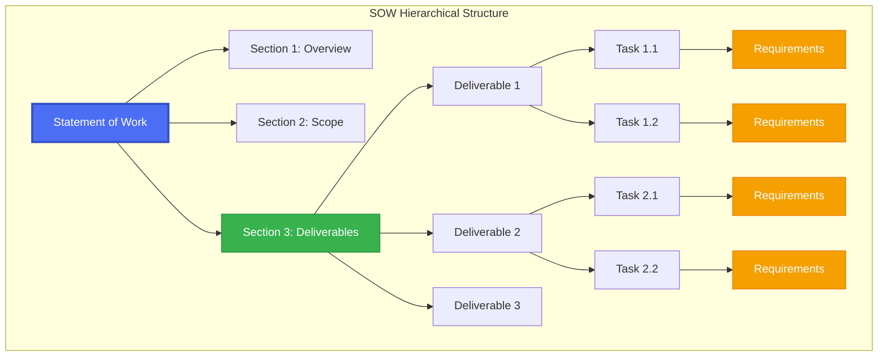

---

## 🔄 SOW Mapping Workflow

### End-to-End SOW Mapping Process

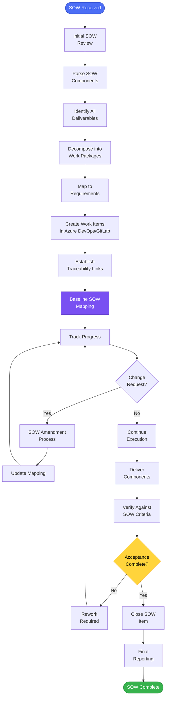

### Workflow Phases Detailed

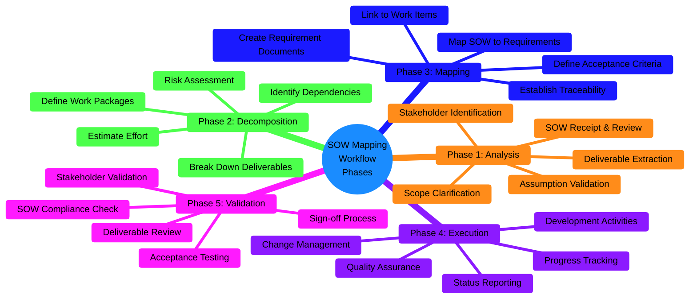

---

## 🗺️ SOW to Requirements Mapping Process

### Mapping Methodology

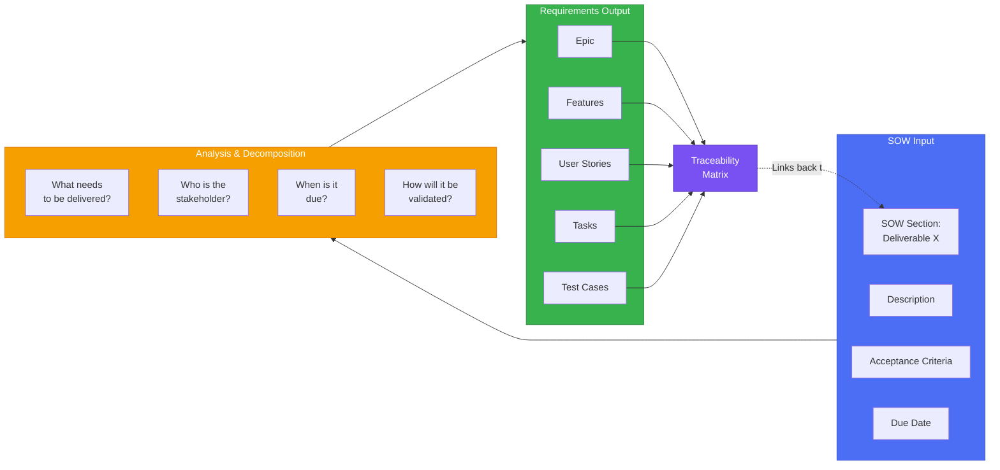

### Mapping Rules

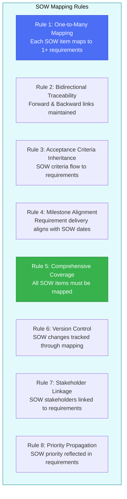

### Detailed Mapping Steps

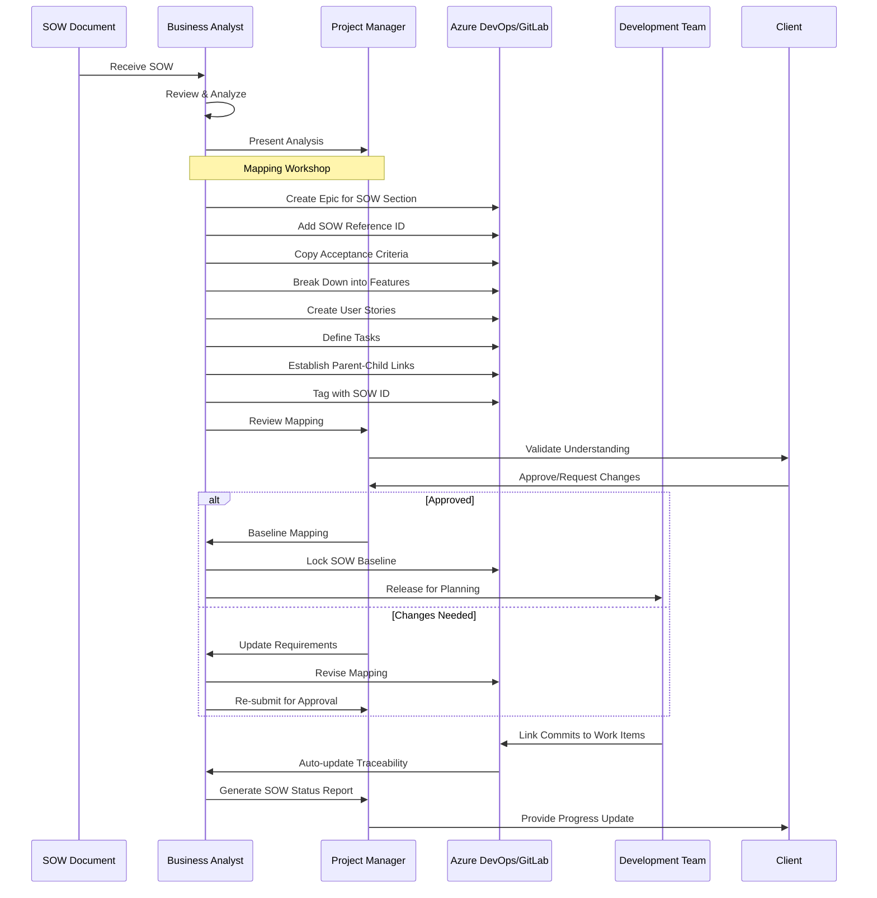

---

## 📦 Deliverable Tracking Framework

### Deliverable Lifecycle

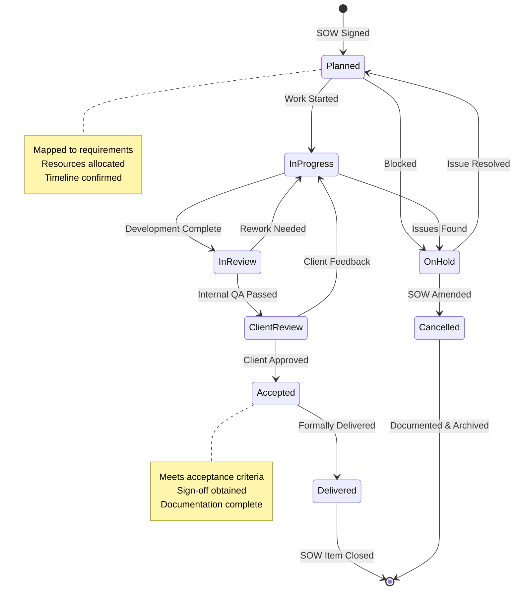

### Progress Tracking Dashboard

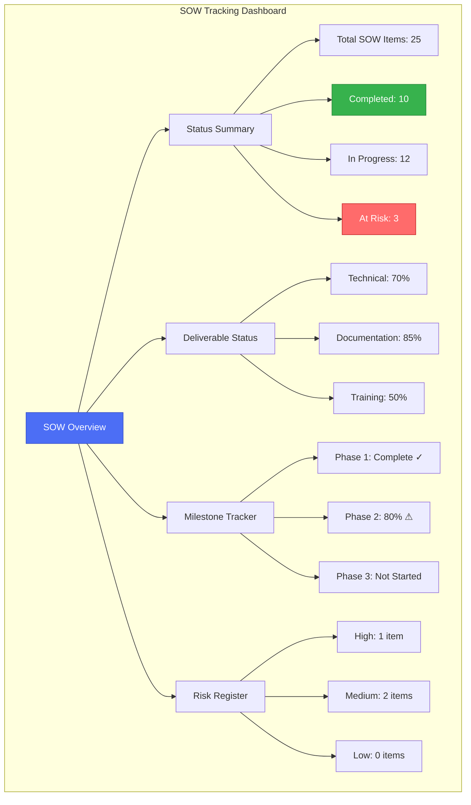

---

## 🔗 Traceability Matrix

### SOW Traceability Matrix Structure

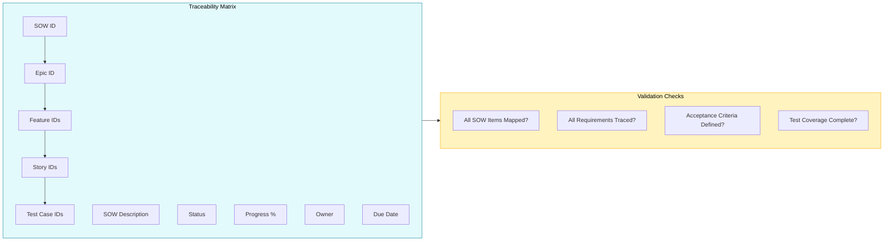

### Forward & Backward Traceability

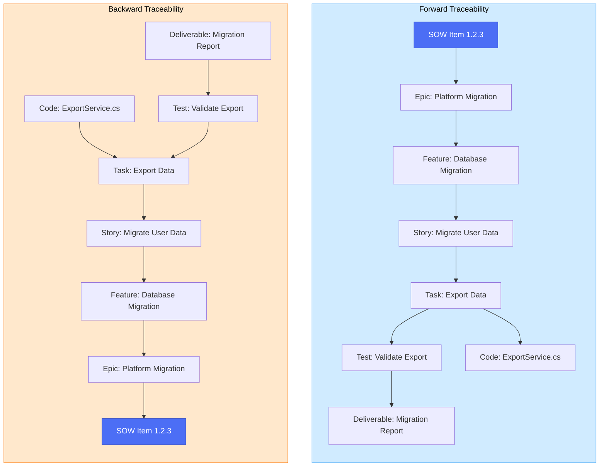

---

## 🏆 Best Practices

### SOW Mapping Best Practices

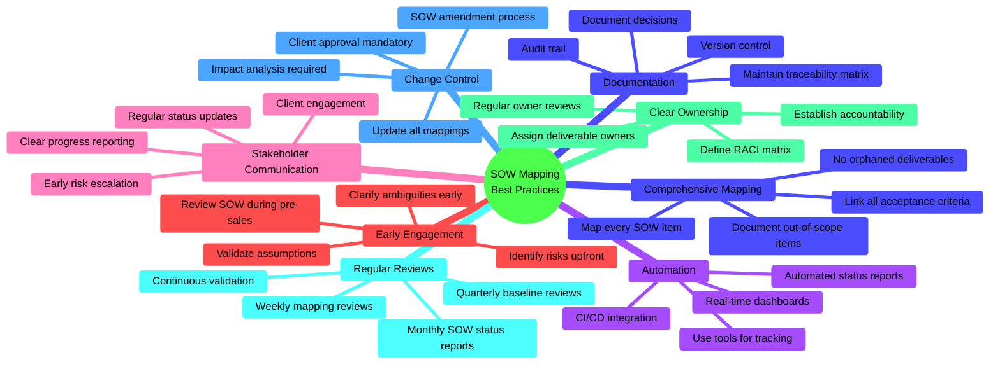

### Common Pitfalls to Avoid

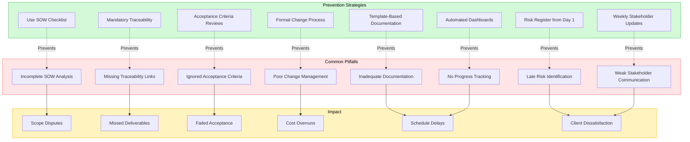

---

## 📝 Templates

### Template 1: SOW Document Structure

```markdown
# Statement of Work
## [Project Name]

### Document Information
| Field | Value |
|-------|-------|
| SOW ID | SOW-2025-XXX |
| Contract Number | [Contract #] |
| Client | [Client Name] |
| Prepared By | [Name] |
| Date | [Date] |
| Version | 1.0 |

### 1. Executive Summary
[Brief project overview, objectives, and expected outcomes]

### 2. Project Scope

#### 2.1 In Scope
- [ ] Deliverable 1: [Description]
- [ ] Deliverable 2: [Description]
- [ ] Deliverable 3: [Description]

#### 2.2 Out of Scope
- Item 1: [Description]
- Item 2: [Description]

#### 2.3 Assumptions
1. [Assumption 1]
2. [Assumption 2]

#### 2.4 Constraints
1. [Constraint 1]
2. [Constraint 2]

### 3. Deliverables

#### 3.1 Technical Deliverables
| ID | Deliverable | Description | Due Date | Acceptance Criteria |
|----|-------------|-------------|----------|---------------------|
| D-01 | [Name] | [Description] | [Date] | [Criteria] |
| D-02 | [Name] | [Description] | [Date] | [Criteria] |

#### 3.2 Documentation Deliverables
| ID | Deliverable | Description | Due Date | Format |
|----|-------------|-------------|----------|--------|
| DOC-01 | [Name] | [Description] | [Date] | [Format] |

#### 3.3 Training Deliverables
| ID | Deliverable | Description | Due Date | Attendees |
|----|-------------|-------------|----------|-----------|
| TRN-01 | [Name] | [Description] | [Date] | [Number] |

### 4. Project Timeline

#### 4.1 Phases
1. **Phase 1: Planning** [Start Date] - [End Date]
2. **Phase 2: Execution** [Start Date] - [End Date]
3. **Phase 3: Delivery** [Start Date] - [End Date]

#### 4.2 Key Milestones
| Milestone | Date | Dependencies |
|-----------|------|--------------|
| [Name] | [Date] | [Dependencies] |

### 5. Resources & Staffing
| Role | Name | Allocation | Duration |
|------|------|------------|----------|
| Project Manager | [Name] | 100% | Full Project |
| Tech Lead | [Name] | 75% | Execution Phase |

### 6. Acceptance Criteria

#### 6.1 Definition of Done
- [ ] All deliverables completed
- [ ] Documentation provided
- [ ] Testing completed
- [ ] Training delivered
- [ ] Client sign-off obtained

#### 6.2 Quality Standards
- [Standard 1]
- [Standard 2]

### 7. Terms & Conditions
[Payment terms, warranties, liabilities, etc.]

### 8. Sign-off

| Role | Name | Signature | Date |
|------|------|-----------|------|
| Client Representative | | | |
| Vendor Project Manager | | | |
| Account Manager | | | |
```

### Template 2: SOW-to-Requirement Mapping Matrix

```markdown
# SOW Traceability Matrix
## Project: [Project Name]

| SOW ID | SOW Deliverable | Epic ID | Feature IDs | User Story IDs | Test Case IDs | Owner | Status | Progress % | Due Date | Notes |
|--------|-----------------|---------|-------------|----------------|---------------|-------|--------|------------|----------|-------|
| SOW-1.1 | [Deliverable Name] | EP-001 | F-001, F-002 | US-001, US-002, US-003 | TC-001, TC-002 | [Owner] | In Progress | 45% | [Date] | On track |
| SOW-1.2 | [Deliverable Name] | EP-001 | F-003 | US-004, US-005 | TC-003 | [Owner] | Not Started | 0% | [Date] | Pending dependency |
| SOW-2.1 | [Deliverable Name] | EP-002 | F-004, F-005 | US-006, US-007, US-008 | TC-004, TC-005, TC-006 | [Owner] | Complete | 100% | [Date] | ✓ Accepted |

### Status Legend
- ✅ Complete: Deliverable accepted by client
- 🟢 On Track: Within schedule and budget
- 🟡 At Risk: Potential issues identified
- 🔴 Blocked: Impediment preventing progress
- ⚪ Not Started: Work not yet begun

### Progress Dashboard
- **Total SOW Items**: 25
- **Completed**: 10 (40%)
- **In Progress**: 12 (48%)
- **Not Started**: 3 (12%)
- **At Risk**: 2

### Coverage Analysis
- **Requirements Coverage**: 100% (All SOW items mapped)
- **Test Coverage**: 95% (All requirements have test cases)
- **Documentation Coverage**: 90% (User guides in progress)
```

### Template 3: Deliverable Tracking Sheet

```markdown
# Deliverable Tracking Sheet
## Project: [Project Name] | SOW: [SOW ID]

### Deliverable Details
| Field | Value |
|-------|-------|
| **Deliverable ID** | D-001 |
| **SOW Reference** | SOW Section 3.1.2 |
| **Name** | [Deliverable Name] |
| **Owner** | [Owner Name] |
| **Due Date** | [Date] |
| **Current Status** | In Progress |

### Acceptance Criteria
- [ ] Criterion 1: [Description]
- [ ] Criterion 2: [Description]
- [ ] Criterion 3: [Description]
- [ ] Criterion 4: [Description]

### Related Work Items
| Type | ID | Title | Status | Progress |
|------|-----|-------|--------|----------|
| Epic | EP-001 | [Epic Name] | In Progress | 60% |
| Feature | F-001 | [Feature Name] | In Progress | 75% |
| Feature | F-002 | [Feature Name] | Complete | 100% |
| User Story | US-001 | [Story Name] | Complete | 100% |
| User Story | US-002 | [Story Name] | In Progress | 50% |
| User Story | US-003 | [Story Name] | Not Started | 0% |

### Progress Timeline
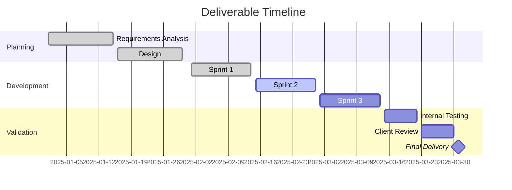

### Risk & Issues
| ID | Type | Description | Impact | Mitigation | Status |
|----|------|-------------|--------|------------|--------|
| R-01 | Risk | [Description] | High | [Mitigation plan] | Monitoring |
| I-01 | Issue | [Description] | Medium | [Resolution plan] | In Progress |

### Quality Metrics
| Metric | Target | Current | Status |
|--------|--------|---------|--------|
| Code Coverage | 80% | 85% | ✅ |
| Test Pass Rate | 95% | 98% | ✅ |
| Documentation | 100% | 90% | 🟡 |
| Code Review | 100% | 100% | ✅ |

### Sign-off Checklist
- [ ] All acceptance criteria met
- [ ] Testing completed and passed
- [ ] Documentation delivered
- [ ] Internal review approved
- [ ] Client notification sent
- [ ] Ready for client acceptance

### Approval
| Role | Name | Date | Signature |
|------|------|------|-----------|
| Development Lead | | | |
| QA Lead | | | |
| Project Manager | | | |
| Client Representative | | | |
```

---

## 🔗 Integration with Requirements Management

### Unified Requirements Management (URM) Framework

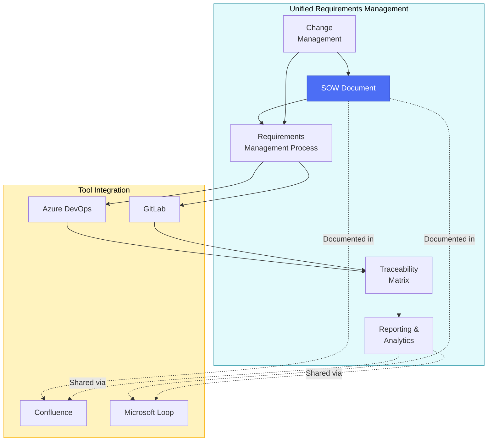

### Integration Points

```mermaid
flowchart LR
    subgraph SOW_PROCESS["SOW Mapping Process"]
        SOW[SOW Document]
        PARSE[Parse & Analyze]
        MAP[Create Mapping]
    end
    
    subgraph REQ_PROCESS["Requirements Process"]
        ELICIT[Elicit Requirements]
        ANALYZE[Analyze Requirements]
        DOCUMENT[Document Requirements]
    end
    
    subgraph WORK_TRACKING["Work Item Tracking"]
        EPIC[Create Epics]
        FEATURE[Create Features]
        STORY[Create Stories]
        TASK[Create Tasks]
    end
    
    SOW --> PARSE
    PARSE --> MAP
    MAP --> ELICIT
    
    ELICIT --> ANALYZE
    ANALYZE --> DOCUMENT
    
    DOCUMENT --> EPIC
    EPIC --> FEATURE
    FEATURE --> STORY
    STORY --> TASK
    
    TASK -.Traces back to.-> SOW
    
    style SOW_PROCESS fill:#d0ebff,stroke:#4dabf7,color:#000
    style REQ_PROCESS fill:#d3f9d8,stroke:#37b24d,color:#000
    style WORK_TRACKING fill:#ffe8cc,stroke:#fd7e14,color:#000
```

---

## 🛠️ Tool Integration (Confluence & Microsoft Loop)

### Confluence Integration

```mermaid
graph TB
    subgraph CONF_SETUP["Confluence Setup"]
        SPACE[Create Project Space]
        TEMPLATE[Install Templates]
        MACRO[Configure Macros]
        PERMS[Set Permissions]
    end
    
    subgraph CONF_PAGES["Page Structure"]
        HOME[Project Home]
        SOW_PAGE[SOW Document]
        MAPPING[Mapping Matrix]
        STATUS[Status Dashboard]
        DECISIONS[Decision Log]
    end
    
    subgraph CONF_FEATURES["Key Features"]
        F1[Page Templates]
        F2[Table Macros]
        F3[Status Indicators]
        F4[@Mentions]
        F5[Page Comments]
        F6[Version History]
    end
    
    CONF_SETUP --> CONF_PAGES
    CONF_PAGES --> CONF_FEATURES
    
    style CONF_SETUP fill:#0052CC,stroke:#0747A6,color:#fff
    style CONF_PAGES fill:#4C9AFF,stroke:#2684FF,color:#fff
    style CONF_FEATURES fill:#B3D4FF,stroke:#4C9AFF,color:#000
```

#### Confluence Page Template (Copy-Paste Ready)

```markdown
<!-- Copy this entire block into a new Confluence page -->

## SOW Mapping Dashboard

### Project Information
| Field | Value |
|-------|-------|
| Project Name | [Enter Project Name] |
| SOW ID | [Enter SOW ID] |
| Contract Date | [Enter Date] |
| Project Manager | @[Username] |
| Last Updated | [Auto-update date] |

---

### SOW Status Summary

<ac:structured-macro ac:name="status">
  <ac:parameter ac:name="title">Overall Status</ac:parameter>
  <ac:parameter ac:name="colour">Green</ac:parameter>
</ac:structured-macro>

**Key Metrics:**
- Total Deliverables: XX
- Completed: XX (XX%)
- In Progress: XX (XX%)
- At Risk: XX (XX%)

---

### Deliverables Tracking

<ac:structured-macro ac:name="table">
| SOW ID | Deliverable | Owner | Status | Progress | Due Date | Notes |
|--------|-------------|-------|--------|----------|----------|-------|
| SOW-1.1 | [Deliverable] | @[Username] | 🟢 On Track | 60% | [Date] | [Notes] |
| SOW-1.2 | [Deliverable] | @[Username] | 🟡 At Risk | 30% | [Date] | [Notes] |
| SOW-2.1 | [Deliverable] | @[Username] | ✅ Complete | 100% | [Date] | [Notes] |
</ac:structured-macro>

---

### Status Legend
- ✅ **Complete**: Deliverable accepted
- 🟢 **On Track**: Within schedule
- 🟡 **At Risk**: Needs attention
- 🔴 **Blocked**: Immediate action required
- ⚪ **Not Started**: Pending

---

### Requirements Traceability

<ac:structured-macro ac:name="expand">
  <ac:parameter ac:name="title">View Full Traceability Matrix</ac:parameter>
  <ac:rich-text-body>
  
| SOW ID | Epic | Features | User Stories | Test Cases | Status |
|--------|------|----------|--------------|------------|--------|
| SOW-1.1 | EP-001 | F-001, F-002 | US-001, US-002, US-003 | TC-001, TC-002 | In Progress |

  </ac:rich-text-body>
</ac:structured-macro>

---

### Recent Updates

<ac:structured-macro ac:name="recently-updated">
  <ac:parameter ac:name="max">5</ac:parameter>
  <ac:parameter ac:name="labels">sow-update</ac:parameter>
</ac:structured-macro>

---

### Action Items

<ac:structured-macro ac:name="jira">
  <ac:parameter ac:name="server">Local JIRA</ac:parameter>
  <ac:parameter ac:name="jqlQuery">project = [PROJECT] AND labels = sow-deliverable AND status != Done</ac:parameter>
  <ac:parameter ac:name="count">true</ac:parameter>
</ac:structured-macro>

---

### Related Pages
- [SOW Document](/link-to-sow)
- [Requirements Management](/link-to-requirements)
- [Change Log](/link-to-change-log)
- [Risk Register](/link-to-risks)
```

### Microsoft Loop Integration

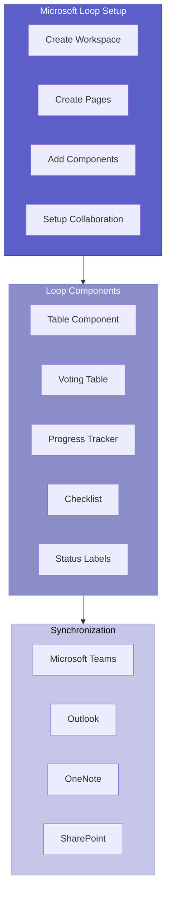

#### Microsoft Loop Template (Copy-Paste Ready)

```markdown
# SOW Mapping Workspace

## 📊 Project Overview

**Project Name:** [Enter Name]
**SOW ID:** [Enter ID]
**PM:** @[Tag Person]
**Status:** 🟢 On Track

---

## 📋 Deliverables Table

| SOW ID | Deliverable | Owner | Status | Progress | Due Date | Actions |
|--------|-------------|-------|--------|----------|----------|---------|
| SOW-1.1 | [Name] | @[Person] | 🟢 | ⬜⬜⬜⬜⬜⬜⬜⬛⬛⬛ 70% | [Date] | [Notes] |
| SOW-1.2 | [Name] | @[Person] | 🟡 | ⬜⬜⬜⬛⬛⬛⬛⬛⬛⬛ 30% | [Date] | [Notes] |
| SOW-2.1 | [Name] | @[Person] | ✅ | ⬜⬜⬜⬜⬜⬜⬜⬜⬜⬜ 100% | [Date] | Accepted |

---

## ✅ Acceptance Criteria Checklist

### Deliverable SOW-1.1
- [ ] Criterion 1: [Description] - @[Owner]
- [ ] Criterion 2: [Description] - @[Owner]
- [ ] Criterion 3: [Description] - @[Owner]
- [x] Criterion 4: [Description] - @[Owner] ✓ Complete

### Deliverable SOW-1.2
- [ ] Criterion 1: [Description] - @[Owner]
- [ ] Criterion 2: [Description] - @[Owner]

---

## 🔗 Traceability Links

### SOW-1.1 → Work Items
- **Epic:** [EP-001] Platform Migration
  - **Feature:** [F-001] Database Migration
    - **Story:** [US-001] Export Data
    - **Story:** [US-002] Transform Data
    - **Story:** [US-003] Import Data
  - **Feature:** [F-002] API Integration
    - **Story:** [US-004] Create API Endpoints

---

## 📈 Progress Dashboard

### Overall Completion
**Total Progress:** 65%

```
██████████████████░░░░░░░░ 65%
```

### By Category
- **Technical Deliverables:** 70% ██████████████░░░░░░
- **Documentation:** 85% █████████████████░░░
- **Training:** 50% ██████████░░░░░░░░░░

---

## 🚨 Risks & Issues

| ID | Type | Description | Impact | Owner | Status |
|----|------|-------------|--------|-------|--------|
| R-01 | Risk | [Description] | 🔴 High | @[Person] | Monitoring |
| I-01 | Issue | [Description] | 🟡 Medium | @[Person] | In Progress |

---

## 💬 Recent Discussion

@[Person] commented: [Comment text]
↳ @[Person] replied: [Reply text]

---

## 📅 Upcoming Milestones

- [ ] **Phase 1 Complete** - [Date] - @[Owner]
- [ ] **Client Review** - [Date] - @[Owner]
- [ ] **Final Delivery** - [Date] - @[Owner]

---

## 🔄 Change Log

| Date | Change | Requestor | Approved By | Status |
|------|--------|-----------|-------------|--------|
| [Date] | [Change description] | @[Person] | @[Person] | Approved |
| [Date] | [Change description] | @[Person] | @[Person] | Pending |

---

## 📎 Related Documents
- [SOW Document](#)
- [Requirements Specification](#)
- [Test Plan](#)
- [Deployment Guide](#)
```

### Tool Comparison for SOW Management

| Feature | Confluence | Microsoft Loop | Azure DevOps | GitLab |
|---------|------------|----------------|--------------|--------|
| **SOW Documentation** | ⭐⭐⭐⭐⭐ | ⭐⭐⭐⭐ | ⭐⭐⭐ | ⭐⭐⭐ |
| **Real-time Collaboration** | ⭐⭐⭐⭐ | ⭐⭐⭐⭐⭐ | ⭐⭐⭐ | ⭐⭐⭐ |
| **Table Management** | ⭐⭐⭐⭐ | ⭐⭐⭐⭐⭐ | ⭐⭐⭐⭐ | ⭐⭐⭐ |
| **Work Item Integration** | ⭐⭐⭐ | ⭐⭐⭐ | ⭐⭐⭐⭐⭐ | ⭐⭐⭐⭐⭐ |
| **Status Tracking** | ⭐⭐⭐⭐ | ⭐⭐⭐⭐ | ⭐⭐⭐⭐⭐ | ⭐⭐⭐⭐⭐ |
| **Client Accessibility** | ⭐⭐⭐⭐⭐ | ⭐⭐⭐⭐ | ⭐⭐⭐ | ⭐⭐⭐ |
| **Template Support** | ⭐⭐⭐⭐⭐ | ⭐⭐⭐⭐ | ⭐⭐⭐ | ⭐⭐⭐ |
| **Mobile Experience** | ⭐⭐⭐⭐ | ⭐⭐⭐⭐⭐ | ⭐⭐⭐ | ⭐⭐⭐ |

### Recommended Approach: Multi-Tool Strategy

```mermaid
graph TB
    SOW[SOW Document] --> CONF[Confluence<br/>Documentation]
    SOW --> LOOP[Microsoft Loop<br/>Collaboration]
    
    CONF --> CLIENT[Client-Facing<br/>Artifacts]
    LOOP --> TEAM[Team<br/>Collaboration]
    
    TEAM --> AZDO[Azure DevOps<br/>Work Tracking]
    TEAM --> GITLAB[GitLab<br/>Work Tracking]
    
    AZDO --> DELIVERY[Technical<br/>Delivery]
    GITLAB --> DELIVERY
    
    DELIVERY -.Updates.-> LOOP
    DELIVERY -.Updates.-> CONF
    
    LOOP -.Reports to.-> CLIENT
    CONF -.Reports to.-> CLIENT
    
    style CONF fill:#0052CC,stroke:#0747A6,color:#fff
    style LOOP fill:#5B5FC7,stroke:#464EB8,color:#fff
    style AZDO fill:#0078d4,stroke:#005a9e,color:#fff
    style GITLAB fill:#fc6d26,stroke:#e24329,color:#fff
```

---

## 📊 Success Metrics

### SOW Performance Indicators

```mermaid
%%{init: {'theme':'base', 'themeVariables': { 'primaryColor':'#ccffcc','primaryTextColor':'#000','primaryBorderColor':'#000','lineColor':'#000','secondaryColor':'#ffcccc','tertiaryColor':'#ccccff'}}}%%
mindmap
  root((SOW Success<br/>Metrics))
    Delivery Metrics
      On-Time Delivery Rate
      Deliverable Quality Score
      First-Time Acceptance Rate
      Rework Percentage
      Client Satisfaction Score
    Process Metrics
      Mapping Completeness
      Traceability Coverage
      Documentation Quality
      Change Request Volume
      Amendment Frequency
    Financial Metrics
      Budget Variance
      Cost Per Deliverable
      Revenue Recognition
      Profitability
      ROI
    Risk Metrics
      Risk Identification Rate
      Issue Resolution Time
      Escalation Frequency
      SLA Compliance
      Critical Issues
    Stakeholder Metrics
      Client Engagement
      Communication Frequency
      Feedback Response Time
      Approval Cycle Time
      Satisfaction Surveys
```

### Key Performance Indicators (KPIs)

| KPI | Target | Measurement | Frequency |
|-----|--------|-------------|-----------|
| **SOW Mapping Completeness** | 100% | All SOW items mapped to requirements | Weekly |
| **Traceability Coverage** | 100% | All requirements traced to SOW | Weekly |
| **On-Time Delivery** | ≥95% | Deliverables completed by due date | Per Deliverable |
| **First-Time Acceptance** | ≥90% | Deliverables accepted without rework | Per Deliverable |
| **Client Satisfaction** | ≥4.5/5 | Survey score | Monthly |
| **Change Request Volume** | ≤10% | Changes vs baseline SOW items | Monthly |
| **Budget Variance** | ±5% | Actual vs planned costs | Monthly |
| **Risk Response Time** | ≤48hrs | Time to address identified risks | Continuous |
| **Documentation Quality** | ≥90% | Review score | Per Deliverable |
| **Stakeholder Engagement** | ≥80% | Meeting attendance & participation | Weekly |

---

## 📄 Document Control

| Version | Date | Author | Changes |
|---------|------|--------|---------|
| 1.0 | [Current Date] | [Your Name] | Initial SOW Mapping Workflow document |

---

## 🎯 Quick Start Guide

### For Project Managers

1. **Receive SOW**
   - Review and validate SOW document
   - Identify all deliverables and acceptance criteria
   - Schedule SOW mapping workshop

2. **Map SOW to Requirements**
   - Use Template 2: SOW-to-Requirement Mapping Matrix
   - Create work items in Azure DevOps/GitLab
   - Establish traceability links

3. **Setup Tracking**
   - Configure Confluence or Microsoft Loop page
   - Setup automated status reports
   - Schedule regular review meetings

4. **Monitor & Report**
   - Track progress using Template 3: Deliverable Tracking Sheet
   - Generate weekly status reports
   - Escalate risks proactively

### For Business Analysts

1. **Analyze SOW**
   - Break down deliverables into requirements
   - Define acceptance criteria for each requirement
   - Identify dependencies and constraints

2. **Create Work Items**
   - Create Epics for SOW sections
   - Create Features for major deliverables
   - Create User Stories for specific requirements

3. **Maintain Traceability**
   - Link all work items to SOW IDs
   - Update traceability matrix regularly
   - Document any changes or deviations

### For Development Teams

1. **Understand SOW Context**
   - Review SOW deliverable descriptions
   - Clarify acceptance criteria with PM/BA
   - Understand delivery timeline

2. **Link Work to SOW**
   - Tag commits with SOW IDs
   - Link pull requests to requirements
   - Update work item status regularly

3. **Validate Deliverables**
   - Test against SOW acceptance criteria
   - Document completion evidence
   - Prepare for client review

---

## 🔗 Related Documents

- [Requirements Management Framework](RequirementManagement.md) - Main requirements management guide
- [Requirements Traceability Matrix](RequirementsTraceabilityMatrix.md) - Detailed traceability tracking
- [Decision Log](DecisionLog.md) - Track architectural and project decisions
- [Change Management Process](RequirementManagement.md#-change-management) - Formal change control procedures

---

## 📞 Support & Resources

### Additional Resources
- Template Library: [Link to template repository]
- Training Materials: [Link to training resources]
- Best Practices Guide: [Link to best practices]
- FAQ: [Link to frequently asked questions]

### Contact Information
- **Project Management Office**: [Email]
- **Requirements Team**: [Email]
- **Tool Support**: [Email]

---

*This SOW Mapping Workflow is part of the comprehensive Requirements Management Framework. For questions or feedback, please contact your engagement manager.*

**Document Status:** ✅ Ready for Use
**Last Reviewed:** [Date]
**Next Review:** [Date + 6 months]
