# Unified Service Capability Management (USCM)
## The Complete DevOps Culture Framework: URM + ADM + UTM = Autonomous Delivery Excellence

---

## Executive Summary

**USCM** (Unified Service Capability Management) is a **cultural transformation framework** that unifies three pillars of modern software delivery into a single, autonomous ecosystem:

| Pillar | Focus | Outcome |
|:-------|:------|:--------|
| **URM** | Unified Requirements Management | 100% traceability from business need to code |
| **ADM** | Architecture Decision Management | Governed, traceable design decisions |
| **UTM** | Unified Test Management | Autonomous quality validation at every layer |

**USCM is not a tool — it's a culture.** It's a subset of DevOps/Agile that creates **autonomous systems** where 90% of processes are embedded in tools, reducing human error and ensuring consistent delivery.

---

## 1. What is USCM?

### 1.1 The USCM Vision

```plantuml
@startuml
!theme cerulean
skinparam backgroundColor #FEFEFE
skinparam rectangle {
  FontColor #FFFFFF
}
skinparam card {
  FontColor #2C3E50
  BackgroundColor #FEFEFE
}

title 🎯 USCM: Unified Service Capability Management

rectangle "🌟 USCM VISION" as VISION #2874A6 {
  card "Culture + Process + Tools\n= Autonomous Delivery" as V1
}

rectangle "📋 URM\nUnified Requirements\nManagement" as URM #1E8449 {
  card "WHAT to build\n23 modules\n5 phases + 5 gates" as URM1
}

rectangle "🏗️ ADM\nArchitecture Decision\nManagement" as ADM #7D3C98 {
  card "HOW to build\n13 modules\nARB governance" as ADM1
}

rectangle "🧪 UTM\nUnified Test\nManagement" as UTM #D35400 {
  card "HOW to verify\n6 layers (L0-L5)\nAutonomous pipelines" as UTM1
}

rectangle "🚀 DELIVERY\nContinuous Value" as DEL #C0392B {
  card "Build → Deploy → Monitor\nCI/CD + SRE\n99.9% reliability" as DEL1
}

VISION --> URM
VISION --> ADM
VISION --> UTM

URM --> DEL
ADM --> DEL
UTM --> DEL

@enduml
```



### 1.2 USCM Definition

> **USCM** = A **cultural and operational framework** that integrates requirements, architecture, and testing into a unified, autonomous delivery capability.

**Core Principles:**
1. **Traceability**: Every artifact traces back to business value (SoW → Req → Design → Test → Deploy)
2. **Autonomy**: 90% of processes are embedded in tools (GitLab CI/CD, Jira Automation, Confluence)
3. **Governance**: Clear gates, RACI, and approval workflows at each phase
4. **Continuous Improvement**: Feedback loops from production back to requirements

### 1.3 USCM in the DevOps/Agile Landscape

```plantuml
@startuml
!theme cerulean
skinparam backgroundColor #FEFEFE
skinparam package {
  FontColor #FFFFFF
}
skinparam rectangle {
  FontColor #2C3E50
  BackgroundColor #FEFEFE
}

title USCM in the DevOps/Agile Ecosystem

package "🌐 AGILE CULTURE" as AGILE #2874A6;text:white {
  package "🔄 DevOps" as DEVOPS #1E8449;text:white {
    package "📦 USCM" as USCM #7D3C98;text:white {
      rectangle "URM" as URM
      rectangle "ADM" as ADM
      rectangle "UTM" as UTM
    }
    rectangle "CI/CD" as CICD
    rectangle "SRE" as SRE
    rectangle "IaC" as IAC
  }
  rectangle "Scrum" as SCRUM
  rectangle "Kanban" as KANBAN
  rectangle "SAFe" as SAFE
}

note right of USCM
  USCM provides the
  **structured backbone**
  for DevOps delivery
end note

@enduml
```



---

## 2. The Three Pillars of USCM

### 2.1 Complete USCM Flow

```plantuml
@startuml
!theme cerulean
skinparam backgroundColor #FEFEFE
skinparam rectangle {
  FontColor #FFFFFF
}
skinparam card {
  FontColor #2C3E50
  BackgroundColor #FEFEFE
}

title USCM End-to-End Flow: Business Need → Production Excellence

' URM Section
rectangle "📋 URM - Unified Requirements Management" as URM #2874A6 {
  card "Phase 1: Foundation\nProcess, Roles, RTM" as U1
  card "Phase 2: Discovery\nRisks, Unknowns, Scope" as U2
  card "Phase 3: Validation\nSMART criteria, Gates" as U3
  card "Phase 4: Development\nJira/GitLab templates" as U4
  card "Phase 5: Operations\nComms, Automation, SRE" as U5
  
  U1 --> U2
  U2 --> U3
  U3 --> U4
  U4 --> U5
}

' ADM Section
rectangle "🏗️ ADM - Architecture Decision Management" as ADM #7D3C98 {
  card "Initiation\nGovernance, RACI" as A1
  card "Planning\nDomains, Traceability" as A2
  card "Design\nADRs, Quality Attrs" as A3
  card "Review\nARB, Checklist" as A4
  card "Operations\nChange Control" as A5
  
  A1 --> A2
  A2 --> A3
  A3 --> A4
  A4 --> A5
}

' UTM Section
rectangle "🧪 UTM - Unified Test Management" as UTM #D35400 {
  card "L0: Static\nFormat, Validate, Lint" as T0
  card "L1: Unit\ntofu test, mocks" as T1
  card "L2: Security\ncheckov, tfsec" as T2
  card "L3: Compliance\nBDD, terraform-compliance" as T3
  card "L4: Integration\nTerratest, real deploy" as T4
  card "L5: UAT\nBusiness validation" as T5
  
  T0 --> T1
  T1 --> T2
  T2 --> T3
  T3 --> T4
  T4 --> T5
}

' Connections
URM ==> ADM : "Requirements\ndrive design"
ADM ==> UTM : "Architecture\ndefines tests"
UTM ==> URM : "Feedback\nloop"

@enduml
```



### 2.2 Pillar Summary

| Pillar | Version | Modules | Core Purpose | Key Artifacts |
|:-------|:-------:|:-------:|:-------------|:--------------|
| **URM** | v2.0 | 23 (00-22) | What to build | RTM, SoW, Gates 1-5 |
| **ADM** | v1.0 | 13 (00-13) | How to build | ADRs, ARB, Design Traceability |
| **UTM** | v1.0 | 3 docs | How to verify | Test Strategy, 6 Layers, Autonomous Pipelines |

---

## 3. URM: Unified Requirements Management

### 3.1 URM Overview


### 3.2 URM Key Outcomes

| Metric | Target | Purpose |
|:-------|:------:|:--------|
| Scope Coverage | ≥95% | Every SoW item mapped to requirement |
| SMART Compliance | ≥95% | Requirements are Specific, Measurable, Achievable, Relevant, Time-bound |
| Traceability | 100% | SoW → Req → Jira → Code → Deploy |
| Gate Pass Rate | 100% | No phase skipping |

### 3.3 URM Central Artifact: RTM (Requirement Traceability Matrix)

```
SoW Item → REQ-XXX → Jira Epic → GitLab MR → Deployment → Production
    ↓          ↓          ↓           ↓            ↓            ↓
 Discovery   Decision   Feature    Code Review   Test Pass   Monitoring
```

---

## 4. ADM: Architecture Decision Management

### 4.1 ADM Overview

```plantuml
@startuml
!theme cerulean
skinparam backgroundColor #FEFEFE
skinparam rectangle {
  FontColor #FFFFFF
}
skinparam card {
  FontColor #2C3E50
  BackgroundColor #FEFEFE
}

title ADM v1.0: Ideation → Delivery

rectangle "🟢 INITIATION" as INIT #2874A6 {
  card "ADM-02: Governance Model\nADM-03: RACI Matrix" as INITC
}

rectangle "🔵 PLANNING" as PLAN #1E8449 {
  card "ADM-04: Solution Domains\nADM-07: Design Traceability" as PLANC
}

rectangle "🟡 DESIGN" as DES #B7950B {
  card "ADM-05: ADR Template\nADM-08: Quality Attributes" as DESC
}

rectangle "🟠 REVIEW" as REV #D35400 {
  card "ADM-09: Design Review Checklist\nADM-01: ARB Process Flow" as REVC
}

rectangle "🔴 OPERATIONS" as OPS #C0392B {
  card "ADM-06: Decision Log\nADM-10: Change Control\nADM-11: Automation & Tooling\nADM-12: Handover/Onboarding\nADM-13: Architecture Testing" as OPSC
}

INIT --> PLAN
PLAN --> DES
DES --> REV
REV --> OPS

@enduml
```



### 4.2 ADM Key Outcomes

| Metric | Target | Purpose |
|:-------|:------:|:--------|
| ADR Coverage | 100% | Every major decision documented |
| ARB Approval | Required | No unapproved designs in production |
| Design Traceability | 100% | Objective → Requirement → Design → Release |
| Architecture Debt | Tracked | Tech debt visible and managed |

### 4.3 ADM Central Artifact: ADR (Architecture Decision Record)

```yaml
# ADR Template (ADM-05)
Title: "Use Azure Container Apps for microservices"
Status: Accepted | Proposed | Deprecated | Superseded
Context: Why is this decision needed?
Decision: What was decided?
Consequences: Trade-offs, risks, benefits
Traceability:
  - Requirement: REQ-PERF-001
  - Epic: EPIC-123
  - Tests: TC-PERF-001..010
```

---

## 5. UTM: Unified Test Management

### 5.1 UTM Overview


### 5.2 UTM Key Outcomes

| Metric | Target | Purpose |
|:-------|:------:|:--------|
| Requirement Coverage | ≥95% | Tests trace to requirements |
| Resource Coverage | ≥80% | IaC resources have assertions |
| Scenario Coverage | ≥90% | BDD scenarios executed |
| Quality Gate Pass | 100% | No Critical/High findings in prod |

### 5.3 UTM Autonomous Pipeline

```yaml
# GitLab CI/CD - Autonomous Testing
stages:
  - validate   # L0: Static
  - test       # L1: Unit
  - security   # L2: Security
  - compliance # L3: Compliance
  - integration # L4: E2E
  - deploy

# Quality Gates: Block on failure
rules:
  - L0-L3: Block pipeline on failure
  - L4: Block release
  - L5: Block production
```

---

## 6. USCM Integration: The Golden Thread

### 6.1 Complete Traceability Chain

```plantuml
@startuml
!theme cerulean
skinparam backgroundColor #FEFEFE
skinparam card {
  FontColor #FFFFFF
}

title 🔗 USCM Golden Thread: Complete Traceability

card "📄 SoW Item\nBusiness Need" as SOW #2C3E50;text:white
card "📋 URM: REQ-XXX\nRequirement" as REQ #2874A6;text:white
card "🏗️ ADM: ADR-XXX\nArchitecture Decision" as ADR #7D3C98;text:white
card "💻 Jira: EPIC/STORY\nWork Item" as JIRA #1E8449;text:white
card "🧪 UTM: TC-XXX\nTest Case" as TC #D35400;text:white
card "🔀 GitLab: MR\nCode Change" as MR #B7950B;text:white
card "🚀 Deploy\nProduction" as DEPLOY #C0392B;text:white

SOW --> REQ : "defines"
REQ --> ADR : "drives"
ADR --> JIRA : "implements"
JIRA --> TC : "validates"
TC --> MR : "verifies"
MR --> DEPLOY : "releases"

DEPLOY ..> SOW : "Feedback Loop"

@enduml
```



### 6.2 Cross-Pillar Traceability Matrix

| Source | Links To | Purpose | Tool |
|:-------|:---------|:--------|:-----|
| **SoW** → REQ | URM-03 RTM | Business to requirement | Confluence |
| **REQ** → ADR | ADM-07 Design Traceability | Requirement to architecture | Confluence + Jira |
| **ADR** → Epic | ADM-05 ADR Template | Architecture to work item | Jira custom field |
| **Epic** → TC | UTM Traceability | Work item to test | Jira link type |
| **TC** → MR | GitLab Smart Commits | Test to code | GitLab + Jira |
| **MR** → Deploy | CI/CD Pipeline | Code to production | GitLab CI/CD |

### 6.3 Autonomous Traceability Creation


---

## 7. USCM Autonomous System Architecture

### 7.1 Process → Tool Embedding

```plantuml
@startuml
!theme cerulean
skinparam backgroundColor #FEFEFE
skinparam rectangle {
  FontColor #FFFFFF
}
skinparam card {
  FontColor #2C3E50
  BackgroundColor #FEFEFE
}

title 🤖 USCM: Manual → Autonomous Transformation

rectangle "📋 MANUAL PROCESSES" as MANUAL #C0392B {
  card "1. Track requirements manually\n2. Create designs in Word\n3. Run tests locally\n4. Email for approvals\n5. Update spreadsheets" as M1
}

rectangle "⚙️ EMBED IN TOOLS" as EMBED #B7950B {
  card "Jira Templates (URM-13)\nConfluence ADRs (ADM-05)\nGitLab CI/CD (UTM)\nJira Automation\nConfluence Macros" as E1
}

rectangle "🤖 AUTONOMOUS SYSTEM" as AUTO #1E8449 {
  card "Self-updating traceability\nAuto-create links\nAuto-block on failure\nLive dashboards\nZero manual tracking" as A1
}

rectangle "📊 90% BASELINE SECURED" as BASE #2874A6 {
  card "Only 10% needs\nhuman judgment\n(UAT, complex decisions)" as B1
}

MANUAL --> EMBED : "Codify"
EMBED --> AUTO : "Deploy"
AUTO --> BASE : "Achieves"

@enduml
```



### 7.2 Tool Integration Matrix

| Tool | URM Role | ADM Role | UTM Role | Autonomous? |
|:-----|:---------|:---------|:---------|:-----------:|
| **Confluence** | RTM, Process Docs | ADRs, Decision Log | Test Strategy | ✅ Yes |
| **Jira** | Epics, Stories, Requirements | Architecture Impact tracking | Test Cases, Defects | ✅ Yes |
| **GitLab** | Issue/MR Templates | Code-Architecture sync | CI/CD Pipelines | ✅ Yes |
| **Jira Automation** | Scope coverage alerts | ADR approval workflows | Traceability updates | ✅ Yes |
| **Confluence Macros** | Live requirement status | Design dashboard | Test coverage dashboard | ✅ Yes |

### 7.3 Automation Rules Summary

| Framework | Automation Rule | Purpose |
|:----------|:----------------|:--------|
| **URM** | Scope coverage alert when <95% | Gate 2 enforcement |
| **URM** | Auto-link GitLab MR to Jira Story | Development traceability |
| **ADM** | Block feature if ADR Link empty | Design governance |
| **ADM** | Notify ARB when ADR created | Review scheduling |
| **UTM** | Auto-create defect on test failure | Quality enforcement |
| **UTM** | Update requirement coverage on test pass | Traceability maintenance |

---

## 8. USCM Governance Model

### 8.1 RACI Across USCM


### 8.2 Gate Summary

| Gate | Phase End | Criteria | Blocker |
|:----:|:----------|:---------|:--------|
| **Gate 1** | URM Foundation | Process documented, roles assigned | ❌ No RACI |
| **Gate 2** | URM Discovery | ≥95% scope coverage | ❌ <95% coverage |
| **Gate 3** | URM Validation | ≥95% SMART requirements | ❌ <95% SMART |
| **Gate 4** | URM Development | 100% UAT pass | ❌ UAT failures |
| **Gate 5** | URM Operations | SLOs defined, monitoring active | ❌ No SLOs |
| **ARB** | ADM Review | Design approved | ❌ No ADR approval |
| **Quality Gate** | UTM Pre-merge | L0-L3 pass, no Critical/High | ❌ Security findings |
| **Release Gate** | UTM Pre-deploy | L4 pass, integration green | ❌ Integration failure |

---

## 9. USCM Implementation Roadmap

### 9.1 4-Phase Adoption

```plantuml
@startuml
!theme cerulean
skinparam backgroundColor #FEFEFE
skinparam rectangle {
  FontColor #FFFFFF
}
skinparam card {
  FontColor #2C3E50
  BackgroundColor #FEFEFE
}

title USCM 4-Phase Implementation Roadmap

rectangle "📍 Phase 1: FOUNDATION" as P1 #2874A6 {
  card "Month 1-2\n• URM-01 to 04 (Process, RTM)\n• ADM-02, 03 (Governance, RACI)\n• UTM Doc 1 (Blueprint)" as P1C
}

rectangle "🔧 Phase 2: TOOLING" as P2 #1E8449 {
  card "Month 3-4\n• Jira templates (URM-13)\n• Confluence ADRs (ADM-05)\n• GitLab CI/CD (UTM L0-L2)" as P2C
}

rectangle "🤖 Phase 3: AUTOMATION" as P3 #B7950B {
  card "Month 5-6\n• Jira Automation Rules\n• Confluence Macros\n• UTM L3-L4 (Compliance, E2E)" as P3C
}

rectangle "🚀 Phase 4: EXCELLENCE" as P4 #C0392B {
  card "Month 7+\n• SRE/SLOs (URM-22)\n• Architecture Testing (ADM-13)\n• UTM L5 (UAT) + Continuous Improvement" as P4C
}

P1 --> P2 : "2 months"
P2 --> P3 : "2 months"
P3 --> P4 : "2+ months"

@enduml
```



### 9.2 Quick Start Checklist

| Week | Focus | Key Actions |
|:----:|:------|:------------|
| **1** | URM Foundation | Implement URM-01 (Process), URM-03 (RTM) |
| **2** | ADM Foundation | Implement ADM-02 (Governance), ADM-05 (ADR Template) |
| **3** | UTM Foundation | Set up GitLab CI/CD with L0-L1 tests |
| **4** | Integration | Configure Jira-GitLab integration, create link types |
| **5-6** | Automation | Deploy Jira Automation rules, Confluence dashboards |
| **7+** | Optimization | Add L2-L5 tests, implement SRE practices |

---

## 10. USCM Benefits & ROI

### 10.1 Business Value

```plantuml
@startuml
!theme cerulean
skinparam backgroundColor #FEFEFE
skinparam object {
  FontColor #2C3E50
  BackgroundColor #FEFEFE
}

title 📈 USCM ROI Summary

object "🕐 Time Savings" as TIME #D5F5E3 {
  Manual Tracking = 4 hrs/day
  With USCM = 15 mins/day
  **Savings = 93%**
}

object "🎯 Quality Improvement" as QUAL #D4E6F1 {
  Defect Escape Rate = 15%
  With USCM = 2%
  **Improvement = 87%**
}

object "📊 Traceability" as TRACE #FCF3CF {
  Manual Coverage = 60%
  With USCM = 99%
  **Improvement = 65%**
}

object "🔒 Compliance" as COMP #FADBD8 {
  Audit Prep Time = 2 weeks
  With USCM = 2 hours
  **Savings = 99%**
}

@enduml
```



### 10.2 Pain Points Solved

| Pain Point | Without USCM | With USCM |
|:-----------|:-------------|:----------|
| "Where do I start?" | Confusion, tribal knowledge | URM-00, ADM-00 Landing Pages |
| "Who's responsible?" | Finger-pointing | RACI in URM-08, ADM-03 |
| "How do I track requirements?" | Spreadsheets, lost docs | URM-03 RTM + Jira |
| "Are designs approved?" | Email chaos | ADM-01 ARB + Jira workflows |
| "Is our code secure?" | Hope and pray | UTM L2 (checkov, tfsec) |
| "Are we production-ready?" | Manual checklists | UTM Quality Gates (L0-L5) |
| "Can we prove compliance?" | Scramble for evidence | Live Confluence dashboards |

---

## 11. USCM Quick Reference

### 11.1 Document Index

| Framework | Document | Purpose |
|:----------|:---------|:--------|
| **URM** | 00-22 (23 docs) | Complete requirements lifecycle |
| **ADM** | 00-13 (14 docs) | Architecture governance |
| **UTM** | 01-03 (3 docs) | Testing strategy & execution |
| **USCM** | This document | Integration framework |

### 11.2 Key Artifacts

| Artifact | Framework | Purpose | Location |
|:---------|:----------|:--------|:---------|
| **RTM** | URM-03 | Traceability matrix | Confluence |
| **ADR** | ADM-05 | Architecture decisions | Confluence |
| **Test Strategy** | UTM-01 | Testing approach | Confluence |
| **Quality Gates** | UTM-02 | Pipeline configuration | GitLab CI/CD |

### 11.3 Contact Points

| Role | Framework Ownership | Responsibility |
|:-----|:--------------------|:---------------|
| **Product Owner** | URM | Requirements, scope, prioritization |
| **Solution Architect** | ADM | Design decisions, governance |
| **QA Lead** | UTM | Test strategy, quality gates |
| **DevOps Engineer** | All | Pipeline automation, tool integration |

---

## 12. Conclusion

### USCM is a Culture, Not Just a Framework

```plantuml
@startuml
!theme cerulean
skinparam backgroundColor #FEFEFE
skinparam rectangle {
  FontColor #FFFFFF
}

title 🌟 USCM: The Culture Shift

rectangle "❌ WITHOUT USCM" as WITHOUT #C0392B {
}
note right of WITHOUT
  • Siloed teams
  • Manual tracking
  • Lost decisions
  • Hope-based quality
  • Audit panic
end note

rectangle "✅ WITH USCM" as WITH #1E8449 {
}
note right of WITH
  • Unified teams
  • Autonomous tracking
  • Traceable decisions
  • Measured quality
  • Audit-ready always
end note

WITHOUT -right-> WITH : "Cultural\nTransformation"

@enduml
```



### Key Takeaways

1. **USCM = URM + ADM + UTM** — Three pillars, one unified capability
2. **Traceability is the spine** — Every artifact traces to business value
3. **Automation secures 90% of the baseline** — Embed processes in tools
4. **Gates enforce discipline** — No skipping phases
5. **Culture > Tools** — Tools enable, culture sustains

---

*Document ID: USCM-Framework | Version: 1.0 | Last Updated: December 2025*
*Frameworks: URM v2.0 | ADM v1.0 | UTM v1.0*

