# Unified Test Management Blueprint
## From Ideation to Validation: The Complete Journey

---

## Executive Summary

This blueprint transforms **scattered testing efforts** into a **unified, autonomous quality system** that traces every business requirement through architecture validation to technical verification.

---

## 1. The Journey: URM → ADM → UTM → Delivery

### 1.1 End-to-End Flow


### 1.2 What Happens at Each Stage

| Stage | Input | Activity | Output | Who |
|:------|:------|:---------|:-------|:----|
| **URM** | Business Need, Contracts | High-level requirement analysis | Statement of Work, Technical Validation | Business Analyst, Stakeholders |
| **Ideation** | URM Requirements | Break down into work items | Jira Epics, Features, User Stories | Product Owner |
| **ADM** | User Stories + URM | Design technical solution | Architecture Decisions, Components | Architect |
| **UTM** | ADM + URM + Stories | Define test approach | Test Strategy, Test Cases, Automation | QA Lead |
| **Delivery** | Test-ready code | Build, Test, Deploy | Production system | DevOps |

---

## 2. Traceability Chain

### 2.1 The Golden Thread

```plantuml
@startuml
!theme cerulean
skinparam backgroundColor #FEFEFE
skinparam shadowing false
skinparam defaultFontColor #FFFFFF
skinparam card {
  BackgroundColor #FEFEFE
  FontColor #2C3E50
}

title Complete Traceability Chain

card "📌 EPIC\nStrategic Goal" as EPIC #2C3E50;text:white
card "📝 USER STORY\nWhat user needs" as US #3498DB;text:white
card "📋 REQUIREMENT\nDetailed spec" as REQ #9B59B6;text:white
card "🏗️ ADM DECISION\nHow we build it" as ADM #27AE60;text:white
card "🧪 TEST CASE\nHow we verify" as TC #8E44AD;text:white
card "✅ RESULT\nEvidence" as RES #16A085;text:white

card "🐛 BUG" as BUG #E74C3C;text:white

EPIC -right-> US : defines
US -right-> REQ : details
REQ -right-> ADM : drives
ADM -right-> TC : validates
TC -right-> RES : produces

TC ..> BUG : Found By
BUG ..> REQ : Affects

@enduml
```



### 2.2 Traceability Benefits

| Benefit | Description | Business Value |
|:--------|:------------|:--------------|
| **🎯 Impact Analysis** | Know what breaks when code changes | Reduced regression risk |
| **📊 Coverage Visibility** | Find gaps early, prove completeness | Audit ready |
| **🔍 Root Cause** | Trace failures to source | Fix once, fix right |
| **✅ Release Confidence** | Objective go/no-go decisions | Stakeholder trust |

### 2.3 How to Implement Traceability in Tools

**Step 1: Jira Link Types Configuration**
```
Admin → Issues → Issue Linking
Create Link Type:
  - Name: "Traces To" / "Traced From"
  - Outward: "traces to"
  - Inward: "is traced from"
```

**Step 2: Linking Structure**
```
[URM] Epic: Payment Security (REQ-PAY-001)
    └→ traces to → [ADM] Story: Encryption Design (ADM-SEC-001)
        └→ traces to → [UTM] Story: TLS Validation Test (TC-SEC-001)
            └→ traces to → [GitLab] MR: !123 (implementation)
```

**Step 3: Confluence RTM Page**
```
{jira:jql=project in (URM, ADM, UTM) AND "Traces To" is not EMPTY
  |columns=key,summary,issuelinks,status}
```

**Step 4: GitLab MR Template**
```markdown
## Traceability
- **Requirement**: REQ-PAY-001
- **Architecture**: ADM-SEC-001  
- **Test Case**: TC-SEC-001
```

---

## 3. Quality Gate Model

### 3.1 Progressive Gates


### 3.2 Gate Criteria Summary

| Gate | Layer | What Passes | What Blocks |
|:----:|:-----:|:------------|:------------|
| **1** | L0 | Valid syntax, proper format | Syntax errors, lint failures |
| **2** | L1 | Unit tests pass, coverage ≥80% | Test failures, low coverage |
| **3** | L2 | No Critical/High vulnerabilities | Security findings |
| **4** | L3/L4 | Compliance + E2E pass | Policy violations, integration failures |

---

## 4. Stakeholder View

### 4.1 Who Sees What


---

## 5. Transformation: Current → Target

### 5.1 Gap Analysis

```plantuml
@startuml
!theme cerulean
skinparam backgroundColor #FEFEFE
skinparam shadowing false
skinparam rectangle {
  FontColor #FFFFFF
}
skinparam card {
  FontColor #2C3E50
  BackgroundColor #FEFEFE
}

title Transformation Journey

rectangle "❌ CURRENT STATE" as CURRENT #C0392B {
  card "Human-centered\ndefect finding" as C1
  card "No regression\nprocess" as C2
  card "Missing\ntraceability" as C3
  card "Ad-hoc\ntesting" as C4
}

rectangle "UTM\nBLUEPRINT" as BLUEPRINT #D35400 {
}

rectangle "✅ TARGET STATE" as TARGET #1E8449 {
  card "System-centric\ndetection" as T1
  card "Automated\nregression" as T2
  card "Full URM→ADM→UTM\ntraceability" as T3
  card "Structured\n5-layer testing" as T4
}

C1 -right-> BLUEPRINT
C2 -right-> BLUEPRINT
C3 -right-> BLUEPRINT
C4 -right-> BLUEPRINT

BLUEPRINT -right-> T1
BLUEPRINT -right-> T2
BLUEPRINT -right-> T3
BLUEPRINT -right-> T4

@enduml
```



### 5.2 Value Realization

| Improvement Area | Before | After | Business Impact |
|:-----------------|:-------|:------|:----------------|
| Defect Detection | Manual, late | Automated, early | 60% cost reduction |
| Traceability | None | 100% linked | Audit ready, faster RCA |
| Regression | None | Every release | Zero known regressions |
| Release Confidence | Low | High | Predictable deployments |

---

## 6. Implementation Roadmap

### 6.1 Three-Phase Approach


### 6.2 Milestones

| Milestone | Target | Success Criteria |
|:----------|:-------|:-----------------|
| **M1** | Week 4 | All modules have L0-L1 tests |
| **M2** | Week 8 | Security scanning integrated, blocking |
| **M3** | Week 10 | E2E test suite operational |
| **M4** | Week 12 | Full RTM, dashboards live |

---

## 7. RACI Matrix

| Activity | Architect | Dev Lead | QA Lead | DevOps | PO |
|:---------|:---------:|:--------:|:-------:|:------:|:--:|
| Test Strategy | C | C | **A** | C | R |
| Test Design | I | C | **R** | I | C |
| Unit Tests | C | **R** | C | I | I |
| Security Tests | C | C | **R** | A | I |
| Pipeline Gates | A | C | C | **R** | I |
| Release Decision | C | I | C | C | **A** |

**Legend**: **R** = Responsible, **A** = Accountable, **C** = Consulted, **I** = Informed

### 7.1 How to Implement RACI in Jira

**Custom Fields for Accountability:**
```
Field Name: Accountable
Field Type: User Picker
Applies to: Epic, Story, Task

Field Name: Consulted  
Field Type: Multi-User Picker
Applies to: Epic, Story
```

**Workflow Validation Rule:**
```
Condition: Status = "In Review"
Validator: "Accountable" field is not empty
Message: "Cannot move to Review without Accountable person assigned"
```

---

## 8. Success Metrics

### 8.1 Quality Index


### 8.2 Target KPIs

| KPI | Current | Target | Timeline |
|:----|:--------|:-------|:---------|
| Test Coverage | 40% | 80% | 12 weeks |
| Pass Rate | ~70% | 95% | 8 weeks |
| Automation Rate | 20% | 90% | 12 weeks |
| Defect Escape Rate | Unknown | <5% | 16 weeks |
| Requirement Traceability | 0% | 100% | 12 weeks |

---

## Key Takeaways

```plantuml
@startuml
!theme cerulean
skinparam backgroundColor #FEFEFE
skinparam package {
  FontColor #FFFFFF
}
skinparam card {
  FontColor #2C3E50
  BackgroundColor #FEFEFE
}

title UTM Success Factors

package "🎯 UTM SUCCESS" as UTM #D35400 {
}

package "🔗 Traceability" as TRACE #2874A6 {
  card "URM → ADM → UTM → Delivery"
  card "Every test linked to requirement"
  card "Impact analysis enabled"
}

package "⚡ Automation" as AUTO #1E8449 {
  card "5-Layer Testing Pyramid"
  card "Quality Gates at every stage"
  card "Shift-Left approach"
}

package "📊 Visibility" as VIS #7D3C98 {
  card "Single source of truth"
  card "Role-based dashboards"
  card "Evidence-based decisions"
}

package "🔄 Continuous" as CONT #C0392B {
  card "Build once, test always"
  card "Fail fast, fix early"
  card "Learn and improve"
}

UTM --> TRACE
UTM --> AUTO
UTM --> VIS
UTM --> CONT

@enduml
```



---

*Document ID: UTM-01 | Version: 2.0 | Last Updated: December 2025*
