# Testing Layers & Tooling Guide
## Complete Technical Reference: Layers, Tools, Pipelines

---

## Context: Where UTM Fits

> **Hierarchy**: URM (Requirements) → ADM (Architecture) → **UTM (Testing)**

| Phase | What | Tool |
|:------|:-----|:-----|
| **URM** | What to build (Requirements) | Jira Epics, Confluence |
| **ADM** | How to build (Architecture) | Confluence ADRs, Diagrams |
| **UTM** | How to verify (Testing) | GitLab CI, Test Suites |

**Each test traces back**: Test Case → Architecture Decision → Requirement

---

## Testing Pyramid Overview


### Layer Comparison

| Layer | Type | Speed | Cost | Confidence | Run Frequency |
|:-----:|:-----|:-----:|:----:|:----------:|:--------------|
| **L0** | Static Analysis | ⚡⚡⚡⚡ | Free | Low | Every save |
| **L1** | Unit Tests | ⚡⚡⚡ | Free | Medium | Every commit |
| **L2** | Security Scans | ⚡⚡⚡ | Free | Medium-High | Pre-merge |
| **L3** | Functional Tests | ⚡⚡ | Low | High | CI Pipeline |
| **L4** | E2E / Integration | ⚡ | High | Very High | Release |
| **L5** | Acceptance (UAT) | ⚡ | Medium | Highest | Pre-Production |

### IaC Coverage Reality

> **⚠️ Important**: OpenTofu/Terraform is **declarative** (describes "what", not "how"). Unlike Java/Python, **line-based code coverage doesn't exist** for IaC.
>
> **What we measure instead:**
> | Coverage Type | How to Calculate | Tool |
> |:--------------|:-----------------|:-----|
> | **Resource Coverage** | Resources with assertions ÷ Total resources | `tofu test` assertion count |
> | **Scenario Coverage** | BDD scenarios tested ÷ Total scenarios | `terraform-compliance` |
> | **Module Coverage** | Modules with `.tftest.hcl` ÷ Total modules | Directory scan |
> | **Requirement Coverage** | Tests linked to requirements ÷ Total requirements | Jira traceability |

---

## 1. L0: Static Analysis

```plantuml
@startuml
!theme cerulean
skinparam backgroundColor #FEFEFE

title L0: Static Analysis Flow

|Developer|
start
:📝 Save File;

|Pre-commit Hook|
:📐 tofu fmt;
note right: Check formatting

if (Formatted?) then (✅ yes)
  :✅ tofu validate;
  note right: Check syntax
  if (Valid?) then (✅ yes)
    :🔍 tflint;
    note right: Best practices
    if (Lint Pass?) then (✅ yes)
      :✅ Commit Allowed;
      stop
    else (❌ no)
      :❌ Block - Fix lint errors;
      stop
    endif
  else (❌ no)
    :❌ Block - Fix syntax;
    stop
  endif
else (❌ no)
  :❌ Block - Run tofu fmt;
  stop
endif

@enduml
```

| Tool | Purpose | Example Finding |
|:-----|:--------|:----------------|
| `tofu fmt` | Enforce code style | Inconsistent indentation |
| `tofu validate` | Syntax correctness | Missing required provider |
| `tflint` | Best practices | Deprecated resource type |

### How to Implement L0 Pre-commit Hook

**File: `.pre-commit-config.yaml`**
```yaml
repos:
  - repo: local
    hooks:
      - id: tofu-fmt
        name: OpenTofu Format
        entry: tofu fmt -check -recursive
        language: system
        files: \.tf$
        pass_filenames: false

      - id: tofu-validate
        name: OpenTofu Validate
        entry: bash -c 'tofu init -backend=false && tofu validate'
        language: system
        files: \.tf$
        pass_filenames: false

      - id: tflint
        name: TFLint
        entry: tflint --recursive
        language: system
        files: \.tf$
```

**Install Hook:**
```bash
pip install pre-commit
pre-commit install
```

---

## 2. L1: Unit Tests

```plantuml
@startuml
!theme cerulean
skinparam backgroundColor #FEFEFE
skinparam rectangle {
  FontColor #2C3E50
}
skinparam card {
  FontColor #2C3E50
  BackgroundColor #FEFEFE
}

title L1: Unit Testing with Mock Provider

rectangle "📥 Input" as INPUT #D4E6F1;text:black {
  card "Module Code\n(.tf files)" as MOD
  card "Test Files\n(.tftest.hcl)" as TEST
}

rectangle "🎭 Mock Layer" as MOCK #FCF3CF;text:black {
  card "mock_provider \"azurerm\" {}\nNo Cloud Calls\nFast Execution" as MP
}

rectangle "⚡ Execution" as EXEC #D5F5E3;text:black {
  card "tofu test\nPlan Mode\nAssertions" as PLAN
}

rectangle "📤 Output" as OUTPUT #E8DAEF;text:black {
  card "Pass / Fail\nCoverage Report" as ASSERT
}

INPUT --> MOCK
MOCK --> EXEC
EXEC --> OUTPUT

@enduml
```

**Example: Payment Gateway Module Test**

```hcl
# tests/payment_gateway_test.tftest.hcl

mock_provider "azurerm" {}

variables {
  gateway_name    = "payment-gw-test"
  environment     = "dev"
  enable_tls      = true
}

run "verify_gateway_configuration" {
  command = plan

  assert {
    condition     = azurerm_api_management.gateway.sku_name == "Developer"
    error_message = "Dev environment must use Developer SKU"
  }

  assert {
    condition     = azurerm_api_management.gateway.protocols.enable_http == false
    error_message = "HTTP must be disabled, only HTTPS allowed"
  }
}
```

---

## 3. L2: Security Scanning

```plantuml
@startuml
!theme cerulean
skinparam backgroundColor #FEFEFE
skinparam rectangle {
  FontColor #FFFFFF
}
skinparam card {
  FontColor #2C3E50
  BackgroundColor #FEFEFE
}

title L2: Security Scanning Flow

rectangle "🔒 Security Scanners" as SCAN #1E8449 {
  card "checkov\nCIS Benchmarks\n1000+ policies" as CHK
  card "tfsec\nTerraform SAST\nAzure specific" as TFS
}

rectangle "📋 Findings" as FIND #FEFEFE;text:black {
  card "🔴 Critical" as CRIT #C0392B;text:white
  card "🟠 High" as HIGH #D35400;text:white
  card "🟡 Medium" as MED #B7950B;text:white
  card "🟢 Low" as LOW #1E8449;text:white
}

rectangle "⚡ Pipeline Action" as ACTION #FEFEFE;text:black {
  card "❌ BLOCK\nPipeline" as BLOCK #C0392B;text:white
  card "⚠️ WARN\nOnly" as WARN #B7950B;text:white
  card "✅ PASS" as PASS #1E8449;text:white
}

CHK --> FIND
TFS --> FIND

CRIT --> BLOCK
HIGH --> BLOCK
MED --> WARN
LOW --> PASS

@enduml
```

**Common Findings**

| Finding | Severity | Fix |
|:--------|:---------|:----|
| Storage account public access | Critical | `allow_blob_public_access = false` |
| SQL Server no encryption | High | `transparent_data_encryption = true` |
| Missing tags | Medium | Add required tags |
| Outdated API version | Low | Update to latest API |

### How to Integrate L2 Security into GitLab

**GitLab Security Dashboard Integration:**
```yaml
# .gitlab-ci.yml
checkov-scan:
  stage: security
  image: bridgecrew/checkov:latest
  script:
    - checkov -d . --output cli --output junitxml --output-file-path . --framework terraform
  artifacts:
    reports:
      junit: results_junitxml.xml
    paths:
      - results_junitxml.xml
    when: always
  allow_failure: false  # BLOCKS pipeline on Critical/High

tfsec-scan:
  stage: security
  image: aquasec/tfsec:latest
  script:
    - tfsec . --format junit --out tfsec-results.xml --severity-threshold HIGH
  artifacts:
    reports:
      junit: tfsec-results.xml
  allow_failure: false
```

**Jira Integration - Auto-Create Finding:**
```python
# scripts/create_security_finding.py
import requests

def create_jira_finding(finding):
    jira_api = "https://your-org.atlassian.net/rest/api/3/issue"
    payload = {
        "fields": {
            "project": {"key": "UTM"},
            "issuetype": {"name": "Bug"},
            "summary": f"[L2-SEC] {finding['check_id']}",
            "description": finding['description'],
            "priority": {"name": "Critical" if finding['severity'] == "CRITICAL" else "High"},
            "labels": ["security", "automated", "L2"]
        }
    }
    requests.post(jira_api, json=payload, auth=("user", "token"))
```

---

## 4. L3: Compliance Testing

```plantuml
@startuml
!theme cerulean
skinparam backgroundColor #FEFEFE
skinparam rectangle {
  FontColor #FFFFFF
}
skinparam card {
  FontColor #2C3E50
  BackgroundColor #FEFEFE
}

title L3: Compliance Testing (BDD)

rectangle "📥 Input" as INPUT #D4E6F1 {
  card "Terraform Plan\nplan.json" as PLAN
  card "Feature Files\n.feature" as FEAT
}

rectangle "🥒 BDD Engine" as BDD #B7950B {
  card "terraform-compliance\nGherkin Syntax" as COMP
}

rectangle "📋 Policy Rules" as RULES #FCF3CF {
  card "Tagging Policy" as TAG
  card "Region Restrictions" as REG
  card "Network Rules" as NET
  card "Security Baseline" as SEC
}

rectangle "✅ Result" as RESULT #FEFEFE {
  card "Pass → Continue" as PASS #1E8449
  card "Fail → Block" as FAIL #C0392B
}

INPUT --> BDD
BDD --> RULES
RULES --> RESULT

@enduml
```

**Example: Payment System Compliance**

```gherkin
# features/payment_compliance.feature

Feature: Payment System Security Compliance

  Scenario: TLS Must Be Enforced
    Given I have azurerm_api_management defined
    Then it must have protocols
    And its value enable_http must be false

  Scenario: Required Tags Present
    Given I have resource that supports tags defined
    Then it must have tags
    And its value must contain "environment"
    And its value must contain "cost-center"

  Scenario: Restricted Regions Only
    Given I have resource that supports location defined
    Then its value must match regex "^(westeurope|northeurope)$"
```

### How to Implement L3 Compliance Testing

**Project Structure:**
```
├── modules/
│   └── payment-gateway/
├── features/                    # BDD Feature Files
│   ├── security.feature
│   ├── tagging.feature
│   └── networking.feature
└── .gitlab-ci.yml
```

**GitLab Pipeline Step:**
```yaml
compliance:
  stage: compliance
  script:
    - tofu plan -out=plan.tfplan
    - tofu show -json plan.tfplan > plan.json
    - terraform-compliance -p plan.json -f features/ --junit-xml compliance.xml
  artifacts:
    reports:
      junit: compliance.xml
```

**Confluence Policy Documentation:**
```
Page: /spaces/UTM/pages/Compliance-Policies

| Policy ID | Rule | Feature File | Last Validated |
|-----------|------|--------------|----------------|
| POL-001 | TLS Required | security.feature | 2025-12-10 |
| POL-002 | Tags Required | tagging.feature | 2025-12-10 |
| POL-003 | EU Regions Only | networking.feature | 2025-12-10 |
```

---

## 5. L4: Integration Testing

```plantuml
@startuml
!theme cerulean
skinparam backgroundColor #FEFEFE

title L4: Integration Testing Flow (Terratest)

participant "🔧 CI Pipeline" as CI
participant "🧪 Terratest" as TT
participant "☁️ OpenTofu" as TF
participant "☁️ Azure" as AZ

CI -> TT: Start Integration Test
activate TT

TT -> TF: tofu init + apply
activate TF
TF -> AZ: Create Real Resources
activate AZ
AZ --> TF: Resource IDs + Outputs
deactivate AZ
TF --> TT: Apply Complete
deactivate TF

TT -> AZ: Validate (HTTP, API calls)
activate AZ
AZ --> TT: Response
deactivate AZ

TT -> TT: Assert Results

TT -> TF: tofu destroy
activate TF
TF -> AZ: Delete Resources
activate AZ
AZ --> TF: Cleanup Complete
deactivate AZ
TF --> TT: Destroy Complete
deactivate TF

TT --> CI: Test Results (Pass/Fail)
deactivate TT

@enduml
```

**Example: Payment Gateway Integration Test**

```go
// tests/integration/payment_gateway_test.go

func TestPaymentGatewayDeployment(t *testing.T) {
    t.Parallel()

    terraformOptions := terraform.WithDefaultRetryableErrors(t, &terraform.Options{
        TerraformDir: "../../modules/payment-gateway",
        Vars: map[string]interface{}{
            "environment":  "test",
            "gateway_name": "payment-gw-integration",
            "enable_tls":   true,
        },
    })

    // Clean up after test
    defer terraform.Destroy(t, terraformOptions)

    // Deploy infrastructure
    terraform.InitAndApply(t, terraformOptions)

    // Get outputs
    gatewayUrl := terraform.Output(t, terraformOptions, "gateway_url")

    // Validate: Health endpoint responds
    statusCode, _ := http_helper.HttpGet(t, gatewayUrl+"/health", nil)
    assert.Equal(t, 200, statusCode)
}
```

---

## 6. L5: Acceptance Testing (UAT)

```plantuml
@startuml
!theme cerulean
skinparam backgroundColor #FEFEFE
skinparam rectangle {
  FontColor #FFFFFF
}
skinparam card {
  FontColor #2C3E50
  BackgroundColor #FEFEFE
}

title L5: User Acceptance Testing

rectangle "🎯 UAT" as UAT #C0392B {
  card "📋 Business Scenarios" as BC
  card "👤 User Testing" as UT
  card "✍️ Sign-Off" as SO
}

rectangle "Test Types" as TYPES #FCF3CF;text:black {
  card "Functional\nValidation" as FUNC
  card "Performance\nCheck" as PERF
  card "Usability\nReview" as USAB
  card "Regression\nSuite" as REG
}

rectangle "✅ Exit Criteria" as CRIT #1E8449 {
  card "Acceptance Criteria Met" as AC
  card "No Blocking Bugs" as NB
  card "PO Approval" as PO
}

UAT --> TYPES
TYPES --> CRIT

@enduml
```

---

## 7. Tool Matrix


### Tool Comparison

| Layer | Tool | Language | Speed | Best For |
|:-----:|:-----|:---------|:-----:|:---------|
| L0 | tflint | Go | ⚡⚡⚡⚡ | Terraform linting |
| L1 | tofu test | HCL | ⚡⚡⚡ | Native IaC unit tests |
| L2 | checkov | Python | ⚡⚡⚡ | Multi-framework security |
| L2 | tfsec | Go | ⚡⚡⚡⚡ | Terraform-specific SAST |
| L3 | terraform-compliance | Python | ⚡⚡ | BDD compliance tests |
| L4 | Terratest | Go | ⚡ | Real infrastructure tests |

---

## 8. Pipeline Architecture

### 8.1 Complete CI/CD Flow

```plantuml
@startuml
!theme cerulean
skinparam backgroundColor #FEFEFE
skinparam rectangle {
  FontColor #FFFFFF
}
skinparam card {
  FontColor #2C3E50
  BackgroundColor #FEFEFE
}

title Complete CI/CD Pipeline

rectangle "📝 COMMIT" as COMMIT #7D3C98 {
  card "Pre-commit Hook" as PRE
  card "L0: Format" as L0A
  card "L0: Validate" as L0B
  card "L0: Lint" as L0C
}

rectangle "🔨 BUILD" as BUILD #2874A6 {
  card "L1: Unit Tests" as L1
  card "Coverage Report" as COV
}

rectangle "🔒 SECURITY" as SEC #1E8449 {
  card "L2: Checkov" as L2A
  card "L2: tfsec" as L2B
}

rectangle "📋 COMPLIANCE" as COMP #B7950B {
  card "Generate Plan" as PLAN
  card "L3: terraform-compliance" as L3
}

rectangle "🔗 INTEGRATION" as INT #D35400 {
  card "L4: Terratest" as L4
  card "Cleanup Resources" as CLEAN
}

rectangle "🚀 DEPLOY" as DEP #C0392B {
  card "Deploy Staging" as STAG
  card "Smoke Tests" as SMOKE
  card "Deploy Production" as PROD
}

COMMIT --> BUILD
BUILD --> SEC
SEC --> COMP
COMP --> INT
INT --> DEP

@enduml
```

### 8.2 GitLab CI/CD Configuration

```yaml
# .gitlab-ci.yml - Complete Testing Pipeline

stages:
  - validate      # L0
  - test          # L1
  - security      # L2
  - compliance    # L3
  - integration   # L4
  - deploy

# L0: STATIC ANALYSIS
format-check:
  stage: validate
  script:
    - tofu fmt -check -recursive -diff

validate:
  stage: validate
  script:
    - tofu init -backend=false
    - tofu validate

lint:
  stage: validate
  script:
    - tflint --init
    - tflint --recursive

# L1: UNIT TESTS
unit-tests:
  stage: test
  script:
    - tofu test -junit-xml=unit-test-results.xml
  coverage: '/Coverage: (\d+\.?\d*)%/'

# L2: SECURITY SCANNING
checkov-scan:
  stage: security
  script:
    - checkov -d . --framework terraform
  allow_failure: false  # Block on Critical/High

tfsec-scan:
  stage: security
  script:
    - tfsec . --severity-threshold HIGH

# L3: COMPLIANCE TESTING
compliance:
  stage: compliance
  script:
    - tofu plan -out=plan.tfplan
    - tofu show -json plan.tfplan > plan.json
    - terraform-compliance -p plan.json -f features/

# L4: INTEGRATION TESTS
integration-tests:
  stage: integration
  script:
    - cd tests/integration
    - go test -v -timeout 30m
  when: manual

# DEPLOYMENT
deploy-staging:
  stage: deploy
  script:
    - tofu apply -auto-approve
  environment: staging

deploy-production:
  stage: deploy
  script:
    - tofu apply -auto-approve
  environment: production
  when: manual
```

---

## 9. Use Case: Payment System

### 9.1 System Overview

```plantuml
@startuml
!theme cerulean
skinparam backgroundColor #FEFEFE
skinparam package {
  FontColor #2C3E50
}
skinparam component {
  FontColor #2C3E50
  BackgroundColor #FEFEFE
}

title Payment System Architecture

package "💳 Payment System" as PAY #D4E6F1;text:black {
  [API Gateway] as GW
  [Validation Service] as VAL
  [Payment Processor] as PROC
  [Database] as DB
  [Audit Log] as LOG
}

package "🌐 External" as EXT #FCF3CF;text:black {
  [Bank API] as BANK
  [Fraud Detection] as FRAUD
}

GW --> VAL
VAL --> PROC
PROC --> DB
PROC --> LOG
PROC <--> BANK
VAL <--> FRAUD

@enduml
```

### 9.2 Testing at Each Layer

| Layer | What We Test | Example |
|:-----:|:-------------|:--------|
| **L0** | Code format, syntax | HCL files are valid |
| **L1** | API Gateway config, SKU | Gateway uses correct SKU |
| **L2** | TLS enabled, no public access | Storage is encrypted |
| **L3** | Tags present, region restricted | Only EU regions allowed |
| **L4** | End-to-end payment flow | Payment API returns 200 |
| **L5** | Business acceptance | €1000 payment succeeds |

---

## 10. Decision Flow

### 10.1 When to Run Each Layer


---

## 10. Autonomous System Architecture

> **Goal**: Transform manual processes into **autonomous tools** that secure **90% of the quality baseline** without human intervention.

### 10.1 Process → Tool Embedding

```plantuml
@startuml
!theme cerulean
skinparam backgroundColor #FEFEFE
skinparam rectangle {
  FontColor #FFFFFF
}
skinparam card {
  FontColor #2C3E50
  BackgroundColor #FEFEFE
}

title 🤖 Process → Tool Embedding = Autonomous System

rectangle "📋 MANUAL PROCESS" as MANUAL #C0392B {
  card "1. Format code\n2. Validate syntax\n3. Run security checks\n4. Create Jira tickets\n5. Update Confluence" as M1
}

rectangle "⬇️ EMBED INTO TOOLS" as EMBED #B7950B {
  card "pre-commit hooks\n.gitlab-ci.yml\nJira Automation Rules\nConfluence Macros" as E1
}

rectangle "🤖 AUTONOMOUS SYSTEM" as AUTO #1E8449 {
  card "GitLab Pipeline\nruns automatically\nJira updates itself\nConfluence shows live data" as A1
}

rectangle "📊 90% BASELINE SECURED" as BASE #2874A6 {
  card "Only 10% needs\nhuman judgment\n(UAT, edge cases)" as B1
}

MANUAL --> EMBED : Codify
EMBED --> AUTO : Deploy
AUTO --> BASE : Achieves

@enduml
```

### 10.2 Autonomous Tooling Matrix

| Process | Manual Effort | Autonomous Tool | Baseline Secured |
|:--------|:--------------|:----------------|:----------------:|
| **Code Formatting** | Run `tofu fmt` manually | pre-commit hook | ✅ 100% |
| **Syntax Validation** | Run `tofu validate` | GitLab CI L0 stage | ✅ 100% |
| **Security Scanning** | Run Checkov/tfsec | GitLab CI L2 stage | ✅ 100% |
| **Compliance Testing** | Write & run tests | GitLab CI L3 stage | ✅ 100% |
| **Defect Creation** | Manual Jira ticket | Jira Automation Rule | ✅ 100% |
| **Traceability Links** | Manual linking | Jira Automation + API | ✅ 95% |
| **Dashboard Updates** | Export/Import | Confluence JQL Macros | ✅ 100% |
| **Quality Gates** | Manual approval | GitLab rules + `allow_failure: false` | ✅ 100% |
| **UAT/Business Review** | Human judgment | N/A - Requires humans | ❌ 0% |

**Result**: **~90% of quality processes are autonomous**

### 10.3 GitLab → Jira → Confluence Integration Flow

```yaml
# Complete Autonomous Integration

# 1. GitLab CI/CD Variables (Project Settings → CI/CD → Variables)
variables:
  JIRA_URL: "https://customer.atlassian.net"
  JIRA_TOKEN: $JIRA_API_TOKEN  # Stored as masked variable
  CONFLUENCE_URL: "https://customer.atlassian.net/wiki"

# 2. Post-Pipeline: Update Jira automatically
.update_jira: &update_jira
  after_script:
    - |
      curl -X POST "$JIRA_URL/rest/api/3/issue/$JIRA_ISSUE/comment" \
        -H "Authorization: Basic $JIRA_TOKEN" \
        -H "Content-Type: application/json" \
        -d '{"body": "Pipeline '$CI_PIPELINE_ID': '$CI_JOB_STATUS'"}'

# 3. Quality Gate with Jira Integration
security-scan:
  stage: security
  script:
    - checkov -d . --output json > results.json
    - python scripts/create_jira_findings.py --file results.json
  <<: *update_jira
```

### 10.4 Jira Automation Rules (No-Code Setup)

> **Location**: Jira → Project Settings → Automation → Create Rule

**Rule 1: Auto-Transition on Pipeline Success**
```yaml
Trigger: Incoming Webhook (from GitLab)
Condition: webhookData.status == "success"
Actions:
  - Transition Issue to: "Ready for Review"
  - Add Comment: "✅ All tests passed - Pipeline {{webhookData.pipeline_id}}"
```

**Rule 2: Auto-Escalate on Security Finding**
```yaml
Trigger: Issue Created
Condition: Labels contains "security" AND Labels contains "critical"
Actions:
  - Set Priority: Highest
  - Assign to: Security Team
  - Send Slack: #security-alerts
```

**Rule 3: Auto-Update Requirement Coverage**
```yaml
Trigger: Scheduled (Daily 6 AM)
Actions:
  - Run JQL: project = URM AND type = Requirement
  - For each requirement:
    - Count linked test cases (status = Pass)
    - Update custom field "Test Coverage"
```

### 10.5 Confluence Live Dashboard Setup

```markdown
# UTM Quality Dashboard (Confluence Page)

## 🎯 Autonomous Metrics (Live)

### Pipeline Status
{jira:jql=project = UTM AND type = "Pipeline Run" AND created >= -7d|columns=key,summary,status,created}

### Open Security Findings
{jira:jql=project = UTM AND type = Defect AND labels = security AND status != Closed|count=true}

### Requirement Coverage
{chart:type=pie}
|| Status || Count ||
| Fully Tested | {jira:jql=project=URM AND "Test Coverage" >= 100%|count=true} |
| Partially Tested | {jira:jql=project=URM AND "Test Coverage" >= 50% AND "Test Coverage" < 100%|count=true} |
| Not Tested | {jira:jql=project=URM AND "Test Coverage" < 50%|count=true} |
{chart}

### Quality Gate History
{jira:jql=project = UTM AND type = "Quality Gate" AND created >= -30d|columns=key,summary,status,resolution|max=20}
```

### 10.6 Autonomous System Benefits

```plantuml
@startuml
!theme cerulean
skinparam backgroundColor #FEFEFE
skinparam object {
  FontColor #2C3E50
  BackgroundColor #FEFEFE
}

title 📈 Autonomous System ROI

object "🕐 Time Savings" as TIME #D5F5E3 {
  Manual Process = 4 hours/day
  Autonomous = 15 minutes/day
  **Savings = 93%**
}

object "🎯 Consistency" as CONS #D4E6F1 {
  Human Error Rate = 5-10%
  Automated Error Rate = <1%
  **Improvement = 90%**
}

object "📊 Traceability" as TRACE #FCF3CF {
  Manual Coverage = 60-70%
  Autonomous Coverage = 95%+
  **Improvement = 35%**
}

object "🔒 Security Baseline" as SEC #FADBD8 {
  Manual Checks = Inconsistent
  Automated Gates = 100% enforced
  **Compliance = Guaranteed**
}

@enduml
```

---

## 11. Coverage Testing Deep Dive for Declarative IaC

> **Challenge**: OpenTofu/Terraform is a **declarative language** that describes "what" state to achieve, not "how" to execute it. Traditional line-based code coverage (like JaCoCo for Java or pytest-cov for Python) **does not exist** for IaC because there is no execution flow to trace.

### 11.1 The IaC Coverage Problem

```plantuml
@startuml
!theme cerulean
skinparam backgroundColor #FEFEFE
skinparam rectangle {
  FontColor #FFFFFF
}
skinparam card {
  FontColor #2C3E50
  BackgroundColor #FEFEFE
}

title ❌ Why Traditional Line Coverage Fails for IaC

rectangle "📦 Imperative Language\n(Java, Python, C#)" as IMP #2874A6 {
  card "Execute line by line\nTrack which lines ran\nMeasure: Lines Executed / Total Lines" as IMPC
}

rectangle "📋 Declarative Language\n(HCL, YAML, JSON)" as DEC #1E8449 {
  card "Describe desired state\nNo execution flow\nNo lines to 'run'" as DECC
}

rectangle "❌ Result" as RES #C0392B {
  card "Traditional coverage tools\nCANNOT work with IaC" as RESC
}

IMP -[hidden]right- DEC
IMP --> RES
DEC --> RES

@enduml
```

### 11.2 Custom IaC Coverage Methodology (Dual Metrics)

Since native line coverage doesn't exist, we developed a **custom dual-metric coverage system**:

| Metric | What It Measures | How to Calculate |
|:-------|:-----------------|:-----------------|
| **Scenario Coverage** | Test execution quality | `Pass Rate = Passed Tests / (Passed + Failed) × 100%` |
| **Line Coverage** | Code structure testing | Weighted formula based on Variables, Resources, Attributes |

#### 11.2.1 Scenario Coverage (Test Pass Rate)

Measures **how well your tests execute** across all testing layers.


**Tools to Measure Scenario Coverage:**

| Layer | Tool | Output Format | Pass/Fail Detection |
|:------|:-----|:--------------|:--------------------|
| L0 | `tofu validate` | Exit code | `0` = pass |
| L1 | `tofu test` | JUnit XML | `<testcase>` results |
| L2 | `checkov --output junitxml` | JUnit XML | `passed/failed` count |
| L3 | `terraform-compliance --junit-xml` | JUnit XML | Scenario results |
| L4 | Terratest | Go test output | `PASS/FAIL` |

#### 11.2.2 Line Coverage for Declarative IaC (Custom Approach)

Since OpenTofu is declarative, we measure **code structure coverage** using static analysis:

```plantuml
@startuml
!theme cerulean
skinparam backgroundColor #FEFEFE
skinparam rectangle {
  FontColor #FFFFFF
}
skinparam card {
  FontColor #2C3E50
  BackgroundColor #FEFEFE
}

title 📏 Custom Line Coverage for IaC

rectangle "1️⃣ PARSE" as PARSE #7D3C98 {
  card "Scan .tf files\nExtract: Variables, Resources, Attributes" as P1
}

rectangle "2️⃣ ANALYZE" as ANALYZE #2874A6 {
  card "Scan .tftest.hcl files\nCount: Tested Variables, Resources, Attributes" as A1
}

rectangle "3️⃣ WEIGHT" as WEIGHT #B7950B {
  card "Apply Domain Weights\nResources × 3, Variables × 2, Attributes × 1" as W1
}

rectangle "4️⃣ CALCULATE" as CALC #1E8449 {
  card "Line Coverage =\n(Tested × Weight) / (Total × Weight) × 100%" as C1
}

PARSE --> ANALYZE
ANALYZE --> WEIGHT
WEIGHT --> CALC

@enduml
```

**Weighted Formula:**

```
Line Coverage = (Variables_Tested×2 + Resources_Tested×3 + Attributes_Tested×1) 
                ÷ (Total_Variables×2 + Total_Resources×3 + Total_Attributes×1) × 100%
```

| Component | Weight | Justification |
|:----------|:------:|:--------------|
| **Resources** | 3 | Core infrastructure - highest deployment impact |
| **Variables** | 2 | Input validation critical for security/correctness |
| **Attributes** | 1 | Implementation details - lower impact |

**Example Calculation (Storage Account Module):**

```
Module: azurerm_storage_account

Variables:   4 total, 4 tested = 100% × 2 = 2.0
Resources:   2 total, 2 tested = 100% × 3 = 3.0
Attributes: 10 total, 8 tested =  80% × 1 = 0.8

Line Coverage = (2.0 + 3.0 + 0.8) / (2×1 + 3×1 + 1×1) = 5.8/6 = 96.7%
```

### 11.3 Coverage Types Summary for IaC

| Coverage Type | How to Calculate | Tool | When to Use |
|:--------------|:-----------------|:-----|:------------|
| **Resource Coverage** | Resources with assertions ÷ Total resources | `tofu test` assertion count | Measure module completeness |
| **Scenario Coverage** | BDD scenarios passed ÷ Total scenarios | `terraform-compliance` | Measure policy compliance |
| **Module Coverage** | Modules with `.tftest.hcl` ÷ Total modules | Directory scan | Track testing progress |
| **Requirement Coverage** | Tests linked to requirements ÷ Total requirements | Jira traceability | Trace to business needs |
| **Variable Coverage** | Variables with validation ÷ Total variables | Static analysis | Measure input protection |

### 11.4 Implementing Custom Coverage Reports

**PowerShell Script for IaC Coverage Analysis:**

```powershell
# calculate-coverage.ps1
param([string]$ModulePath)

# Parse Terraform files
$tfFiles = Get-ChildItem -Path $ModulePath -Filter "*.tf" -Recurse
$testFiles = Get-ChildItem -Path $ModulePath -Filter "*.tftest.hcl" -Recurse

# Count elements
$variables = (Select-String -Path $tfFiles -Pattern 'variable\s+"' -AllMatches).Matches.Count
$resources = (Select-String -Path $tfFiles -Pattern 'resource\s+"' -AllMatches).Matches.Count
$outputs = (Select-String -Path $tfFiles -Pattern 'output\s+"' -AllMatches).Matches.Count

# Count tested elements (from test files)
$testedVars = (Select-String -Path $testFiles -Pattern 'var\.' -AllMatches).Matches.Count
$testedRes = (Select-String -Path $testFiles -Pattern 'assert\s*{' -AllMatches).Matches.Count

# Calculate weighted coverage
$totalWeight = ($variables * 2) + ($resources * 3) + ($outputs * 1)
$testedWeight = ([Math]::Min($testedVars, $variables) * 2) + ([Math]::Min($testedRes, $resources) * 3)
$coverage = [Math]::Round(($testedWeight / $totalWeight) * 100, 1)

Write-Output "Module: $ModulePath"
Write-Output "Variables: $variables | Resources: $resources | Outputs: $outputs"
Write-Output "Line Coverage: $coverage%"
```

---

## 12. Fuzz Testing for Infrastructure as Code

> **What is Fuzz Testing?** Fuzz testing (or fuzzing) exposes unhandled errors by sending **random, malformed, or boundary-case inputs** to a system. For IaC, this means testing modules with invalid parameters to ensure they fail gracefully.

### 12.1 Why Fuzz Testing Matters for IaC Modules


### 12.2 IaC Fuzz Testing Strategy

For declarative IaC, fuzz testing is implemented through **variable validation rules**, **preconditions**, and **postconditions**:

| Technique | When Evaluated | What It Catches |
|:----------|:---------------|:----------------|
| **Variable Validation** | Before plan generation | Invalid input formats, wrong values |
| **Precondition** | Before resource creation | Configuration assumptions |
| **Postcondition** | After resource creation | Deployment guarantees |
| **Check Block** | After apply (non-blocking) | Runtime validation |

### 12.3 Example: Region Restriction Fuzz Testing

**Scenario**: A Storage Account module should ONLY deploy to `westeurope` or `northeurope`. If a team passes `eastus` or an invalid region, the deployment should **fail immediately**.

**Module: `modules/storage-account/variables.tf`**

```hcl
variable "location" {
  description = "Azure region for the storage account"
  type        = string

  # FUZZ TEST: Reject invalid regions
  validation {
    condition     = contains(["westeurope", "northeurope"], lower(var.location))
    error_message = "Location must be 'westeurope' or 'northeurope'. EU data residency required."
  }
}

variable "storage_account_name" {
  description = "Name of the storage account"
  type        = string

  # FUZZ TEST: Reject names that don't match Azure naming rules
  validation {
    condition     = length(var.storage_account_name) >= 3 && length(var.storage_account_name) <= 24
    error_message = "Storage account name must be 3-24 characters."
  }

  validation {
    condition     = can(regex("^[a-z0-9]+$", var.storage_account_name))
    error_message = "Storage account name must contain only lowercase letters and numbers."
  }
}

variable "environment" {
  description = "Deployment environment"
  type        = string

  # FUZZ TEST: Only allow known environments
  validation {
    condition     = contains(["dev", "test", "staging", "prod"], var.environment)
    error_message = "Environment must be one of: dev, test, staging, prod."
  }
}
```

**Test File: `modules/storage-account/tests/fuzz_test.tftest.hcl`**

```hcl
# Fuzz Test: Invalid region should fail
run "fuzz_invalid_region_eastus" {
  command = plan

  variables {
    location             = "eastus"  # Invalid - not in allowed list
    storage_account_name = "testaccount"
    environment          = "dev"
  }

  expect_failures = [
    var.location  # This variable should fail validation
  ]
}

run "fuzz_invalid_region_typo" {
  command = plan

  variables {
    location             = "west-europe"  # Invalid - typo with hyphen
    storage_account_name = "testaccount"
    environment          = "dev"
  }

  expect_failures = [
    var.location
  ]
}

run "fuzz_invalid_name_uppercase" {
  command = plan

  variables {
    location             = "westeurope"
    storage_account_name = "TestAccount"  # Invalid - contains uppercase
    environment          = "dev"
  }

  expect_failures = [
    var.storage_account_name
  ]
}

run "fuzz_invalid_name_special_chars" {
  command = plan

  variables {
    location             = "westeurope"
    storage_account_name = "test-account"  # Invalid - contains hyphen
    environment          = "dev"
  }

  expect_failures = [
    var.storage_account_name
  ]
}

run "fuzz_invalid_environment" {
  command = plan

  variables {
    location             = "westeurope"
    storage_account_name = "testaccount"
    environment          = "production"  # Invalid - should be "prod"
  }

  expect_failures = [
    var.environment
  ]
}
```

### 12.4 Advanced Fuzz Testing with Preconditions

For more complex validation that requires resource context:

**Module: `modules/storage-account/main.tf`**

```hcl
data "azurerm_resource_group" "target" {
  name = var.resource_group_name
}

resource "azurerm_storage_account" "this" {
  name                     = var.storage_account_name
  resource_group_name      = data.azurerm_resource_group.target.name
  location                 = var.location
  account_tier             = var.account_tier
  account_replication_type = var.replication_type

  lifecycle {
    # PRECONDITION: Resource group must be in same region as storage account
    precondition {
      condition     = data.azurerm_resource_group.target.location == var.location
      error_message = "Storage account must be in the same region as the resource group (${data.azurerm_resource_group.target.location})."
    }

    # PRECONDITION: Production must use GRS replication
    precondition {
      condition     = var.environment != "prod" || contains(["GRS", "RAGRS", "GZRS"], var.replication_type)
      error_message = "Production storage accounts must use geo-redundant replication (GRS, RAGRS, or GZRS)."
    }

    # POSTCONDITION: Verify HTTPS-only is enforced
    postcondition {
      condition     = self.https_traffic_only_enabled == true
      error_message = "Storage account must enforce HTTPS-only traffic."
    }
  }
}
```

### 12.5 Fuzz Testing CI/CD Integration

**GitLab Pipeline Stage for Fuzz Testing:**

```yaml
# .gitlab-ci.yml
fuzz-tests:
  stage: test
  script:
    - echo "Running fuzz tests for all modules..."
    - |
      for module in modules/*/; do
        if [ -d "$module/tests" ]; then
          echo "Testing $module"
          cd $module
          tofu init -backend=false
          tofu test -filter="*fuzz*" || exit 1
          cd ../..
        fi
      done
  rules:
    - if: $CI_MERGE_REQUEST_ID
      changes:
        - modules/**/*.tf
        - modules/**/*.tftest.hcl
```

### 12.6 Fuzz Testing Checklist

| Test Case | Validation Type | Example |
|:----------|:----------------|:--------|
| Invalid region | `contains()` validation | `eastus` when only EU allowed |
| Typos | `regex()` validation | `west-europe` instead of `westeurope` |
| Case sensitivity | `lower()` + validation | `WestEurope` vs `westeurope` |
| Length limits | `length()` validation | Name too short/long |
| Special characters | `regex()` validation | Hyphens, underscores where not allowed |
| Missing required tags | `can()` + lookup | Environment tag missing |
| Wrong data types | `type` constraint | String passed instead of number |
| Null/empty values | `nullable = false` | Empty string for required field |
| Cross-resource validation | `precondition` | RG region ≠ Storage region |
| Runtime guarantees | `postcondition` | HTTPS not enforced |

---

## 13. Functional and Non-Functional Testing for IaC

### 13.1 Testing Categories Overview


### 13.2 Functional Testing for IaC

| Test Type | What It Validates | Layer | Tools |
|:----------|:------------------|:-----:|:------|
| **Unit Tests** | Individual resource configuration | L1 | `tofu test`, mock_provider |
| **Compliance Tests** | Policy adherence (tags, regions) | L3 | `terraform-compliance` |
| **Integration Tests** | Full stack deployment | L4 | Terratest |
| **Acceptance Tests** | Business requirements met | L5 | Manual + automated scripts |

**Example: Functional Test for Payment Gateway**

```hcl
# Functional Test: Verify payment gateway creates correct resources
run "functional_gateway_creates_correct_sku" {
  command = plan

  variables {
    gateway_name = "payment-gw"
    environment  = "prod"
  }

  # Functional assertion: Correct SKU for production
  assert {
    condition     = azurerm_api_management.gateway.sku_name == "Premium"
    error_message = "Production gateway must use Premium SKU"
  }
}

run "functional_gateway_creates_required_apis" {
  command = apply

  # Functional assertion: All required APIs exist
  assert {
    condition     = length(azurerm_api_management_api.payment) >= 3
    error_message = "Payment gateway must have at least 3 APIs configured"
  }
}
```

### 13.3 Non-Functional Testing for IaC

| Test Type | What It Validates | Tools |
|:----------|:------------------|:------|
| **Security** | Vulnerabilities, misconfigurations | Checkov, tfsec |
| **Performance** | Response time, throughput | Terratest + load testing |
| **Cost** | Monthly cost estimation | Infracost |
| **Reliability** | Redundancy, availability zones | Custom assertions |
| **Compliance** | Regulatory requirements | terraform-compliance |

**Example: Non-Functional Security Test**

```yaml
# Non-functional: Security scanning with Checkov
checkov-nonfunctional:
  stage: security
  script:
    - checkov -d . --framework terraform --check CKV_AZURE_*
  artifacts:
    reports:
      junit: checkov-results.xml
```

---

## 14. From User Stories to Acceptance Testing

### 14.1 Traceability Flow: Requirements → Tests → Acceptance

```plantuml
@startuml
!theme cerulean
skinparam backgroundColor #FEFEFE
skinparam rectangle {
  FontColor #FFFFFF
}
skinparam card {
  FontColor #2C3E50
  BackgroundColor #FEFEFE
}

title 📋 User Story → Test Case → Acceptance Criteria → UAT

rectangle "📝 USER STORY" as US #7D3C98 {
  card "As a payment team\nI want storage encrypted\nSo data is protected" as USC
}

rectangle "📐 ACCEPTANCE CRITERIA" as AC #2874A6 {
  card "1. Storage uses SSE-CMK\n2. Key stored in Key Vault\n3. Audit logs enabled" as ACC
}

rectangle "🧪 TEST CASES" as TC #B7950B {
  card "TC-001: Verify SSE enabled\nTC-002: Verify CMK reference\nTC-003: Verify audit logs" as TCC
}

rectangle "✅ ACCEPTANCE TESTS" as AT #1E8449 {
  card "L1: Unit test encryption config\nL2: Security scan passes\nL5: UAT sign-off" as ATC
}

rectangle "📊 UAT RESULT" as UAT #C0392B {
  card "✅ All criteria met\n✅ PO Sign-off\n✅ Ready for Production" as UATC
}

US --> AC : Defines
AC --> TC : Generates
TC --> AT : Implements
AT --> UAT : Validates

@enduml
```

### 14.2 Example: User Story to UAT Mapping

**User Story (Jira Epic: URM-EPIC-042):**
> As a **payment application team**, I want **storage accounts to be encrypted with customer-managed keys**, so that **our payment data is protected per PCI-DSS requirements**.

**Acceptance Criteria:**

| AC # | Criteria | Testable Requirement |
|:----:|:---------|:---------------------|
| AC-1 | Storage account uses SSE with CMK | Encryption source = `Microsoft.Keyvault` |
| AC-2 | CMK stored in designated Key Vault | Key Vault ID matches approved vault |
| AC-3 | Key rotation enabled (90 days) | Key rotation policy configured |
| AC-4 | Diagnostic logs sent to Log Analytics | `diagnostic_settings` resource exists |

**Test Cases Derived:**

| TC ID | Type | Maps to AC | Test |
|:------|:-----|:-----------|:-----|
| TC-001 | L1 Unit | AC-1 | Assert encryption source = KeyVault |
| TC-002 | L1 Unit | AC-2 | Assert key_vault_key_id references approved vault |
| TC-003 | L2 Security | AC-1, AC-2 | Checkov CKV_AZURE_43 passes |
| TC-004 | L3 Compliance | AC-3 | BDD: Key rotation policy configured |
| TC-005 | L4 Integration | AC-4 | Terratest: Verify diagnostic settings created |
| TC-006 | L5 UAT | All | Manual: PO reviews deployed storage |

**Acceptance Test Implementation:**

```hcl
# tests/acceptance/storage_pci_test.tftest.hcl

# AC-1: Storage uses SSE with CMK
run "acceptance_sse_cmk_enabled" {
  command = plan

  assert {
    condition     = azurerm_storage_account.payment.customer_managed_key[0].key_vault_key_id != null
    error_message = "AC-1 FAILED: Storage must use customer-managed key encryption"
  }
}

# AC-2: CMK stored in designated Key Vault
run "acceptance_approved_keyvault" {
  command = plan

  variables {
    approved_keyvault_id = "/subscriptions/xxx/resourceGroups/security-rg/providers/Microsoft.KeyVault/vaults/pci-keyvault"
  }

  assert {
    condition     = contains(azurerm_storage_account.payment.customer_managed_key[0].key_vault_key_id, var.approved_keyvault_id)
    error_message = "AC-2 FAILED: CMK must be from approved PCI Key Vault"
  }
}
```

**BDD Compliance Test (AC-3):**

```gherkin
# features/pci_compliance.feature

Feature: PCI-DSS Storage Compliance

  @AC-3
  Scenario: Key rotation must be enabled
    Given I have azurerm_key_vault_key defined
    Then it must have rotation_policy
    And its value expire_after must be "P90D"

  @AC-4
  Scenario: Diagnostic logs must be configured
    Given I have azurerm_storage_account defined
    Then I should have azurerm_monitor_diagnostic_setting defined
    And its name must contain "payment-storage-diag"
```

### 14.3 UAT Sign-Off Checklist

| Checkpoint | Responsible | Evidence |
|:-----------|:------------|:---------|
| All test cases pass (L1-L4) | DevOps | CI/CD pipeline green |
| Security scan clean | Security | Checkov report |
| Compliance scenarios pass | Compliance | BDD report |
| Integration tests pass | DevOps | Terratest output |
| Business owner review | Product Owner | Manual inspection |
| Sign-off documented | Product Owner | Jira ticket transition |

---

## Quick Reference

### Test Commands Cheat Sheet

```bash
# L0: Static Analysis
tofu fmt -check -recursive
tofu validate
tflint --recursive

# L1: Unit Tests
tofu test

# L2: Security
checkov -d . --framework terraform
tfsec .

# L3: Compliance
tofu plan -out=plan.tfplan
tofu show -json plan.tfplan > plan.json
terraform-compliance -p plan.json -f features/

# L4: Integration
cd tests/integration && go test -v -timeout 30m
```

### Quality Gate Summary

| Gate | Layer | Blocking? | Criteria |
|:----:|:-----:|:---------:|:---------|
| Pre-commit | L0 | ✅ | Format + Validate + Lint pass |
| Pre-merge | L1, L2 | ✅ | Unit pass, Coverage ≥80%, No Critical/High |
| Pre-deploy | L3 | ✅ | All compliance scenarios pass |
| Release | L4 | ✅ | Integration tests pass |
| Pre-prod | L5 | ✅ | UAT sign-off |

---

*Document ID: UTM-02 | Version: 2.1 | Last Updated: December 2025*
