# Test Strategy & Execution Guide
## Traceability, Metrics, Coverage, and Autonomous Execution

---

## 1. Quality Strategy Overview

```plantuml
@startuml
!theme cerulean
skinparam backgroundColor #FEFEFE
skinparam rectangle {
  FontColor #FFFFFF
}
skinparam card {
  FontColor #2C3E50
  BackgroundColor #FEFEFE
}

title Test Strategy - Four Pillars

rectangle "🎯 QUALITY STRATEGY" as QS #2874A6

rectangle "📋 TRACEABILITY" as TRACE #1E8449 {
  card "Requirement → Test\nBidirectional Links\nImpact Analysis" as T1
}

rectangle "📊 METRICS" as METRIC #B7950B {
  card "Coverage Index\nDefect Density\nQuality Score" as M1
}

rectangle "🔄 EXECUTION" as EXEC #D35400 {
  card "Autonomous Tests\nQuality Gates\nAutomatic Rollback" as E1
}

rectangle "📈 REPORTING" as REP #C0392B {
  card "Dashboards\nTrend Analysis\nStakeholder Views" as R1
}

QS --> TRACE
QS --> METRIC
QS --> EXEC
QS --> REP

@enduml
```

---

## 2. Traceability Matrix

### 2.1 Traceability Flow (URM → ADM → UTM)

> **Hierarchy Rule**: Requirements (URM) drive Architecture (ADM), which drives Testing (UTM)


### 2.2 Traceability Table (URM → ADM → UTM)

| URM-ID (Requirement) | ADM-ID (Design) | Test-ID | Status | Defect |
|:---------------------|:----------------|:--------|:------:|:-------|
| REQ-PAY-001 | ADM-SEC-001 | TC-SEC-001 | ✅ Pass | - |
| REQ-PAY-001 | ADM-SEC-001 | TC-SEC-002 | ✅ Pass | - |
| REQ-PAY-002 | ADM-SEC-001 | TC-COMP-001 | ✅ Pass | - |
| REQ-PAY-001 | ADM-NET-001 | TC-NET-001 | ⚠️ Blocked | - |
| REQ-PAY-003 | ADM-REL-001 | TC-PERF-001 | ❌ Fail | BUG-002 |

**How to Implement in Jira:**
```
1. Create Custom Link Type: "Traces To" / "Traced From"
2. URM Epic → links to → ADM Story (Design Decision)
3. ADM Story → links to → UTM Story (Test Case)
4. Use Jira JQL: project = UTM AND "Traces From" ~ "REQ-PAY-*"
```

---

### 2.3 How to Create Autonomous Traceability (Step-by-Step)

> **Customer Question**: "How do we ACTUALLY create traceability automatically? What tools? What configuration?"
>
> **Answer**: Use **GitLab Smart Commits + Jira Automation + Confluence Macros** to create a self-maintaining traceability system.

#### Step 1: GitLab Smart Commits → Automatic Jira Linking

**Configure GitLab-Jira Integration:**
```yaml
# GitLab Project → Settings → Integrations → Jira

Jira Configuration:
  Web URL: https://customer.atlassian.net
  Jira API URL: https://customer.atlassian.net
  Username: gitlab-integration@customer.com
  Password/API Token: [Jira API Token]
  
Enable:
  ✅ Enable Jira issue transitions
  ✅ Enable comments on Jira issues
  ✅ Enable Jira issues creation from vulnerabilities
```

**Smart Commit Syntax (Developers use this):**
```bash
# Commit message format that AUTO-LINKS to Jira
git commit -m "REQ-PAY-001 TC-SEC-001: Implement TLS validation test

Implements security test for payment encryption.
Traces-To: REQ-PAY-001
Tests: ADM-SEC-001
#time 2h #comment Added TLS 1.3 validation"
```

**GitLab extracts `REQ-PAY-001` and `TC-SEC-001` → automatically links in Jira!**

#### Step 2: GitLab CI/CD → Auto-Update Jira Test Status

```yaml
# .gitlab-ci.yml - Autonomous Traceability Update

variables:
  JIRA_URL: "https://customer.atlassian.net"
  JIRA_PROJECT: "UTM"

# After each test run, update Jira automatically
update-traceability:
  stage: .post
  image: python:3.11-slim
  script:
    # 1. Parse test results for requirement IDs
    - |
      echo "Extracting requirement links from test results..."
      REQ_IDS=$(grep -oP 'REQ-[A-Z]+-\d+' test-results.xml | sort -u)
      echo "Found requirements: $REQ_IDS"
    
    # 2. Update each linked requirement in Jira
    - |
      for REQ in $REQ_IDS; do
        echo "Updating $REQ with test results..."
        curl -X POST "$JIRA_URL/rest/api/3/issue/$REQ/comment" \
          -H "Authorization: Basic $JIRA_AUTH" \
          -H "Content-Type: application/json" \
          -d '{
            "body": {
              "type": "doc",
              "version": 1,
              "content": [{
                "type": "paragraph",
                "content": [{
                  "type": "text",
                  "text": "🤖 Pipeline '$CI_PIPELINE_ID' completed: '$CI_JOB_STATUS'\nCommit: '$CI_COMMIT_SHORT_SHA'\nBranch: '$CI_COMMIT_REF_NAME'"
                }]
              }]
            }
          }'
      done
    
    # 3. Run Python script for detailed traceability update
    - pip install requests
    - python scripts/update_traceability.py
  artifacts:
    reports:
      junit: test-results.xml
```

**Python Script: `scripts/update_traceability.py`**
```python
#!/usr/bin/env python3
"""
Autonomous Traceability Creator
Creates bidirectional links: Requirement ↔ Test ↔ Defect
"""
import os
import re
import json
import requests
from xml.etree import ElementTree

# Configuration from GitLab CI/CD variables
JIRA_URL = os.getenv("JIRA_URL", "https://customer.atlassian.net")
JIRA_AUTH = os.getenv("JIRA_AUTH")  # Base64 encoded user:token
PIPELINE_ID = os.getenv("CI_PIPELINE_ID", "local")

def parse_test_results(junit_file="test-results.xml"):
    """Extract test cases and their linked requirements."""
    results = []
    tree = ElementTree.parse(junit_file)
    
    for testcase in tree.findall('.//testcase'):
        name = testcase.get('name', '')
        classname = testcase.get('classname', '')
        
        # Extract REQ-XXX, ADM-XXX, TC-XXX patterns
        req_ids = re.findall(r'REQ-[A-Z]+-\d+', f"{name} {classname}")
        adm_ids = re.findall(r'ADM-[A-Z]+-\d+', f"{name} {classname}")
        tc_ids = re.findall(r'TC-[A-Z]+-\d+', f"{name} {classname}")
        
        # Determine pass/fail
        failure = testcase.find('failure')
        status = "FAIL" if failure is not None else "PASS"
        error_msg = failure.get('message', '') if failure is not None else ''
        
        results.append({
            "test_name": name,
            "requirements": req_ids,
            "architecture": adm_ids,
            "test_cases": tc_ids,
            "status": status,
            "error": error_msg
        })
    
    return results

def create_jira_link(source_key, target_key, link_type="Traces"):
    """Create bidirectional link between two Jira issues."""
    headers = {
        "Authorization": f"Basic {JIRA_AUTH}",
        "Content-Type": "application/json"
    }
    
    payload = {
        "type": {"name": link_type},
        "inwardIssue": {"key": source_key},
        "outwardIssue": {"key": target_key}
    }
    
    response = requests.post(
        f"{JIRA_URL}/rest/api/3/issueLink",
        headers=headers,
        json=payload
    )
    
    if response.status_code == 201:
        print(f"✅ Linked: {source_key} → {target_key}")
    else:
        print(f"⚠️ Link exists or failed: {source_key} → {target_key}")

def update_requirement_status(req_id, test_results):
    """Update requirement with test execution status."""
    headers = {
        "Authorization": f"Basic {JIRA_AUTH}",
        "Content-Type": "application/json"
    }
    
    # Calculate pass rate for this requirement
    related_tests = [t for t in test_results if req_id in t['requirements']]
    passed = sum(1 for t in related_tests if t['status'] == 'PASS')
    total = len(related_tests)
    pass_rate = (passed / total * 100) if total > 0 else 0
    
    # Update custom field (Test Coverage %)
    update_payload = {
        "fields": {
            "customfield_10100": f"{pass_rate:.1f}%",  # Test Coverage field
            "customfield_10101": f"{passed}/{total}"   # Tests Passed field
        }
    }
    
    requests.put(
        f"{JIRA_URL}/rest/api/3/issue/{req_id}",
        headers=headers,
        json=update_payload
    )
    
    # Add traceability comment
    comment_payload = {
        "body": {
            "type": "doc",
            "version": 1,
            "content": [{
                "type": "paragraph",
                "content": [{
                    "type": "text",
                    "text": f"🤖 Autonomous Traceability Update (Pipeline {PIPELINE_ID})\n"
                           f"• Tests Executed: {total}\n"
                           f"• Tests Passed: {passed}\n"
                           f"• Coverage: {pass_rate:.1f}%"
                }]
            }]
        }
    }
    
    requests.post(
        f"{JIRA_URL}/rest/api/3/issue/{req_id}/comment",
        headers=headers,
        json=comment_payload
    )
    
    print(f"📊 Updated {req_id}: {passed}/{total} tests ({pass_rate:.1f}%)")

def create_defect_for_failure(test_result, req_id):
    """Auto-create defect when test fails, linked to requirement."""
    if test_result['status'] != 'FAIL':
        return
    
    headers = {
        "Authorization": f"Basic {JIRA_AUTH}",
        "Content-Type": "application/json"
    }
    
    defect_payload = {
        "fields": {
            "project": {"key": "UTM"},
            "issuetype": {"name": "Bug"},
            "summary": f"Test Failure: {test_result['test_name']}",
            "description": {
                "type": "doc",
                "version": 1,
                "content": [{
                    "type": "paragraph",
                    "content": [{
                        "type": "text",
                        "text": f"Automated defect from Pipeline {PIPELINE_ID}\n\n"
                               f"Error: {test_result['error']}\n\n"
                               f"Linked Requirement: {req_id}"
                    }]
                }]
            },
            "labels": ["automated", "test-failure", "pipeline"],
            "priority": {"name": "High"}
        }
    }
    
    response = requests.post(
        f"{JIRA_URL}/rest/api/3/issue",
        headers=headers,
        json=defect_payload
    )
    
    if response.status_code == 201:
        defect_key = response.json()['key']
        print(f"🐛 Created defect: {defect_key}")
        
        # Link defect to requirement
        create_jira_link(defect_key, req_id, "Blocks")
        
        # Link defect to test case
        for tc in test_result['test_cases']:
            create_jira_link(defect_key, tc, "Caused By")

def main():
    print("🤖 Starting Autonomous Traceability Update...")
    
    # 1. Parse test results
    results = parse_test_results()
    print(f"📋 Found {len(results)} test results")
    
    # 2. Collect all unique requirement IDs
    all_reqs = set()
    for r in results:
        all_reqs.update(r['requirements'])
    
    print(f"🔗 Linked to {len(all_reqs)} requirements")
    
    # 3. Create links and update each requirement
    for req_id in all_reqs:
        # Create links: REQ → ADM → TC
        for r in results:
            if req_id in r['requirements']:
                for adm in r['architecture']:
                    create_jira_link(req_id, adm, "Derives")
                for tc in r['test_cases']:
                    create_jira_link(req_id, tc, "Tests")
        
        # Update requirement status
        update_requirement_status(req_id, results)
    
    # 4. Create defects for failures
    for r in results:
        if r['status'] == 'FAIL':
            for req_id in r['requirements']:
                create_defect_for_failure(r, req_id)
    
    print("✅ Autonomous Traceability Update Complete!")

if __name__ == "__main__":
    main()
```

#### Step 3: Jira Automation Rules (No-Code)

> **Location**: Jira → Project Settings → Automation → Create Rule

**Rule 1: Forward Traceability (Requirement → Test → Defect)**
```yaml
Rule Name: "Auto-Link Test to Requirement"
Trigger: Issue Created (type = Test Case)
Condition: Summary matches "REQ-*"
Actions:
  1. Extract: requirement_id = regex({{issue.summary}}, "REQ-[A-Z]+-\\d+")
  2. Link Issue: 
     - Link Type: "Tests"
     - Target: {{requirement_id}}
  3. Comment on Target: "🔗 Test case {{issue.key}} now linked"
```

**Rule 2: Backward Traceability (Defect → Test → Requirement)**
```yaml
Rule Name: "Auto-Link Defect to Requirement Chain"
Trigger: Issue Created (type = Bug)
Condition: Labels contains "test-failure"
Actions:
  1. Lookup: test_case = linked issues where linkType = "Caused By"
  2. Lookup: requirement = test_case.linked issues where linkType = "Tests"
  3. Link Issue:
     - Link Type: "Blocks"
     - Target: {{requirement}}
  4. Transition Target: Status = "Blocked"
  5. Comment: "⚠️ Requirement blocked by defect {{issue.key}}"
```

**Rule 3: Change Impact Analysis**
```yaml
Rule Name: "Impact Analysis on Requirement Change"
Trigger: Issue Updated (field = Description OR field = Acceptance Criteria)
Condition: Issue Type = Requirement
Actions:
  1. Lookup: affected_tests = linked issues where linkType = "Tested By"
  2. For each in affected_tests:
     - Add Label: "retest-required"
     - Add Comment: "⚠️ Linked requirement {{triggerIssue.key}} changed - retest needed"
  3. Lookup: affected_architecture = linked issues where linkType = "Derived By"
  4. For each in affected_architecture:
     - Add Label: "review-required"
     - Send Email: architecture-team@customer.com
```

#### Step 4: Confluence Live Traceability Dashboard

**Create Page: "UTM Traceability Dashboard"**

```markdown
# 🔗 Live Traceability Dashboard

## Forward Traceability: Requirements → Tests

### All Requirements with Test Coverage
{jira:jql=project = URM AND type = Requirement|columns=key,summary,customfield_10100,customfield_10101,status}

### Requirements WITHOUT Tests (Gap Analysis)
{jira:jql=project = URM AND type = Requirement AND "Tested By" is EMPTY|columns=key,summary,priority}

---

## Backward Traceability: Defects → Requirements

### Active Defects Blocking Requirements
{jira:jql=project = UTM AND type = Bug AND status != Closed AND "Blocks" is not EMPTY|columns=key,summary,priority,status}

### Requirements Blocked by Defects
{jira:jql=project = URM AND type = Requirement AND status = Blocked|columns=key,summary,status}

---

## Change Impact Analysis

### Requirements Changed (Last 7 Days)
{jira:jql=project = URM AND type = Requirement AND updated >= -7d|columns=key,summary,updated,status}

### Tests Requiring Re-execution
{jira:jql=project = UTM AND type = "Test Case" AND labels = "retest-required"|columns=key,summary,status}

---

## Traceability Health Score

{chart:type=pie|title=Traceability Coverage}
|| Status || Count ||
| Fully Traced | {jira:jql=project=URM AND "Tested By" is not EMPTY AND "Derived From" is not EMPTY|count=true} |
| Partially Traced | {jira:jql=project=URM AND ("Tested By" is EMPTY OR "Derived From" is EMPTY)|count=true} |
| Not Traced | {jira:jql=project=URM AND "Tested By" is EMPTY AND "Derived From" is EMPTY|count=true} |
{chart}
```

#### Step 5: Complete Autonomous Traceability Flow

```plantuml
@startuml
!theme cerulean
skinparam backgroundColor #FEFEFE

title 🤖 Autonomous Traceability Creation Flow

|Developer|
start
:Write Code;
:Commit with Smart Message\n"REQ-PAY-001 TC-SEC-001: ...";

|GitLab|
:Parse Commit Message;
:Extract REQ-*, ADM-*, TC-* IDs;
:Run CI/CD Pipeline;

|Pipeline|
:Execute Tests;
:Generate JUnit XML;
:Run update_traceability.py;

|Jira API|
:Create Issue Links\n(REQ → ADM → TC);
:Update Custom Fields\n(Coverage %, Tests Passed);
:Add Traceability Comments;

if (Test Failed?) then (yes)
  :Create Defect Issue;
  :Link Defect → Test → Requirement;
  :Transition Requirement to Blocked;
else (no)
  :Update Requirement Status;
endif

|Jira Automation|
:Trigger Automation Rules;
:Send Notifications;
:Update Related Issues;

|Confluence|
:Live Dashboard Refreshes;
:JQL Macros Show Current State;

|Stakeholder|
:View Real-time Traceability;
:No Manual Updates Needed;

stop

@enduml
```

#### Traceability Tool Summary

| Tool | Role in Autonomous Traceability | Configuration |
|:-----|:--------------------------------|:--------------|
| **GitLab Smart Commits** | Extract REQ/ADM/TC IDs from commits | Integration settings |
| **GitLab CI/CD** | Run traceability update scripts | `.gitlab-ci.yml` |
| **Python Script** | Create Jira links via API | `update_traceability.py` |
| **Jira Link Types** | Store bidirectional relationships | Admin → Issue Linking |
| **Jira Custom Fields** | Store coverage metrics | Admin → Custom Fields |
| **Jira Automation** | No-code rules for auto-linking | Project → Automation |
| **Confluence Macros** | Live dashboards with JQL | Page → Insert Macro |

---

## 3. Coverage Metrics

> **⚠️ IaC Coverage Reality**: Unlike imperative languages (Java, Python), **OpenTofu/Terraform is declarative** - it describes "what" not "how". Traditional line-based code coverage doesn't apply. Instead, we use:
> - **Resource Coverage**: % of resources with test assertions
> - **Scenario Coverage**: % of business scenarios tested
> - **Module Coverage**: % of modules with test files

### 3.1 Coverage Model

```plantuml
@startuml
!theme cerulean
skinparam backgroundColor #FEFEFE
skinparam package {
  FontColor #2C3E50
}
skinparam rectangle {
  FontColor #FFFFFF
}
skinparam card {
  FontColor #2C3E50
  BackgroundColor #FEFEFE
}

title Coverage Calculation Model (IaC-Specific)

package "📊 Coverage Types" as COV #FEFEFE {
  rectangle "Requirement Coverage" as RC #1E8449 {
    card "Requirements with Tests\n÷ Total Requirements" as RC1
  }
  
  rectangle "Resource Coverage" as CC #2874A6 {
    card "Resources with Assertions\n÷ Total Resources" as CC1
  }
  
  rectangle "Scenario Coverage" as FC #B7950B {
    card "Scenarios Tested\n÷ Total Scenarios" as FC1
  }
  
  rectangle "Risk Coverage" as RK #C0392B {
    card "Risks Mitigated\n÷ Total Risks" as RK1
  }
}

rectangle "🎯 Quality Index" as QI #7D3C98 {
  card "QI = (RC×0.3 + ResC×0.2 + SC×0.3 + RK×0.2) × 100" as QIF
}

COV --> QI

@enduml
```

### 3.2 Coverage Targets

| Coverage Type | Target | Current | Status | How Measured |
|:--------------|:------:|:-------:|:------:|:-------------|
| Requirement Coverage | ≥95% | 97% | ✅ | Jira query: Tests linked to Requirements |
| Resource Coverage | ≥80% | 82% | ✅ | Assertions ÷ Resources in tofu test |
| Scenario Coverage | ≥90% | 88% | ⚠️ | BDD scenarios in .feature files |
| Risk Coverage | ≥100% | 100% | ✅ | Security findings addressed |
| **Quality Index** | **≥85** | **91.4** | ✅ | Calculated formula |

### 3.3 How to Capture Metrics in Tools

**GitLab CI/CD - Automated Coverage Capture:**
```yaml
# .gitlab-ci.yml
unit-tests:
  stage: test
  script:
    - tofu test -junit-xml=results.xml
  coverage: '/Coverage: (\d+\.?\d*)%/'  # Regex extracts coverage
  artifacts:
    reports:
      junit: results.xml
      coverage_report:
        coverage_format: cobertura
        path: coverage.xml
```

**Jira Dashboard Widget - Requirement Coverage:**
```
JQL Query: project = UTM AND type = "Test Case" AND status = Pass
Divide by: project = URM AND type = Requirement AND status = Approved
Formula: (Passed Tests ÷ Total Requirements) × 100
```

**Confluence Macro - Live Metrics:**
```
{jira:jql=project=UTM AND fixVersion=current|columns=key,summary,status}
```

```plantuml
@startuml
!theme cerulean
skinparam backgroundColor #FEFEFE
skinparam card {
  FontColor #FFFFFF
}

title Coverage Dashboard

card "**Requirement Coverage**\n\n[█████████▓] 97%" as RC #1E8449
card "**Code Coverage**\n\n[████████▒▒] 82%" as CC #2874A6
card "**Feature Coverage**\n\n[███████▓▒▒] 88%" as FC #B7950B
card "**Risk Coverage**\n\n[██████████] 100%" as RK #1E8449

card "**QUALITY INDEX: 91.4**" as QI #7D3C98

RC --> QI
CC --> QI
FC --> QI
RK --> QI

@enduml
```

---

## 4. Findings Management

### 4.1 Finding Lifecycle


### 4.2 Finding Severity Matrix

| Severity | SLA | Examples | Action |
|:---------|:----|:---------|:-------|
| 🔴 Critical | 4 hours | Production down, data breach | Stop deployment, immediate fix |
| 🟠 High | 24 hours | Security vulnerability, payment failure | Block merge, urgent fix |
| 🟡 Medium | 72 hours | Missing tags, minor non-compliance | Fix before release |
| 🟢 Low | Next sprint | Code style, warnings | Plan for future |

### 4.3 How to Implement Finding Workflow in Jira

**Jira Workflow Configuration:**
```
Issue Type: Bug / Finding
Custom Fields:
  - Severity: Critical | High | Medium | Low
  - Found By: L0 | L1 | L2 | L3 | L4 | L5
  - Linked Requirement: [Link to URM]
  - Linked Architecture: [Link to ADM]

Workflow States:
  Detected → Triaged → In Progress → Fixed → Verified → Closed

Automation Rules:
  - IF Severity = Critical THEN Assignee = Security-Team
  - IF Severity = Critical THEN Notify = CTO + DevLead
  - IF Status = Fixed THEN Trigger = Retest-Pipeline
```

**GitLab Integration - Auto-Create Issues:**
```yaml
# When security scan fails, auto-create Jira ticket
checkov-scan:
  script:
    - checkov -d . --output junitxml > results.xml
  after_script:
    - python scripts/create_jira_finding.py --file results.xml
```

```plantuml
@startuml
!theme cerulean
skinparam backgroundColor #FEFEFE
skinparam package {
  FontColor #FFFFFF
}
skinparam component {
  FontColor #2C3E50
  BackgroundColor #FEFEFE
}

title Finding Categories

package "🔒 Security Findings" as SEC #1E8449 {
  [SEC-001: Missing Encryption]
  [SEC-002: Public Access Enabled]
  [SEC-003: Weak TLS Version]
}

package "📋 Compliance Findings" as COMP #2874A6 {
  [COMP-001: Missing Tags]
  [COMP-002: Wrong Region]
  [COMP-003: Policy Violation]
}

package "⚡ Performance Findings" as PERF #D35400 {
  [PERF-001: Slow Response]
  [PERF-002: Resource Timeout]
}

package "🧪 Functional Findings" as FUNC #C0392B {
  [FUNC-001: Wrong Output]
  [FUNC-002: Missing Validation]
}

@enduml
```

---

## 5. Change Impact Analysis

### 5.1 Impact Analysis Flow

```plantuml
@startuml
!theme cerulean
skinparam backgroundColor #FEFEFE

title Change Impact Analysis

|Developer|
start
:📝 Code Change Proposed;
:📋 Identify Changed Modules;

|Impact Analyzer|
:🔍 Trace Dependencies;
:📊 Map Affected Resources;

fork
  :Affected Tests;
  note right
    Tests that cover
    changed modules
  end note
fork again
  :Affected Requirements;
  note right
    Requirements linked
    to changed code
  end note
fork again
  :Affected Environments;
  note right
    Environments using
    changed resources
  end note
end fork

:📈 Generate Impact Report;

|Reviewer|
if (High Impact?) then (yes)
  :🔴 Extended Review;
  :Additional Tests Required;
else (no)
  :🟢 Standard Review;
endif

:✅ Approve or Reject;
stop

@enduml
```

### 5.2 Impact Matrix

| Change Type | Impact Level | Required Tests | Approval |
|:------------|:-------------|:---------------|:---------|
| Security config | 🔴 High | L2 + L3 + L4 | Security team |
| Network changes | 🔴 High | L3 + L4 | Network team |
| Tag updates | 🟢 Low | L3 | Auto-approve |
| New resource | 🟠 Medium | L1 + L2 + L3 | Module owner |
| SKU change | 🟡 Medium | L1 + L3 | Cost team |

### 5.3 Regression Scope

```plantuml
@startuml
!theme cerulean
skinparam backgroundColor #FEFEFE
skinparam rectangle {
  FontColor #FFFFFF
}
skinparam package {
  FontColor #FFFFFF
}
skinparam component {
  FontColor #2C3E50
  BackgroundColor #FEFEFE
}

title Regression Test Selection

rectangle "📝 Change: VNet Module" as CHANGE #7D3C98

package "🔗 Direct Dependencies" as DIRECT #2874A6 {
  [Subnet Module]
  [NSG Module]
  [Route Table Module]
}

package "🔗 Indirect Dependencies" as INDIRECT #B7950B {
  [VM Module]
  [AKS Module]
  [API Management]
}

package "🧪 Regression Scope" as SCOPE #C0392B {
  [TC-NET-001..010]
  [TC-SEC-005..008]
  [TC-INT-001..003]
}

CHANGE --> DIRECT
DIRECT --> INDIRECT
DIRECT --> SCOPE
INDIRECT --> SCOPE

@enduml
```

---

## 6. Autonomous Execution

### 6.1 Autonomous Pipeline

```plantuml
@startuml
!theme cerulean
skinparam backgroundColor #FEFEFE

title Autonomous Test Execution

participant "📝 GitLab" as GL
participant "🤖 Pipeline" as PL
participant "🧪 Test Engine" as TE
participant "☁️ Azure" as AZ
participant "📊 Quality Gate" as QG

GL -> PL: Merge Request Event
activate PL

PL -> TE: Run L0 (Static)
TE --> PL: Pass

PL -> TE: Run L1 (Unit)
TE --> PL: Pass + Coverage 85%

PL -> TE: Run L2 (Security)
TE --> PL: Pass (0 Critical/High)

PL -> TE: Run L3 (Compliance)
TE --> PL: Pass

PL -> QG: Check Quality Gate
QG --> PL: ✅ Gate Passed

PL -> AZ: Deploy to Staging
AZ --> PL: Deployed

PL -> TE: Run L4 (Integration)
TE --> PL: Pass

PL -> GL: ✅ Auto-Merge

deactivate PL

@enduml
```

### 6.2 Quality Gate Configuration

```yaml
# Quality Gate Configuration

gates:
  gate_1_static:
    stage: validate
    criteria:
      - name: format_check
        condition: "tofu fmt -check == 0"
      - name: validate
        condition: "tofu validate == success"
      - name: lint
        condition: "tflint warnings == 0"
    on_failure: block

  gate_2_unit:
    stage: test
    criteria:
      - name: unit_tests
        condition: "all tests pass"
      - name: coverage
        condition: "coverage >= 80%"
    on_failure: block

  gate_3_security:
    stage: security
    criteria:
      - name: critical_findings
        condition: "count == 0"
      - name: high_findings
        condition: "count == 0"
    on_failure: block

  gate_4_compliance:
    stage: compliance
    criteria:
      - name: all_scenarios
        condition: "pass"
    on_failure: block

  gate_5_integration:
    stage: integration
    criteria:
      - name: integration_tests
        condition: "all pass"
      - name: cleanup
        condition: "resources destroyed"
    on_failure: rollback
```

### 6.3 Auto-Rollback Flow

```plantuml
@startuml
!theme cerulean
skinparam backgroundColor #FEFEFE

title Automatic Rollback on Failure

start
:🚀 Deploy to Production;
:⏱️ Wait 5 minutes;

fork
  :📊 Monitor Health;
fork again
  :📈 Monitor Metrics;
fork again
  :🔍 Run Smoke Tests;
end fork

if (All Healthy?) then (✅ yes)
  :✅ Deployment Success;
  :📢 Notify Team;
  stop
else (❌ no)
  :🔴 Failure Detected;
  :⏪ Trigger Rollback;
  :📋 Restore Previous Version;
  :📢 Alert On-Call;
  :📝 Create Incident;
  stop
endif

@enduml
```

---

## 6.5 Autonomous Traceability System

> **The Goal**: Create a **self-maintaining traceability system** that automatically links Requirements (URM) → Architecture (ADM) → Tests (UTM) → Defects → Coverage — without manual intervention.

### Step 1: Configure Jira Issue Types & Link Hierarchy

```yaml
# Jira Admin → Issue Types Configuration
Issue Types:
  - name: "Requirement"          # URM
    prefix: "REQ-"
    project: URM
    
  - name: "Architecture Decision"  # ADM
    prefix: "ADM-"
    project: ADM
    
  - name: "Test Case"             # UTM
    prefix: "TC-"
    project: UTM
    
  - name: "Defect"
    prefix: "BUG-"
    project: UTM

# Jira Admin → Issue Linking
Link Types:
  - name: "Derives"
    outward: "derives from"
    inward: "is derived by"
    
  - name: "Tests"
    outward: "is tested by"
    inward: "tests"
    
  - name: "Caused"
    outward: "caused"
    inward: "is caused by"
```

### Step 2: Create Jira Automation Rules (No-Code)

> **Location**: Jira → Project Settings → Automation → Create Rule

**Rule 1: Auto-Link Test Cases to Requirements**
```yaml
# When test file is committed, auto-link to requirement
Trigger: 
  - Type: "Scheduled"
  - Schedule: "Every 1 hour"

Condition:
  - JQL: 'project = UTM AND type = "Test Case" AND "Requirement Link" is EMPTY'

Actions:
  1. Parse Test Case summary for REQ-XXX pattern
  2. Create link: "tests" → matched REQ-XXX
  3. Add comment: "Auto-linked to {{requirement.key}}"
```

**Rule 2: Auto-Create Defect from Test Failure**
```yaml
Trigger:
  - Type: "Webhook"
  - Endpoint: /jira/webhook/test-failure

Condition:
  - JQL: 'NOT EXISTS issue WHERE summary ~ "{{testCase.key}}"'

Actions:
  1. Create Issue:
     - Type: Defect
     - Summary: "Test Failure: {{testCase.key}}"
     - Description: "{{testFailure.message}}"
  2. Link: "is caused by" → {{testCase.key}}
  3. Link: "blocks" → {{requirement.key}}
```

**Rule 3: Auto-Update Requirement Status Based on Test Results**
```yaml
Trigger:
  - Type: "Issue Transitioned"
  - From: "Any"
  - To: "Passed"

Condition:
  - Type = "Test Case"

Actions:
  1. Lookup linked Requirement
  2. Count: Total linked tests vs Passed tests
  3. IF all tests pass:
     - Update Requirement: Status = "Verified"
     - Add comment: "All tests passing ✅"
```

### Step 3: GitLab CI/CD → Jira Webhook Integration

> **This creates autonomous traceability from Git commits to Jira**

```yaml
# .gitlab-ci.yml - Auto-Update Jira from Pipeline

variables:
  JIRA_URL: "https://customer.atlassian.net"
  JIRA_PROJECT: "UTM"

# Extract requirement IDs from commit messages
.extract_req_ids: &extract_req_ids
  - |
    REQ_IDS=$(git log --oneline -1 | grep -oP 'REQ-\d+' | sort -u | tr '\n' ',')
    echo "Linked Requirements: $REQ_IDS"

# Update Jira after test stage
update-traceability:
  stage: .post
  script:
    - *extract_req_ids
    - |
      for REQ in $(echo $REQ_IDS | tr ',' ' '); do
        curl -X POST "$JIRA_URL/rest/api/3/issue/$REQ/comment" \
          -H "Authorization: Basic $JIRA_TOKEN" \
          -H "Content-Type: application/json" \
          -d "{\"body\": \"Pipeline $CI_PIPELINE_ID: Tests $TEST_STATUS\"}"
      done
    - python scripts/update_jira_traceability.py
  rules:
    - if: '$CI_PIPELINE_SOURCE == "merge_request_event"'
```

**Python Script: `scripts/update_jira_traceability.py`**
```python
#!/usr/bin/env python3
"""
Autonomous Traceability Updater
- Parses test results
- Updates Jira issues
- Creates traceability links automatically
"""
import os
import re
import json
import requests
from xml.etree import ElementTree

JIRA_URL = os.getenv("JIRA_URL")
JIRA_TOKEN = os.getenv("JIRA_TOKEN")

def parse_test_results(junit_file: str) -> dict:
    """Parse JUnit XML for test results and linked requirements."""
    tree = ElementTree.parse(junit_file)
    results = {}
    
    for testcase in tree.findall('.//testcase'):
        name = testcase.get('name')
        # Extract REQ-XXX from test name or comments
        req_match = re.search(r'REQ-\d+', name)
        if req_match:
            req_id = req_match.group()
            status = "PASS" if testcase.find('failure') is None else "FAIL"
            results.setdefault(req_id, []).append({
                "test": name,
                "status": status
            })
    return results

def update_jira_traceability(results: dict):
    """Update Jira issues with test traceability."""
    headers = {
        "Authorization": f"Basic {JIRA_TOKEN}",
        "Content-Type": "application/json"
    }
    
    for req_id, tests in results.items():
        passed = sum(1 for t in tests if t['status'] == 'PASS')
        total = len(tests)
        
        # Add traceability comment
        comment = {
            "body": f"🤖 **Autonomous Traceability Update**\n"
                   f"- Tests Linked: {total}\n"
                   f"- Tests Passed: {passed}/{total}\n"
                   f"- Coverage: {(passed/total)*100:.1f}%"
        }
        
        requests.post(
            f"{JIRA_URL}/rest/api/3/issue/{req_id}/comment",
            headers=headers,
            json=comment
        )
        
        # Update custom field with coverage
        update = {
            "fields": {
                "customfield_10100": f"{(passed/total)*100:.1f}%"  # Test Coverage
            }
        }
        requests.put(
            f"{JIRA_URL}/rest/api/3/issue/{req_id}",
            headers=headers,
            json=update
        )

if __name__ == "__main__":
    results = parse_test_results("results.xml")
    update_jira_traceability(results)
    print(f"✅ Updated traceability for {len(results)} requirements")
```

### Step 4: Autonomous Traceability Dashboard

> **Confluence Page with Live Jira Macros**

```markdown
# Traceability Dashboard (Confluence)

## Live Requirement Coverage
{jira:jql=project = URM AND type = Requirement|columns=key,summary,status,customfield_10100}

## Orphan Detection (Requirements without Tests)
{jira:jql=project = URM AND type = Requirement AND "Tested By" is EMPTY|columns=key,summary}

## Orphan Detection (Tests without Requirements)  
{jira:jql=project = UTM AND type = "Test Case" AND "Tests" is EMPTY|columns=key,summary}

## Traceability Health Score
{chart:type=pie}
|| Status || Count ||
| Fully Traced | {jira:jql=project=URM AND "Tested By" is NOT EMPTY|count=true} |
| Missing Tests | {jira:jql=project=URM AND "Tested By" is EMPTY|count=true} |
{chart}
```

### Autonomous Traceability Flow Summary

```plantuml
@startuml
!theme cerulean
skinparam backgroundColor #FEFEFE
skinparam rectangle {
  FontColor #FFFFFF
}

title 🤖 Autonomous Traceability System

rectangle "📝 Developer Commits" as DEV #2874A6 {
}

rectangle "🔄 GitLab CI/CD" as GL #D35400 {
}

rectangle "📊 Jira Automation" as JIRA #1E8449 {
}

rectangle "📈 Confluence Dashboard" as CONF #7D3C98 {
}

DEV --> GL : git push\n(includes REQ-XXX in message)
GL --> GL : Run Tests\nParse Results
GL --> JIRA : Webhook\nUpdate Traceability
JIRA --> JIRA : Auto-Link\nAuto-Status Update
JIRA --> CONF : Live Macros\nReal-time Dashboard

note right of GL
  **Autonomous Actions:**
  1. Extract REQ-IDs from commits
  2. Run tests & capture results
  3. Send to Jira via API
end note

note right of JIRA
  **Autonomous Actions:**
  1. Create bidirectional links
  2. Update requirement status
  3. Auto-create defects
end note

@enduml
```

### 🎯 Key Principle: Zero Manual Traceability

| Component | Manual Effort | Autonomous System |
|:----------|:--------------|:------------------|
| Linking Req→Test | Manual link creation | Auto-link from naming/tags |
| Test Result → Jira | Export & import | Webhook + API |
| Coverage Calculation | Spreadsheet | JQL + Custom Fields |
| Orphan Detection | Periodic review | Scheduled automation rule |
| Dashboard Update | Manual refresh | Live Jira macros |

---

## 7. Test Execution Strategy

### 7.1 Execution Matrix by Trigger


### 7.2 Execution Summary Table

| Trigger | L0 | L1 | L2 | L3 | L4 | L5 |
|:--------|:--:|:--:|:--:|:--:|:--:|:--:|
| File Save | ✅ | - | - | - | - | - |
| Commit | ✅ | ✅ | - | - | - | - |
| MR Created | ✅ | ✅ | ✅ | ✅ | - | - |
| MR Merge | ✅ | ✅ | ✅ | ✅ | - | - |
| Release Tag | ✅ | ✅ | ✅ | ✅ | ✅ | - |
| Pre-Prod | ✅ | ✅ | ✅ | ✅ | ✅ | ✅ |

---

## 8. Reporting & Dashboards

### 8.1 Report Types

```plantuml
@startuml
!theme cerulean
skinparam backgroundColor #FEFEFE
skinparam rectangle {
  FontColor #FFFFFF
}
skinparam package {
  FontColor #FFFFFF
}
skinparam component {
  FontColor #2C3E50
  BackgroundColor #FEFEFE
}

title Reporting Structure

rectangle "📊 REPORTS" as REP #2874A6

package "📈 Executive" as EXEC #7D3C98 {
  [Quality Index Trend]
  [Release Readiness]
  [Risk Summary]
}

package "🔧 Technical" as TECH #1E8449 {
  [Test Results]
  [Coverage Details]
  [Finding Details]
}

package "⏱️ Real-Time" as RT #D35400 {
  [Pipeline Status]
  [Current Coverage]
  [Open Findings]
}

REP --> EXEC
REP --> TECH
REP --> RT

@enduml
```

### 8.2 Quality Trend

```plantuml
@startuml
!theme cerulean
skinparam backgroundColor #FEFEFE
skinparam rectangle {
  FontColor #FFFFFF
}
skinparam card {
  FontColor #2C3E50
  BackgroundColor #FEFEFE
}

title Quality Index Trend (12 Weeks)

rectangle "Week 1-4" as W1 #C0392B {
  card "QI: 65 → 72\nSetup Phase\nBaseline Established" as Q1
}

rectangle "Week 5-8" as W2 #B7950B {
  card "QI: 72 → 82\nImprovement Phase\nTests Added" as Q2
}

rectangle "Week 9-12" as W3 #1E8449 {
  card "QI: 82 → 91\nMaturity Phase\nTarget Exceeded" as Q3
}

W1 --> W2 : "+7 points"
W2 --> W3 : "+9 points"

note right of W3 : 🎯 Target: 85\n✅ Current: 91

@enduml
```

### 8.3 Stakeholder Views

| Stakeholder | Primary Metrics | Report Frequency |
|:------------|:----------------|:-----------------|
| **Executive** | Quality Index, Release Risk | Weekly |
| **Product Owner** | Requirement Coverage, UAT Status | Sprint |
| **Dev Lead** | Code Coverage, Unit Test Results | Daily |
| **Security** | Vulnerability Count, Compliance % | Daily |
| **Operations** | Integration Status, Deployment Health | Real-time |

---

## 9. Implementation Roadmap

### 9.1 Phased Implementation

```plantuml
@startuml
!theme cerulean
skinparam backgroundColor #FEFEFE
skinparam rectangle {
  FontColor #FFFFFF
}
skinparam card {
  FontColor #2C3E50
  BackgroundColor #FEFEFE
}

title Implementation Roadmap

rectangle "Phase 1: Foundation (Week 1-2)" as P1 #7D3C98 {
  card "✅ L0: Static Analysis\n✅ Pre-commit hooks\n✅ Basic CI pipeline" as P1C
}

rectangle "Phase 2: Unit Testing (Week 3-4)" as P2 #2874A6 {
  card "✅ L1: tofu test\n✅ Mock providers\n✅ Coverage tracking" as P2C
}

rectangle "Phase 3: Security (Week 5-6)" as P3 #1E8449 {
  card "🔲 L2: Checkov + tfsec\n🔲 Security gates\n🔲 Vulnerability tracking" as P3C
}

rectangle "Phase 4: Compliance (Week 7-8)" as P4 #B7950B {
  card "🔲 L3: terraform-compliance\n🔲 BDD scenarios\n🔲 Policy as code" as P4C
}

rectangle "Phase 5: Integration (Week 9-10)" as P5 #D35400 {
  card "🔲 L4: Terratest\n🔲 E2E automation\n🔲 Auto-cleanup" as P5C
}

rectangle "Phase 6: Full Automation (Week 11-12)" as P6 #C0392B {
  card "🔲 L5: UAT integration\n🔲 Auto-rollback\n🔲 Quality dashboards" as P6C
}

P1 --> P2
P2 --> P3
P3 --> P4
P4 --> P5
P5 --> P6

@enduml
```

### 9.2 Success Metrics

| Phase | Success Criteria | Target |
|:------|:-----------------|:-------|
| P1 | Format violations | 0 per PR |
| P2 | Code coverage | ≥80% |
| P3 | Critical findings | 0 at merge |
| P4 | Compliance pass rate | 100% |
| P5 | Integration success | ≥95% |
| P6 | Quality Index | ≥85 |

---

## 10. Quick Reference

### Key Formulas

```
Quality Index = (RC × 0.3 + CC × 0.2 + FC × 0.3 + RK × 0.2) × 100

Where:
  RC = Requirement Coverage (%)
  CC = Code Coverage (%)
  FC = Feature Coverage (%)
  RK = Risk Coverage (%)
```

### Gate Pass Criteria

| Gate | Criteria |
|:-----|:---------|
| Pre-commit | Format ✓, Validate ✓, Lint ✓ |
| Pre-merge | L1 Pass, Coverage ≥80%, L2 No Critical/High |
| Pre-deploy | L3 Pass, All scenarios green |
| Release | L4 Pass, Integration green |
| Production | L5 Pass, UAT signed off |

### Escalation Path

| Severity | Escalate To | Timeline |
|:---------|:------------|:---------|
| 🔴 Critical | CTO + Security | Immediate |
| 🟠 High | Dev Lead + Security | 4 hours |
| 🟡 Medium | Module Owner | 24 hours |
| 🟢 Low | Sprint backlog | Next sprint |

---

*Document ID: UTM-03 | Version: 2.0 | Last Updated: December 2025*
