```mermaid
graph TB
    INDEX[INDEX.md<br/>Start Here] --> README[RequirementManagement.md<br/>Core Framework]
    INDEX --> IMPL[IMPLEMENTATION_GUIDE.md<br/>Quick Start]
    INDEX --> REF[GITLAB_QUICK_REFERENCE.md<br/>Cheat Sheet]
    INDEX --> PRES[PRESENTATION_GUIDE.md<br/>How to Present]
    INDEX --> RTM[RequirementsTraceabilityMatrix.md<br/>Traceability]
    INDEX --> DL[DecisionLog.md<br/>Decision Tracking]
    INDEX --> PR[PipelineRequirements.md<br/>CI/CD Validation]
    
    README --> EXEC[Executive<br/>Review]
    README --> ARCH[Architecture<br/>Discussions]
    README --> TRAIN[Training<br/>Material]
    
    IMPL --> PM[Project<br/>Managers]
    IMPL --> TEAM[Implementation<br/>Teams]
    
    REF --> DEV[Developers]
    REF --> DEVOPS[DevOps<br/>Engineers]
    
    PRES --> CSA[Cloud Solution<br/>Architects]
    PRES --> EM[Engagement<br/>Managers]
    
    RTM --> QA[QA<br/>Engineers]
    RTM --> PM
    
    DL --> ARCH
    DL --> PO[Product<br/>Owners]
    
    PR --> DEVOPS
    PR --> DEV
    
    style INDEX fill:#4c6ef5,stroke:#364fc7,color:#fff
    style README fill:#37b24d,stroke:#2b8a3e,color:#fff
    style IMPL fill:#fc6d26,stroke:#e24329,color:#fff
    style REF fill:#f59f00,stroke:#e67700,color:#fff
    style PRES fill:#7950f2,stroke:#5f3dc4,color:#fff
    style RTM fill:#20c997,stroke:#12b886,color:#fff
    style DL fill:#ff6b6b,stroke:#fa5252,color:#fff
    style PR fill:#748ffc,stroke:#5c7cfa,color:#fff
```

# 📚 Requirements Management Framework - Complete Package

## 🎯 Welcome to Your Enterprise Requirements Management Solution

This comprehensive package provides everything you need to implement world-class requirements management for **Siemens** using **GitLab** (with Azure DevOps alternative).

---

## 📦 Package Contents

### 1️⃣ [RequirementManagement.md](../Requirement%20Management/RequirementManagement.md) - The Core Framework
**📄 Main Document | ~1,090 lines | 30+ Diagrams**

Complete requirements management framework including:
- ✅ Requirements gathering methodology (Elicit → Analyze → Record)
- ✅ Stakeholder identification and management
- ✅ Quality characteristics (SMART framework)
- ✅ Change management process (6-step CAB framework)
- ✅ Azure DevOps integration (Option 1)
- ✅ GitLab integration (Option 2) ⭐ Recommended for Siemens
- ✅ Platform comparison matrix
- ✅ Best practices and common pitfalls
- ✅ Success metrics and KPIs

**Who Should Read:** Everyone - executives, managers, architects, developers

---

### 2️⃣ [IMPLEMENTATION_GUIDE.md](IMPLEMENTATION_GUIDE.md) - Quick Start
**🚀 Implementation Roadmap | Siemens-Specific**

Practical implementation guide featuring:
- ✅ 4-week implementation roadmap
- ✅ GitLab-first approach (tailored for Siemens)
- ✅ Week-by-week action items
- ✅ Requirement templates
- ✅ CSV import/export guidance
- ✅ Migration strategies
- ✅ Training resources
- ✅ Platform decision framework

**Who Should Read:** Project managers, implementation teams, change managers

---

### 3️⃣ [GITLAB_QUICK_REFERENCE.md](GITLAB_QUICK_REFERENCE.md) - Cheat Sheet
**📋 Daily Reference | Commands & Workflows**

Developer-focused quick reference:
- ✅ GitLab commands and syntax
- ✅ CI/CD configuration examples
- ✅ API reference and examples
- ✅ Labels and scoped labels
- ✅ Automation scripts
- ✅ Search and filter syntax
- ✅ Troubleshooting guide
- ✅ Integration examples

**Who Should Read:** Developers, DevOps engineers, technical leads

---

### 4️⃣ [PRESENTATION_GUIDE.md](PRESENTATION_GUIDE.md) - How to Present
**💼 Customer Presentation Strategy**

Complete presentation guide including:
- ✅ Presentation flow (45-minute template)
- ✅ Key messages to emphasize
- ✅ Visual highlights (which diagrams to show)
- ✅ Anticipated Q&A
- ✅ Success metrics to propose
- ✅ Post-presentation follow-up
- ✅ Do's and don'ts
- ✅ Leave-behind checklist

**Who Should Read:** Presenters, engagement managers, solution architects

---

### 5️⃣ [RequirementsTraceabilityMatrix.md](../Requirement%20Management/RequirementsTraceabilityMatrix.md) - Traceability Matrix
**🔗 Requirements Tracking | RTM Template**

Comprehensive traceability matrix including:
- ✅ Requirements-to-tests mapping
- ✅ Forward and backward traceability
- ✅ GitLab integration examples
- ✅ Metrics and KPIs
- ✅ Multiple RTM formats (simple, comprehensive, GitLab-specific)
- ✅ Automated RTM generation
- ✅ Best practices and maintenance process

**Who Should Read:** QA engineers, project managers, business analysts, compliance officers

---

### 6️⃣ [DecisionLog.md](../Requirement%20Management/DecisionLog.md) - Decision Tracking
**📝 Stakeholder Decisions | ADR Template**

Decision documentation and tracking:
- ✅ Architectural Decision Records (ADR) format
- ✅ Stakeholder matrix (RACI)
- ✅ Decision categories and lifecycle
- ✅ Voting and approval tracking
- ✅ Decision review process
- ✅ Integration with requirements
- ✅ Templates for quick decision capture

**Who Should Read:** Architects, product owners, project managers, stakeholders

---

### 7️⃣ [PipelineRequirements.md](../Requirement%20Management/PipelineRequirements.md) - CI/CD Validation
**⚙️ Automated Validation | Pipeline Integration**

Pipeline-based requirement validation:
- ✅ GitLab CI/CD integration with requirements
- ✅ `requirements.json` artifact format
- ✅ Automated test-to-requirement mapping
- ✅ Python script for auto-generation
- ✅ Complete CI/CD examples (Node.js, Python, Java)
- ✅ Fail-fast validation gates
- ✅ Best practices for automation

**Who Should Read:** DevOps engineers, developers, QA automation engineers

---

### 8️⃣ [INDEX.md](INDEX.md) - This File
**🗺️ Navigation Guide**

Package overview and navigation.

---

## 🎨 Visual Architecture



---

## 🚀 Quick Start Paths

### Path 1: For Customer Presentation
**Goal:** Present to Siemens stakeholders

```
1. Read PRESENTATION_GUIDE.md (30 min)
2. Review RequirementManagement.md diagrams (20 min)
3. Prepare slides with key diagrams (1 hour)
4. Practice flow (30 min)
5. Present with confidence! 🎯
```

**Total Prep Time:** ~2.5 hours

---

### Path 2: For Implementation Team
**Goal:** Start pilot project

```
1. Read RequirementManagement.md Executive Summary (10 min)
2. Deep dive into IMPLEMENTATION_GUIDE.md (45 min)
3. Setup GitLab project (30 min)
4. Create RequirementsTraceabilityMatrix.md (20 min)
5. Setup DecisionLog.md for tracking (15 min)
6. Configure PipelineRequirements.md validation (30 min)
7. Follow Week 1 checklist (2-3 days)
8. Iterate and improve 🔄
```

**Total Time to First Value:** 1 week

---

### Path 3: For Developers
**Goal:** Daily operational use

```
1. Bookmark GITLAB_QUICK_REFERENCE.md
2. Configure CI/CD with PipelineRequirements.md (30 min)
3. Create first requirement (10 min)
4. Link to merge request (5 min)
5. Ship! 🚢
```

**Total Time to Productivity:** <1 hour

---

### Path 4: For QA Engineers
**Goal:** Establish traceability

```
1. Read RequirementsTraceabilityMatrix.md (30 min)
2. Choose RTM format (Simple/Comprehensive/GitLab)
3. Map existing requirements to tests (1-2 hours)
4. Setup automated validation pipeline (45 min)
5. Track coverage metrics 📊
```

**Total Time to Setup:** 1 day

---

## 📊 Key Features Overview

### 30+ Professional Diagrams
- 🧠 Mindmaps for concept visualization
- 🔄 Flowcharts for process flows
- 📈 Graphs for relationships
- 🔀 Sequence diagrams for workflows
- 🏗️ Architecture diagrams

### Dual Platform Support
- 🔷 **Azure DevOps** (Option 1) - Enterprise Microsoft ecosystem
- 🦊 **GitLab** (Option 2) - Modern DevOps platform ⭐ Recommended

### Complete Methodologies
- 📋 Requirements gathering (3-step process)
- 🔄 Change management (6-step CAB framework)
- ✅ Quality assurance (SMART + 11 attributes)
- 🔗 Traceability (end-to-end)

### Ready-to-Use Templates
- 📝 Requirement templates
- 📊 CSV import/export formats
- 🔧 CI/CD configurations
- 📈 Dashboard designs

---

## 🎯 Success Metrics

### Immediate (Week 1-4)
- ✅ Pilot team onboarded
- ✅ First requirements in GitLab
- ✅ CI/CD pipeline configured
- ✅ Team satisfaction >8/10

### Short Term (Month 2-3)
- ✅ 5 teams using framework
- ✅ 25% defect reduction
- ✅ 40% faster approvals
- ✅ Dashboard deployed

### Long Term (Month 6+)
- ✅ Organization-wide adoption
- ✅ 50% rework reduction
- ✅ Complete audit trail
- ✅ Positive ROI

---

## 🏆 Why This Package Wins

| Aspect | Benefit |
|--------|---------|
| **Visual Excellence** | 30+ diagrams demonstrate professionalism |
| **Actionable** | Not theory - ready to implement Monday |
| **Platform Fit** | Designed for Siemens' GitLab environment |
| **Low Risk** | 4-week pilot, clear metrics |
| **Complete** | Framework + Implementation + Reference |
| **Credible** | Microsoft Global Delivery best practices |
| **Scalable** | Pilot → team → organization |

---

## 📋 Document Comparison

| Document | Purpose | Length | Audience | Time to Read |
|----------|---------|--------|----------|--------------|
| RequirementManagement.md | Complete framework | Long | All | 60-90 min |
| IMPLEMENTATION_GUIDE.md | Quick start | Medium | PM/Teams | 30-45 min |
| GITLAB_QUICK_REFERENCE.md | Daily reference | Medium | Developers | 20-30 min |
| PRESENTATION_GUIDE.md | Present to customer | Medium | Presenters | 25-35 min |
| RequirementsTraceabilityMatrix.md | Track requirements | Medium | QA/PM/BA | 30-40 min |
| DecisionLog.md | Track decisions | Medium | Architects/PO | 25-35 min |
| PipelineRequirements.md | CI/CD integration | Medium | DevOps/Dev | 35-45 min |
| INDEX.md | Navigation | Short | All | 5-10 min |

---

## 🗺️ Navigation Tips

### Finding Information Quickly

**"How do I create a requirement in GitLab?"**  
→ GITLAB_QUICK_REFERENCE.md → "Creating Requirements" section

**"What's the change management process?"**  
→ RequirementManagement.md → "Change Management" section → 6-step process

**"How do I present this to executives?"**  
→ PRESENTATION_GUIDE.md → "Opening" and "Key Messages"

**"When can we start?"**  
→ IMPLEMENTATION_GUIDE.md → "4-Week Roadmap"

**"What are the best practices?"**  
→ RequirementManagement.md → "Best Practices" section

**"Azure DevOps or GitLab?"**  
→ RequirementManagement.md → "Platform Comparison Matrix"

---

## 💡 Pro Tips

### For Presenters
1. **Use the PRESENTATION_GUIDE.md** - it has everything you need
2. **Pick 5-7 key diagrams** - don't show all 30
3. **Focus on GitLab** - it's what Siemens uses
4. **Emphasize the 4-week pilot** - low risk, high value
5. **Schedule next steps** - before leaving the meeting

### For Implementation Teams
1. **Start with one project** - don't boil the ocean
2. **Use the templates** - don't reinvent the wheel
3. **Automate from day one** - CI/CD integration is key
4. **Communicate progress** - weekly updates build momentum
5. **Collect feedback** - iterate and improve

### For Developers
1. **Bookmark the Quick Reference** - you'll use it daily
2. **Link everything** - requirements, issues, MRs, tests
3. **Use labels liberally** - they enable powerful filtering
4. **Automate validation** - let CI/CD update requirement status
5. **Document as you go** - future you will thank present you

---

## 🔗 External Resources

### GitLab
- [Official GitLab Requirements Docs](https://docs.gitlab.com/user/project/requirements/)
- [GitLab Work Items Guide](https://docs.gitlab.com/development/work_items/)
- [GitLab CI/CD Documentation](https://docs.gitlab.com/ee/ci/)
- [GitLab University](https://university.gitlab.com/)

### Azure DevOps
- [Azure Boards Documentation](https://docs.microsoft.com/azure/devops/boards/)
- [Work Item Tracking](https://docs.microsoft.com/azure/devops/boards/work-items/)
- [Azure DevOps Learning Paths](https://docs.microsoft.com/learn/azure-devops/)

### Best Practices
- [BABOK (Business Analysis Body of Knowledge)](https://www.iiba.org/standards-and-resources/babok/)
- [IEEE 830 - Software Requirements Specification](https://standards.ieee.org/)
- [Agile Requirements Documentation](https://www.agilealliance.org/)

---

## 📞 Support

### Questions About This Package?
- **Technical Questions:** Review GITLAB_QUICK_REFERENCE.md troubleshooting section
- **Implementation Questions:** See IMPLEMENTATION_GUIDE.md
- **Presentation Questions:** Consult PRESENTATION_GUIDE.md

### Need Customization?
This framework is designed to be adapted to your specific needs. Feel free to:
- Modify diagrams for your context
- Add organization-specific templates
- Adjust the 4-week roadmap
- Incorporate your existing processes

---

## 🎓 Learning Path

### Week 1: Foundation
- [ ] Read this INDEX.md
- [ ] Skim RequirementManagement.md (understand structure)
- [ ] Review PRESENTATION_GUIDE.md if presenting

### Week 2: Deep Dive
- [ ] Read RequirementManagement.md thoroughly
- [ ] Study key diagrams
- [ ] Review IMPLEMENTATION_GUIDE.md

### Week 3: Preparation
- [ ] Read GITLAB_QUICK_REFERENCE.md
- [ ] Setup test GitLab project
- [ ] Create sample requirements

### Week 4: Launch
- [ ] Present to stakeholders
- [ ] Start pilot project
- [ ] Begin implementation

---

## ✅ Checklist: Before Customer Meeting

- [ ] Reviewed PRESENTATION_GUIDE.md
- [ ] Selected 5-7 key diagrams to show
- [ ] Prepared answers to anticipated questions
- [ ] Printed GITLAB_QUICK_REFERENCE.md (leave-behind)
- [ ] Have all 5 files ready to email
- [ ] Scheduled follow-up time
- [ ] Prepared demo environment
- [ ] Ready to discuss 4-week pilot
- [ ] Confident and energized! 💪

---

## 🌟 Package Highlights

✨ **30+ Visual Diagrams** - Professional, presentation-ready  
✨ **2 Platform Options** - Azure DevOps + GitLab  
✨ **4-Week Roadmap** - Actionable, achievable  
✨ **Complete Guides** - Framework, Implementation, Reference, Presentation  
✨ **Traceability Matrix** - Link requirements to tests and code  
✨ **Decision Log** - Track all stakeholder decisions  
✨ **Pipeline Validation** - Automated requirement verification  
✨ **Battle-Tested** - Microsoft Global Delivery practices  
✨ **Customizable** - Adapt to your needs  
✨ **GitLab-Optimized** - Perfect for Siemens  

---

## 📈 Version History

| Version | Date | Changes |
|---------|------|---------|
| 1.0 | 10/11/2025 | Initial release with Azure DevOps focus |
| 1.1 | 10/11/2025 | Added GitLab Option 2, comparison matrix, implementation guides |

---

## 🎉 You're Ready!

You now have everything you need to:
- ✅ Present a world-class requirements framework
- ✅ Implement it in 4 weeks
- ✅ Support developers daily
- ✅ Win the Siemens engagement

**Choose your path above and get started!**

---

## 📚 Document Map

```
📦 Requirements Management Package
│
├── 📄 INDEX.md (You are here ⭐)
│   └── Start here, navigate to other docs
│
├── 📘 RequirementManagement.md
│   ├── Executive Summary
│   ├── Requirements Framework
│   ├── Change Management
│   ├── Azure DevOps Integration (Option 1)
│   ├── GitLab Integration (Option 2) ⭐
│   └── Platform Comparison
│
├── 🚀 IMPLEMENTATION_GUIDE.md
│   ├── Quick Start
│   ├── 4-Week Roadmap
│   ├── Templates
│   └── Migration Strategy
│
├── 📋 GITLAB_QUICK_REFERENCE.md
│   ├── Commands & Syntax
│   ├── CI/CD Examples
│   ├── API Reference
│   └── Troubleshooting
│
├── 💼 PRESENTATION_GUIDE.md
│   ├── Presentation Flow
│   ├── Key Messages
│   ├── Q&A Prep
│   └── Follow-up Plan
│
├── 🔗 RequirementsTraceabilityMatrix.md
│   ├── RTM Templates (Simple, Comprehensive, GitLab)
│   ├── Forward/Backward Traceability
│   ├── Metrics & KPIs
│   └── Best Practices
│
├── 📝 DecisionLog.md
│   ├── Decision Log Template
│   ├── ADR Format
│   ├── Stakeholder Matrix (RACI)
│   └── Decision Lifecycle
│
└── ⚙️ PipelineRequirements.md
    ├── GitLab CI/CD Integration
    ├── requirements.json Format
    ├── Auto-generation Scripts
    └── Complete Examples
```

---

**© 2025 Microsoft Global Delivery - Requirements Management Framework**

**Prepared for:** Siemens  
**Package Version:** 1.1  
**Last Updated:** November 10, 2025  
**Author:** Pavleen Bali, Senior Cloud Solution Architect

---

**Next Step:** Choose your path above and dive in! 🚀
