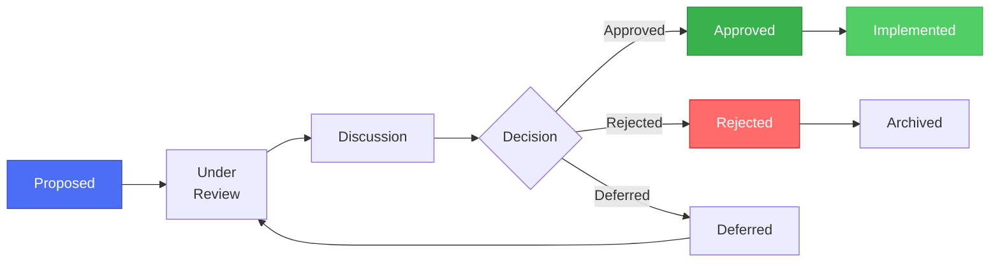
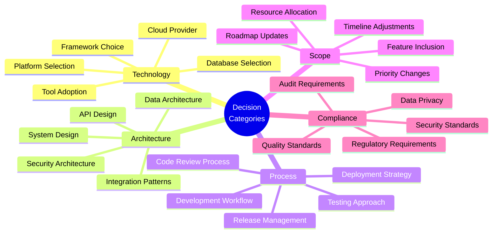
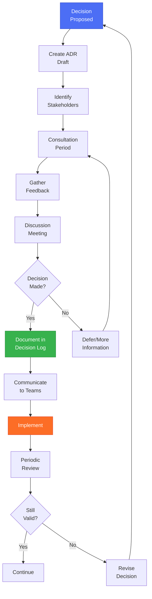

# Decision Log

## 📋 Overview

A Decision Log is a project management artifact that captures all significant decisions made during a project lifecycle. It provides transparency, accountability, and a historical record for stakeholders to reference.

---

## 🎯 Purpose

The Decision Log serves to:

- ✅ **Document Key Decisions**: Capture all important project, technical, and architectural decisions
- ✅ **Track Stakeholder Input**: Record who participated in each decision
- ✅ **Provide Context**: Explain the rationale and alternatives considered
- ✅ **Enable Audit Trail**: Maintain compliance and governance requirements
- ✅ **Support Onboarding**: Help new team members understand past decisions
- ✅ **Prevent Re-litigation**: Avoid revisiting settled decisions

---

## 📊 Decision Log Structure

### Decision Lifecycle



---

## 📝 Decision Log Template

### Comprehensive Decision Log

| Decision ID | Date | Title | Category | Description | Alternatives Considered | Decision | Rationale | Stakeholders | Owner | Status | Impact | Related Items | Review Date |
|-------------|------|-------|----------|-------------|------------------------|----------|-----------|--------------|-------|--------|--------|---------------|-------------|
| DEC-001 | 2025-11-01 | Select GitLab as Primary DevOps Platform | Technology | Choose between Azure DevOps and GitLab for requirements management | Azure DevOps, Jira + Confluence, GitLab | **GitLab** | Already in use; single platform for code, CI/CD, and requirements; cost-effective | Product Owner, Architect, Dev Lead, Security | Pavleen Bali | ✅ Approved | High | REQ-006, REQ-007 | 2026-05-01 |
| DEC-002 | 2025-11-05 | Implement OAuth 2.0 for Authentication | Security | Standardize authentication mechanism across all applications | Basic Auth, SAML, OAuth 2.0, API Keys | **OAuth 2.0** | Industry standard; integrates with Azure AD; better security than basic auth; supports modern apps | Security Lead, Architect, Compliance | J. Smith | ✅ Approved | High | REQ-001, SEC-010 | 2026-02-01 |
| DEC-003 | 2025-11-08 | Use Microservices Architecture | Architecture | Define application architecture pattern | Monolithic, Microservices, Serverless | **Microservices** | Better scalability; easier to maintain; aligns with cloud-native principles; team expertise | Architect, Dev Lead, Product Owner | A. Johnson | ✅ Approved | High | ARCH-001 | 2026-08-01 |
| DEC-004 | 2025-11-10 | Defer Multi-language Support to Q2 2026 | Scope | Decide when to implement i18n/l10n support | Implement now, Q1 2026, Q2 2026, Later | **Q2 2026** | Current bandwidth focused on core features; market research needed for language priorities | Product Owner, Business Analyst, Marketing | M. Lee | ⏳ Deferred | Medium | REQ-004, FEAT-025 | 2026-03-01 |
| DEC-005 | 2025-11-11 | Use PostgreSQL for Primary Database | Technology | Select database technology | MySQL, PostgreSQL, MongoDB, SQL Server | **PostgreSQL** | Open source; better performance for complex queries; team experience; JSON support | Architect, DBA, Dev Lead | K. Patel | 🔄 Under Review | High | TECH-005 | TBD |

---

### Simplified Decision Log (Stakeholder-Focused)

| ID | Date | Decision Title | Architect | Product Owner | Security | Dev Lead | DevOps | Compliance | Decision | Status |
|----|------|----------------|-----------|---------------|----------|----------|--------|------------|----------|--------|
| DEC-001 | 2025-11-01 | GitLab as Primary Platform | ✅ Approve | ✅ Approve | ✅ Approve | ✅ Approve | ✅ Approve | ✅ Approve | **Approved** | ✅ Implemented |
| DEC-002 | 2025-11-05 | OAuth 2.0 Authentication | ✅ Approve | ✅ Approve | ✅ Approve | ✅ Approve | ℹ️ Consulted | ✅ Approve | **Approved** | ✅ Implemented |
| DEC-003 | 2025-11-08 | Microservices Architecture | ✅ Approve | ✅ Approve | ℹ️ Consulted | ✅ Approve | ✅ Approve | ℹ️ Consulted | **Approved** | 🔄 In Progress |
| DEC-004 | 2025-11-10 | Defer i18n to Q2 2026 | ℹ️ Consulted | ✅ Approve | - | ℹ️ Consulted | - | - | **Deferred** | ⏳ Planned Q2 |
| DEC-005 | 2025-11-11 | PostgreSQL Database | ✅ Recommend | ✅ Approve | ℹ️ Consulted | ✅ Approve | ✅ Approve | ℹ️ Consulted | **Under Review** | 📋 Pending |

**Legend:**
- ✅ **Approve**: Stakeholder approves
- ❌ **Reject**: Stakeholder rejects
- ℹ️ **Consulted**: Stakeholder was consulted/informed
- `-`: Not involved in this decision

---

### Architectural Decision Record (ADR) Format

Each major architectural decision should follow the ADR template:

---

#### ADR-001: Use GitLab for Requirements Management

**Status**: Accepted  
**Date**: 2025-11-01  
**Deciders**: Pavleen Bali (Architect), J. Smith (Product Owner), K. Patel (Dev Lead)

**Context and Problem Statement**

The organization needs a unified platform for managing requirements, tracking development, and ensuring traceability from requirements through deployment. The current scattered approach using multiple tools creates inefficiency.

**Decision Drivers**

* Need for single platform to reduce tool sprawl
* Cost efficiency and ROI
* Integration with existing development workflow
* Traceability requirements for compliance
* Team familiarity and learning curve

**Considered Options**

1. **Azure DevOps** - Microsoft ecosystem, mature work item tracking
2. **Jira + Confluence** - Industry standard, extensive marketplace
3. **GitLab** - Single DevOps platform, already in use for code

**Decision Outcome**

Chosen option: **GitLab**, because:

* Already deployed and in use for code repositories
* Single platform reduces license costs and training overhead
* Native CI/CD integration with requirements validation
* Strong requirement traceability features (Ultimate tier)
* Open-source options for self-hosted deployment

**Positive Consequences**

* Reduced tool sprawl - developers stay in one platform
* Automated requirement validation through CI/CD pipelines
* Better traceability from requirement to deployment
* Lower total cost of ownership

**Negative Consequences**

* Requires GitLab Ultimate tier for native requirements feature
* May need customization for complex reporting needs
* Some stakeholders prefer Azure DevOps for reporting

**Compliance/Governance**

* Meets ISO 27001 requirements for traceability
* Supports audit trail requirements
* GDPR compliant for data storage

**Implementation**

* Phase 1 (Week 1-2): Setup GitLab requirements in pilot project
* Phase 2 (Week 3-4): Configure CI/CD integration
* Phase 3 (Month 2): Roll out to all teams

**Related Decisions**

* DEC-006: CI/CD Pipeline Structure
* DEC-007: Requirement Validation Strategy

---

## 📊 Decision Categories



---

## 🎯 Sample Decision Log for DevOps PPT Project

### DevOps - People, Processes & Tools Initiative

| Decision ID | Date | Category | Decision Title | Stakeholders Involved | Decision | Rationale | Impact | Status |
|-------------|------|----------|----------------|----------------------|----------|-----------|--------|--------|
| PPT-DEC-001 | 2025-10-15 | Process | Establish Requirements Management Framework | Product Owner, Architect, BA, Compliance | Create comprehensive framework document | Needed standardized approach for all projects | High - Foundation for all future requirements | ✅ Complete |
| PPT-DEC-002 | 2025-10-20 | Tool | Adopt GitLab for Requirements | Product Owner, Architect, Dev Leads, Security | Use GitLab over Azure DevOps | Already in use; cost-effective; single platform | High - Affects all development teams | ✅ Complete |
| PPT-DEC-003 | 2025-10-25 | Process | Implement Change Advisory Board (CAB) | Product Owner, PMO, Stakeholders | Establish 6-step CAB process | Needed governance for requirement changes | Medium - Affects change management | ✅ Complete |
| PPT-DEC-004 | 2025-11-01 | Documentation | Create Visual Diagrams | Architect, Technical Writer | Use diagrams for all process visualization | Keeps diagrams in Git; easy to update; version controlled | Medium - Affects documentation quality | ✅ Complete |
| PPT-DEC-005 | 2025-11-05 | Process | Create Requirements Traceability Matrix | Product Owner, QA Lead, BA | Implement RTM for all projects | Needed for compliance and audit trails | High - Affects testing and validation | ✅ Complete |
| PPT-DEC-006 | 2025-11-08 | Tool | Pipeline-based Requirement Validation | Architect, DevOps Lead, Dev Lead | Use requirements.json in CI/CD | Automates validation; fail-fast approach | High - Affects deployment process | 🔄 In Progress |
| PPT-DEC-007 | 2025-11-10 | Documentation | Maintain Decision Log | PMO, Architect, Product Owner | Track all major decisions centrally | Transparency and accountability needed | Medium - Affects governance | 🔄 In Progress |
| PPT-DEC-008 | 2025-11-11 | Scope | Include Azure DevOps as Alternative | Product Owner, Architect | Document both GitLab and Azure DevOps options | Some teams may prefer Azure; flexibility needed | Low - Optional alternative | 📝 Planned |

---

## 👥 Stakeholder Matrix (RACI)

### Decision-Making Roles

| Stakeholder Role | Responsible | Accountable | Consulted | Informed |
|------------------|-------------|-------------|-----------|----------|
| **Product Owner** | Define requirements | Final decision authority | All stakeholders | Executive team |
| **Architect** | Technical design | Architecture decisions | Dev team, Security | Product Owner |
| **Security Lead** | Security requirements | Security compliance | Architect, Compliance | All teams |
| **Dev Lead** | Implementation approach | Development decisions | Dev team | Product Owner |
| **DevOps Lead** | CI/CD design | DevOps decisions | Dev team, Ops | Architect |
| **QA Lead** | Test strategy | Quality assurance | Dev team | Product Owner |
| **Compliance Officer** | Regulatory requirements | Compliance decisions | All teams | Executive team |
| **Business Analyst** | Requirements documentation | Requirement clarity | Stakeholders | Product Owner |

---

## 🔄 Decision Review Process

### Review Cycle



---

## 📈 Decision Metrics and Reporting

### Decision Dashboard

| Metric | Current Month | Last Month | Trend |
|--------|---------------|------------|-------|
| **Total Decisions** | 8 | 5 | ⬆️ +60% |
| **Approved** | 5 | 4 | ⬆️ +25% |
| **Under Review** | 2 | 1 | ⬆️ +100% |
| **Deferred** | 1 | 0 | ⬆️ New |
| **Rejected** | 0 | 0 | ➡️ Stable |
| **Avg. Decision Time** | 5 days | 7 days | ⬇️ -29% |

### Decision by Category

| Category | Count | Percentage |
|----------|-------|------------|
| Technology | 3 | 37.5% |
| Architecture | 2 | 25.0% |
| Process | 2 | 25.0% |
| Documentation | 1 | 12.5% |

---

## 🔗 Integration with Project Tools

### GitLab Integration

```markdown
## Decision Reference

**Decision ID**: DEC-001  
**Related Epic**: &12  
**Related Issues**: #145, #146  
**ADR Document**: [ADR-001-GitLab-Platform.md](../decisions/ADR-001.md)  
**Stakeholder Approval**: [Approval Thread](https://gitlab.com/project/issues/145#note_123)  
```

### Linking to Requirements

| Decision | Requirements Affected | Impact Type |
|----------|----------------------|-------------|
| DEC-001: GitLab Platform | REQ-006, REQ-007, REQ-030 | Enables |
| DEC-002: OAuth 2.0 | REQ-001, SEC-010 | Fulfills |
| DEC-003: Microservices | ARCH-001, REQ-050 | Constrains |
| DEC-004: Defer i18n | REQ-004, FEAT-025 | Delays |

---

## 🛠️ Best Practices

### ✅ Do's

1. **Document Immediately**: Capture decisions as soon as they're made
2. **Include Context**: Always explain "why" not just "what"
3. **List Alternatives**: Show what was considered and rejected
4. **Name Stakeholders**: Record who participated
5. **Set Review Dates**: Revisit decisions periodically
6. **Link to Evidence**: Attach meeting notes, emails, documents
7. **Use Templates**: Maintain consistency across decisions
8. **Version Control**: Keep decision log in Git

### ❌ Don'ts

1. **Don't Delay Documentation**: Memories fade quickly
2. **Don't Skip Minor Decisions**: They become major later
3. **Don't Forget Rationale**: Context is crucial for future teams
4. **Don't Ignore Dissent**: Document opposing views
5. **Don't Make Decisions in Silos**: Involve stakeholders
6. **Don't Forget to Communicate**: Ensure decisions are shared
7. **Don't Leave Status Ambiguous**: Always update status

---

## 📅 Decision Review Schedule

| Decision Category | Review Frequency | Review Team | Next Review |
|-------------------|------------------|-------------|-------------|
| Technology Stack | Quarterly | Architect, Dev Leads | 2026-02-01 |
| Architecture | Bi-annually | Architecture Review Board | 2026-05-01 |
| Process | Monthly | PMO, Process Owners | 2025-12-01 |
| Security | Quarterly | Security Team, Compliance | 2026-01-15 |
| Tooling | Bi-annually | DevOps, Dev Leads | 2026-04-01 |

---

## 📋 Decision Log Template (Blank)

### For Your Project

| Decision ID | Date | Title | Category | Description | Alternatives | Decision | Rationale | Stakeholders | Owner | Status | Impact | Related | Review Date |
|-------------|------|-------|----------|-------------|--------------|----------|-----------|--------------|-------|--------|--------|---------|-------------|
| DEC-XXX | YYYY-MM-DD | [Title] | [Category] | [Description] | [Options considered] | [Final decision] | [Why this option] | [Who involved] | [Owner name] | [Status] | [Impact level] | [Links] | YYYY-MM-DD |

### Quick Stakeholder Vote Template

| ID | Date | Decision | Architect | PO | Security | Dev Lead | DevOps | QA | Compliance | Decision | Status |
|----|------|----------|-----------|-----|----------|----------|--------|-----|------------|----------|--------|
| DEC-XXX | YYYY-MM-DD | [Decision Title] | | | | | | | | | |

**Vote Options**: ✅ Approve | ❌ Reject | ℹ️ Consulted | `-` Not Involved

---

## 🎯 Conclusion

An effective Decision Log:

- ✅ Creates transparency in decision-making
- ✅ Provides accountability for decisions
- ✅ Enables knowledge transfer to new team members
- ✅ Supports compliance and governance
- ✅ Prevents decision fatigue by avoiding re-litigation

**Remember**: Every significant decision deserves documentation!

---

## 📚 Related Documents

- [Requirements Management Framework](./RequirementManagement.md)
- [Requirements Traceability Matrix](./RequirementsTraceabilityMatrix.md)
- [Pipeline Requirements Validation](./PipelineRequirements.md)
- [GitLab Quick Reference](../_docs/GITLAB_QUICK_REFERENCE.md)
- [Implementation Guide](../_docs/IMPLEMENTATION_GUIDE.md)

---

## 📖 Additional Resources

### ADR Tools and Templates

- [ADR GitHub Organization](https://adr.github.io/)
- [Markdown Architectural Decision Records](https://github.com/joelparkerhenderson/architecture-decision-record)
- [ADR Tools](https://github.com/npryce/adr-tools)

### Best Practices

- Record decisions when they're made, not after
- Include the date and participants
- Describe the context and problem
- List alternatives considered
- Explain the chosen solution and why
- Note consequences (both positive and negative)

---

**© 2025 Microsoft Global Delivery - Requirements Management Framework**

**Version:** 1.0  
**Last Updated:** November 11, 2025  
**Author:** Pavleen Bali, Cloud Solution Architect  
**For:** Customer Engagement - DevOps PPT Initiative
