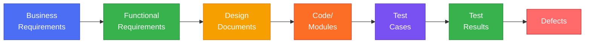
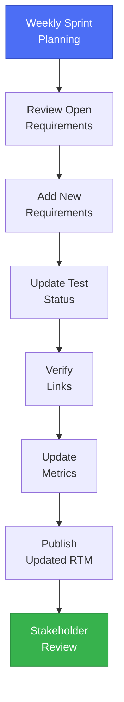
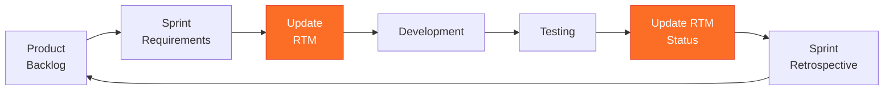

# Requirements Traceability Matrix (RTM)

## 📋 Overview

A Requirements Traceability Matrix (RTM) is a document that demonstrates the relationship between requirements and other artifacts of the software development lifecycle. It ensures that all requirements are accounted for and validated throughout the project.

---

## 🎯 Purpose

The RTM serves multiple critical purposes:

- ✅ **Ensures Complete Coverage**: Every requirement is linked to design, development, and testing
- ✅ **Impact Analysis**: Quickly assess the impact of requirement changes
- ✅ **Audit Trail**: Provides evidence for compliance and quality audits
- ✅ **Gap Identification**: Identifies missing requirements or test coverage
- ✅ **Stakeholder Communication**: Clear visibility of requirement status

---

## 📊 RTM Structure

### Traceability Types



---

## 📝 Requirements Traceability Matrix Template

### Format 1: Comprehensive RTM

| Req ID | Requirement Description | Priority | Source | Design Doc | Module/Component | Test Case ID | Test Status | Defect ID | Status | Owner | Notes |
|--------|------------------------|----------|--------|------------|------------------|--------------|-------------|-----------|--------|-------|-------|
| REQ-001 | User must authenticate via OAuth 2.0 | High | Stakeholder Workshop | DD-AUTH-001 | auth.module.ts | TC-001, TC-002 | Passed | - | ✅ Complete | J. Smith | Integrated with Azure AD |
| REQ-002 | System must export data to CSV | Medium | User Story US-045 | DD-EXPORT-001 | export.service.ts | TC-015, TC-016 | Passed | - | ✅ Complete | A. Johnson | Excel format also supported |
| REQ-003 | Dashboard must load within 2 seconds | High | Performance SLA | DD-PERF-001 | dashboard.component.ts | TC-030, TC-031 | Failed | DEF-012 | 🔄 In Progress | M. Lee | Optimization needed |
| REQ-004 | Support multi-language interface | Low | Product Roadmap | DD-I18N-001 | i18n.module.ts | TC-050 | Not Started | - | 📝 Planned | S. Chen | Q2 2026 target |
| REQ-005 | Implement role-based access control | High | Security Audit | DD-RBAC-001 | rbac.service.ts | TC-020, TC-021, TC-022 | Passed | - | ✅ Complete | K. Patel | Five roles defined |

---

### Format 2: Simplified RTM (for smaller projects)

| Req ID | Description | Test Case | Status | Notes |
|--------|-------------|-----------|--------|-------|
| REQ-001 | OAuth 2.0 Authentication | TC-001, TC-002 | ✅ Passed | - |
| REQ-002 | CSV Export | TC-015, TC-016 | ✅ Passed | - |
| REQ-003 | Dashboard Performance | TC-030 | ❌ Failed | Need optimization |
| REQ-004 | Multi-language Support | TC-050 | ⏳ Pending | Q2 2026 |
| REQ-005 | Role-Based Access Control | TC-020-022 | ✅ Passed | - |

---

### Format 3: GitLab-Specific RTM

| GitLab Req ID | Title | Epic | Issue | Merge Request | Test Case | Pipeline Status | Satisfied |
|---------------|-------|------|-------|---------------|-----------|-----------------|-----------|
| 1 | OAuth 2.0 Authentication | &12 | #145, #146 | !234 | TC-001, TC-002 | ✅ Passed | Yes |
| 2 | CSV Export Functionality | &15 | #201 | !245 | TC-015, TC-016 | ✅ Passed | Yes |
| 3 | Dashboard Performance | &12 | #178 | !256 | TC-030 | ❌ Failed | No |
| 4 | Multi-language Support | &18 | #210 | - | TC-050 | ⏳ Pending | No |
| 5 | Role-Based Access Control | &14 | #189, #190 | !267, !268 | TC-020-022 | ✅ Passed | Yes |

---

## 🔄 Traceability Matrix Types

### 1. Forward Traceability Matrix

Traces requirements forward to design and implementation.

| Business Req | Functional Req | Design Spec | Implementation | Test Case |
|-------------|----------------|-------------|----------------|-----------|
| BR-001: User Management | FR-001: User Login<br/>FR-002: User Logout | DS-001: Auth Module | auth.service.ts | TC-001, TC-002 |
| BR-002: Data Analytics | FR-010: Dashboard View<br/>FR-011: Export Reports | DS-005: Analytics Engine | analytics.module.ts | TC-030, TC-031 |
| BR-003: Security Compliance | FR-020: RBAC<br/>FR-021: Audit Logging | DS-008: Security Layer | security.service.ts | TC-050-055 |

### 2. Backward Traceability Matrix

Traces from test cases back to requirements.

| Test Case | Functional Req | Business Req | Test Result | Defects |
|-----------|----------------|--------------|-------------|---------|
| TC-001 | FR-001: User Login | BR-001: User Management | ✅ Passed | - |
| TC-002 | FR-002: User Logout | BR-001: User Management | ✅ Passed | - |
| TC-030 | FR-010: Dashboard View | BR-002: Data Analytics | ❌ Failed | DEF-012 |
| TC-050 | FR-020: RBAC | BR-003: Security Compliance | ✅ Passed | - |

### 3. Bi-Directional Traceability Matrix

Combines both forward and backward traceability.

```mermaid
flowchart LR
    subgraph Upstream["⬅️ Backward Trace"]
        TC[Test Cases] --> FR[Functional<br/>Requirements]
        FR --> BR[Business<br/>Requirements]
    end
    
    subgraph Downstream["➡️ Forward Trace"]
        BR2[Business<br/>Requirements] --> FR2[Functional<br/>Requirements]
        FR2 --> TC2[Test Cases]
    end
    
    BR -.-> BR2
    
    style TC fill:#7950f2,stroke:#5f3dc4,color:#fff
    style TC2 fill:#7950f2,stroke:#5f3dc4,color:#fff
    style FR fill:#37b24d,stroke:#2b8a3e,color:#fff
    style FR2 fill:#37b24d,stroke:#2b8a3e,color:#fff
    style BR fill:#4c6ef5,stroke:#364fc7,color:#fff
    style BR2 fill:#4c6ef5,stroke:#364fc7,color:#fff
```



---

## 🏗️ Sample RTM for DevOps PPT Project

### Project: DevOps - People, Processes & Tools

| Req ID | Category | Requirement | Priority | Epic Link | GitLab Issue | Design Doc | Test Cases | Status | Owner |
|--------|----------|-------------|----------|-----------|--------------|------------|------------|--------|-------|
| PPT-001 | People | Document team roles and responsibilities | High | &1 | #10 | People-Roles.md | Manual Review | ✅ Complete | Pavleen |
| PPT-002 | People | Define skill matrix for team members | Medium | &1 | #11 | People-Skills.md | Manual Review | ✅ Complete | Pavleen |
| PPT-003 | Process | Establish requirements gathering process | High | &2 | #20 | RequirementManagement.md | Manual Review | ✅ Complete | Pavleen |
| PPT-004 | Process | Define change management workflow | High | &2 | #21 | RequirementManagement.md | Manual Review | ✅ Complete | Pavleen |
| PPT-005 | Process | Create traceability matrix template | Medium | &2 | #25 | RequirementsTraceabilityMatrix.md | Manual Review | 🔄 In Progress | Pavleen |
| PPT-006 | Tools | Integrate with GitLab requirements | High | &3 | #30 | GITLAB_QUICK_REFERENCE.md | Automated | 📝 Planned | Team |
| PPT-007 | Tools | Setup CI/CD pipeline validation | High | &3 | #31 | PipelineRequirements.md | Automated | 📝 Planned | Team |
| PPT-008 | Tools | Configure Azure DevOps integration | Medium | &3 | #32 | RequirementManagement.md | Manual | 📝 Planned | Team |

---

## 📈 RTM Metrics and KPIs

### Coverage Metrics

| Metric | Formula | Target | Current | Status |
|--------|---------|--------|---------|--------|
| Requirements Coverage | (Tested Reqs / Total Reqs) × 100 | 100% | 85% | 🟡 |
| Test Case Coverage | (Test Cases / Requirements) | ≥ 1.5 | 1.8 | 🟢 |
| Defect Density | Defects / Requirements | < 0.1 | 0.08 | 🟢 |
| Requirement Stability | (Unchanged Reqs / Total Reqs) × 100 | > 80% | 92% | 🟢 |
| Traceability Completeness | (Traced Reqs / Total Reqs) × 100 | 100% | 95% | 🟡 |

### Status Legend

- 🟢 **Green**: Meeting target
- 🟡 **Yellow**: Near target (within 10%)
- 🔴 **Red**: Below target (> 10% gap)

---

## 🔗 Integration with GitLab

### Linking Requirements in GitLab

```yaml
# In your GitLab requirement or issue:

## Traceability Links

**Epic**: &12  
**Related Issues**: #145, #146  
**Merge Requests**: !234  
**Test Cases**: TC-001, TC-002  
**Design Documents**: [DD-AUTH-001](../design/auth.md)  

## Validation Criteria

- [ ] Unit tests passing
- [ ] Integration tests passing
- [ ] Code review completed
- [ ] Documentation updated
```

### Automated RTM Updates

```yaml
# .gitlab-ci.yml
update_rtm:
  stage: reporting
  script:
    - python scripts/generate_rtm.py
    - git add RequirementsTraceabilityMatrix.md
    - git commit -m "Auto-update RTM [skip ci]"
    - git push
  only:
    - master
  when: on_success
```

---

## 🛠️ Best Practices

### ✅ Do's

1. **Keep it Updated**: Update RTM with every requirement or test change
2. **Automate Where Possible**: Use scripts to generate RTM from issue tracking systems
3. **Use Unique IDs**: Ensure every requirement has a unique, immutable ID
4. **Link Everything**: Connect requirements to all related artifacts
5. **Regular Reviews**: Review RTM in sprint planning and retrospectives
6. **Version Control**: Keep RTM in Git along with code
7. **Clear Ownership**: Assign an owner for each requirement
8. **Status Tracking**: Maintain clear status for each requirement

### ❌ Don'ts

1. **Don't Create Manually Without Automation**: Manual RTMs become outdated quickly
2. **Don't Use Ambiguous IDs**: Avoid REQ-1, REQ-2 pattern; use descriptive IDs
3. **Don't Skip Failed Requirements**: Track and document all failures
4. **Don't Ignore Dependencies**: Document requirement dependencies
5. **Don't Create Too Many Columns**: Keep it simple and focused
6. **Don't Forget to Archive**: Move completed requirements to archive section

---

## 📝 RTM Maintenance Process

### Weekly Updates



### Roles and Responsibilities

| Role | Responsibility | Frequency |
|------|----------------|-----------|
| **Product Owner** | Define and prioritize requirements | Weekly |
| **Business Analyst** | Create and link requirements | Daily |
| **Developer** | Link code to requirements | Per commit |
| **QA Engineer** | Create and link test cases | Per test cycle |
| **Project Manager** | Review and publish RTM | Weekly |
| **Stakeholders** | Review and approve RTM | Bi-weekly |

---

## 📊 Sample RTM Dashboard

### Requirement Status Overview

| Status | Count | Percentage |
|--------|-------|------------|
| ✅ Complete | 45 | 56% |
| 🔄 In Progress | 20 | 25% |
| 📝 Planned | 10 | 13% |
| ❌ Failed | 3 | 4% |
| 🚫 Blocked | 2 | 2% |
| **Total** | **80** | **100%** |

### Priority Breakdown

| Priority | Complete | In Progress | Planned | Total |
|----------|----------|-------------|---------|-------|
| Critical | 8 | 2 | 0 | 10 |
| High | 20 | 8 | 2 | 30 |
| Medium | 12 | 7 | 6 | 25 |
| Low | 5 | 3 | 2 | 10 |

---

## 🔄 RTM Workflow Integration

### Integration with Agile/Scrum



---

## 📖 RTM Template for Different Project Types

### For GitLab Projects

```markdown
| Req ID | Title | Epic | Issue | MR | Tests | Pipeline | Satisfied |
|--------|-------|------|-------|----|----|----------|-----------|
| 1 | Feature Name | &epic-id | #issue-id | !mr-id | TC-xxx | ✅ | Yes |
```

### For Azure DevOps Projects

```markdown
| Work Item ID | Title | Feature | User Story | Tasks | Test Cases | Status |
|--------------|-------|---------|------------|-------|------------|--------|
| 1234 | Feature Name | F-001 | US-045 | T-101, T-102 | TC-050 | ✅ Done |
```

### For Jira Projects

```markdown
| Jira Key | Summary | Epic Link | Story Points | Test Cases | Status |
|----------|---------|-----------|--------------|------------|--------|
| PROJ-123 | Feature Name | EPIC-12 | 8 | TC-001, TC-002 | Done |
```

---

## 🎯 Conclusion

A well-maintained Requirements Traceability Matrix is essential for:

- ✅ Ensuring all requirements are addressed
- ✅ Facilitating impact analysis for changes
- ✅ Supporting compliance and audits
- ✅ Improving communication with stakeholders
- ✅ Tracking project progress

**Remember**: The RTM is a living document that should evolve with your project!

---

## 📚 Related Documents

- [Requirements Management Framework](./RequirementManagement.md)
- [Decision Log](./DecisionLog.md)
- [Pipeline Requirements Validation](./PipelineRequirements.md)
- [GitLab Quick Reference](../_docs/GITLAB_QUICK_REFERENCE.md)
- [Implementation Guide](../_docs/IMPLEMENTATION_GUIDE.md)

---

**© 2025 Microsoft Global Delivery - Requirements Management Framework**

**Version:** 1.0  
**Last Updated:** November 11, 2025  
**Author:** Pavleen Bali, Cloud Solution Architect  
**For:** Customer Engagement - DevOps PPT Initiative
